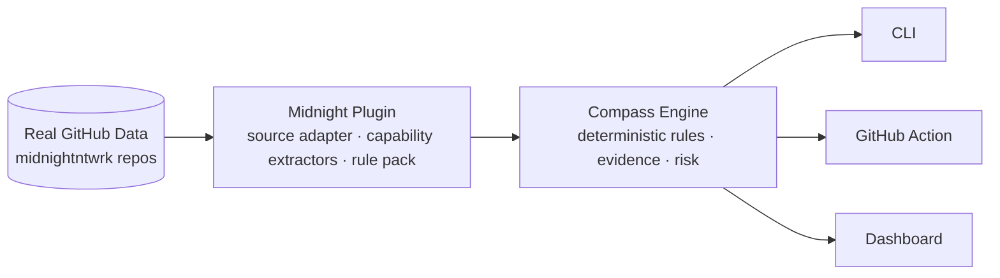
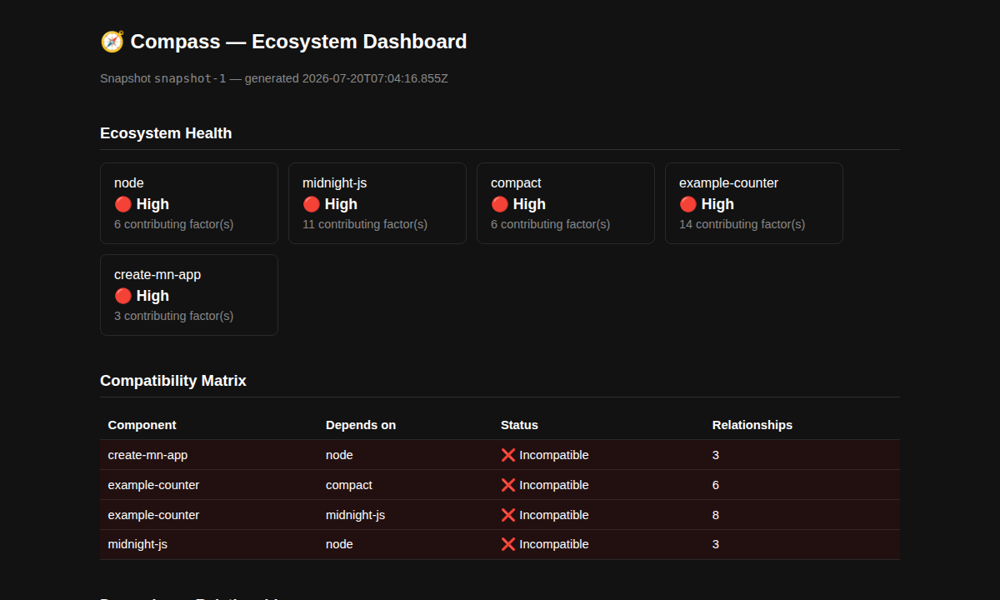
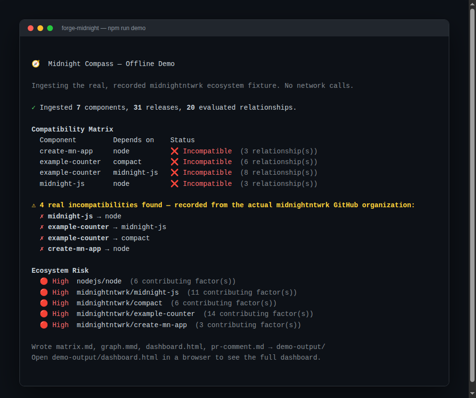
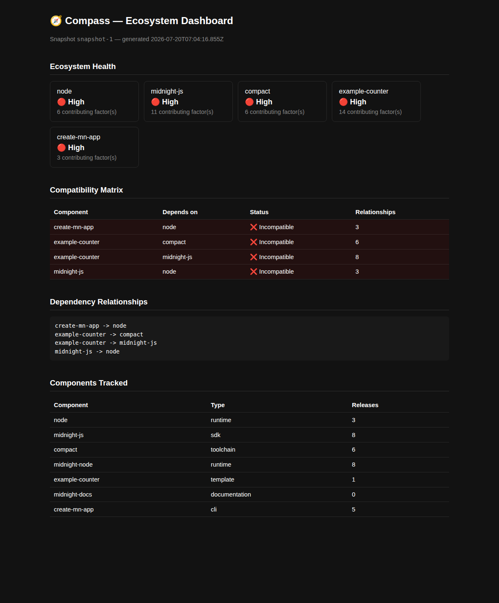
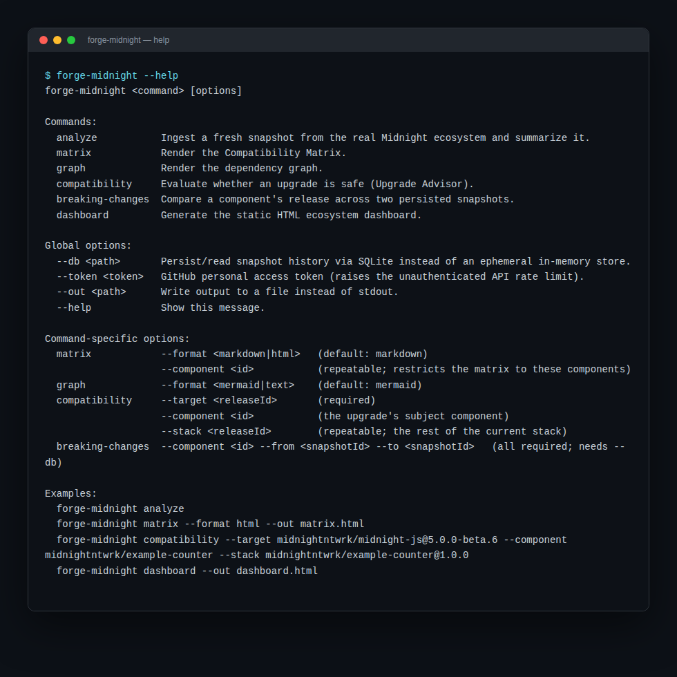

<p align="center">🧭</p>

<h1 align="center">Midnight Compass</h1>

<p align="center"><strong>Ecosystem Compatibility Intelligence for Midnight</strong></p>

<p align="center">
  
  
  
  
  
  
</p>

---

## IndiaCodex 2026 Submission

| | |
| --- | --- |
| **Project** | Compass |
| **Track** | MIDNIGHT |
| **Team** | Younus |
| **PPT** | [`docs/presentation/Midnight-Compass-Presentation.pptx`](docs/presentation/Midnight-Compass-Presentation.pptx) — 12 slides, dark theme, real screenshots and diagrams, speaker notes on every slide |
| **Live demo** | Not deployed — runs locally from a single command (`npm run demo`, see [Running the Demo](#running-the-demo)). No public hosted instance exists; nothing below claims otherwise. |
| **Demo video** | None recorded. The [Demo Screenshots](#demo-screenshots) below and the presentation deck are the available visual proof; see [`docs/demo.md`](docs/demo.md) for a second-by-second script anyone can follow live instead. |

## Table of Contents

- [Project Description](#project-description)
- [Problem Statement](#problem-statement)
- [Why the Problem Matters](#why-the-problem-matters)
- [Solution](#solution)
- [Architecture Overview](#architecture-overview)
- [Key Features](#key-features)
- [Technical Innovation](#technical-innovation)
- [Engineering Highlights](#engineering-highlights)
- [Tech Stack](#tech-stack)
- [Repository Structure](#repository-structure)
- [Installation](#installation)
- [Running the Demo](#running-the-demo)
- [Demo Screenshots](#demo-screenshots)
- [Future Roadmap](#future-roadmap)
- [Team Members](#team-members)
- [License](#license)

---

## Project Description

Compass is an ecosystem compatibility intelligence platform for Midnight.
It ingests real release and dependency metadata from the Midnight
ecosystem's GitHub repositories — the Compact compiler, the `midnight-js`
SDK, the node runtime, reference templates, and related tooling — and
computes, deterministically, which combinations of releases actually work
together. It ships as three real, working consumers of one shared engine:
a CLI (`forge-midnight`), a GitHub Action that posts compatibility reports
as pull-request comments, and a static HTML dashboard.

## Problem Statement

Midnight is not one artifact — it is a constellation of independently
released components (protocol, compiler, SDK packages, node, wallet,
reference templates) each versioned on its own schedule. Nothing today
records which combinations of these releases are known to work together.
A team finds out when a build fails, a proof generation errors out, or
CI goes red — usually after the change has already shipped. Concretely
and verifiably: Compass's own ingestion of the real ecosystem found that
`example-counter` — Midnight's official reference template — declares a
dependency on `@midnight-ntwrk/midnight-js` at `^4.0.4`, while the
currently tracked SDK release is `5.0.0-beta.6`. That is a real,
currently-open incompatibility in the ecosystem's own example code,
discovered automatically, not staged for this submission.

## Why the Problem Matters

Existing tooling operates one layer too low to catch this. A dependency
bot compares a `package.json` range against a registry's latest version —
it has no model of cross-repository compatibility, and no visibility into
facts that live outside any manifest, such as the Compact *language*
version Midnight embeds as text inside a GitHub release name rather than
in any structured field. Without a system built specifically to read and
reason about Midnight's own release metadata, this category of problem is
invisible until it breaks something.

## Solution

Compass separates *what compatibility means* (a deterministic domain
model and rule engine) from *where data comes from* (an ecosystem plugin)
and *how answers are delivered* (CLI, GitHub Action, dashboard — all
calling the same application-layer use cases and rendering through the
same shared formatting layer). Every compatibility verdict is computed
from the components' own declared metadata and cited evidence — no AI, no
heuristics, no guessing. The same question, asked twice against the same
data, always produces the same answer, and that answer can be traced back
to the specific evidence responsible for it.

## Architecture Overview

Clean Architecture, enforced structurally, not just documented:
`core/domain` has zero dependency on any framework or ecosystem-specific
knowledge. `plugins/midnight` is the only package that knows Midnight
exists; it populates the domain model through three explicit extension
points (source adapter, capability extractors, rule pack). Every consumer
— CLI, GitHub Action, dashboard — calls the same `core/application` use
cases and renders through the same `interfaces/reporting` layer, so they
cannot disagree about a finding.



The inward-only dependency rule (`interfaces` → `plugins`/`storage` →
`core/application` → `core/domain`, never the reverse) is enforced in CI
by a `dependency-cruiser` check — verified in this submission at 0
violations across 379 modules, 1114 dependencies cruised. Full
architecture specification, twelve Architecture Decision Records, and
every diagram: [`docs/architecture-overview.md`](docs/architecture-overview.md),
[`docs/architecture/`](docs/architecture/), [`docs/adr/`](docs/adr/).

## Key Features

| Capability | What it does |
| --- | --- |
| **Compatibility Matrix** | Which releases are known to work together, computed from real declared metadata (`forge-midnight matrix`) |
| **Upgrade Advisor** | Is a specific upgrade safe, and who else in the ecosystem does it affect (`forge-midnight compatibility`) |
| **Breaking Change Analyzer** | What changed between two ingested snapshots, and who depends on what broke (`forge-midnight breaking-changes`) |
| **GitHub Action** | Posts the same compatibility finding as a pull-request comment, before merge |
| **Static Dashboard** | Self-contained HTML file, zero JS, zero server — the same engine's output, browsable anywhere |
| **Offline Demo** | `npm run demo` — zero network, zero GitHub API rate-limit risk, real recorded ecosystem data |

## Technical Innovation

- **Zero-rule-authoring compatibility checking.** A release's own declared
  dependency constraint (e.g. a `package.json` version range) is
  evaluated directly as a compatibility signal, without requiring a
  hand-written rule for that specific pair. The real `example-counter` /
  `midnight-js` incompatibility above was caught by a rule pack
  containing zero rules about that pair — see
  [ADR 0011](docs/adr/0011-declared-dependency-constraints-are-first-class-compatibility-signal.md).
- **A second, non-npm versioning scheme modeled without special-casing
  the domain.** The Compact toolchain embeds its *language* version as
  text inside a GitHub release name, not in any manifest field. Compass
  extracts it and treats it as the same generic `Capability` type used
  for everything else — no domain-model change was needed to support it.
- **Fail-closed by construction.** The domain layer's own factory
  functions reject constructing a `compatible` relationship with no
  evidence, or a `Risk` with no contributing factors — a runtime
  invariant a test cannot accidentally bypass. Absence of evidence
  resolves to `unverified`, never `compatible` — see
  [ADR 0006](docs/adr/0006-evidence-mandatory-fail-closed.md).
- **Disclosed, not hidden, limitations.**
  [ADR 0012](docs/adr/0012-interfaces-ingest-fresh-per-invocation.md)
  documents, in the repository itself, that the GitHub Action currently
  ingests fresh on every run rather than querying a pre-warmed snapshot —
  a real, known performance gap written down instead of quietly shipped
  around.

## Engineering Highlights

- **411 tests across 58 files**, ~95.6% line coverage — unit tests with
  real fixtures (not mocks), plugin/adapter conformance suites,
  property-based tests, and an end-to-end golden-snapshot test against
  the real recorded ecosystem. Verified fresh for this submission from a
  clean `npm install`.
- **Zero architecture violations**, enforced by `dependency-cruiser` in
  CI — checked, not assumed.
- **Twelve Architecture Decision Records**, including one that documents
  a real, current performance limitation rather than hiding it.
- **Apache-2.0 licensed** with a complete open-source health-file set:
  `SECURITY.md`, `CONTRIBUTING.md`, `CHANGELOG.md`, `LICENSE`.

## Tech Stack

**Language:** TypeScript 5.9, Node.js ≥ 20
**Runtime/Build:** npm workspaces, TypeScript project references (`tsc -b`)
**Testing:** Vitest, fast-check (property-based testing)
**Storage:** In-memory adapter, SQLite (`better-sqlite3`) adapter
**Architecture enforcement:** `dependency-cruiser` (CI-checked module boundaries)
**Linting:** ESLint (strict, type-checked)
**Integration:** GitHub REST API (real `midnightntwrk` organization data)

## Repository Structure

```
Compass/
  core/
    domain/         Deterministic compatibility, rule, evidence, risk, recommendation engines. Zero dependencies.
    application/     Use cases + ports (ingest, matrix, advisor, breaking-change, risk).
    testing/          Shared builders, fakes, and conformance suites.
  plugins/
    plugin-sdk/      The three-extension-point plugin contract.
    midnight/         The real Midnight ecosystem plugin.
  storage/
    storage-sdk/     SnapshotRepositoryPort contract + conformance kit.
    adapters/          Memory and SQLite adapters.
  interfaces/
    reporting/        Shared Markdown/HTML rendering — the only place output is assembled.
    cli/                forge-midnight CLI.
    github-action/       PR comment bot.
  docs/                 Architecture, ADRs, demo package, screenshots.
    assets/                Real screenshots referenced from this README.
    presentation/           Hackathon presentation deck (.pptx).
  scripts/                 The offline demo (npm run demo).
```

Full package-by-package responsibilities are in
[`docs/architecture/repository-structure.md`](docs/architecture/repository-structure.md).

## Installation

Requirements: Node.js ≥ 20.

```bash
cd Compass
npm install
npm run build
```

## Running the Demo

```bash
npm run demo
```

Ingests a real, recorded snapshot of the Midnight ecosystem — zero
network calls, zero GitHub API rate-limit risk, works the same in any
environment. It is the exact same engine `forge-midnight analyze` runs
against live data; only the source of the data differs. Prints a terminal
summary and writes `demo-output/dashboard.html`, `matrix.md`, `graph.mmd`,
and `pr-comment.md`.

For the live-network path and every CLI command:

```bash
node interfaces/cli/dist/bin.js analyze   # live GitHub API — pass --token to raise the unauthenticated rate limit
node interfaces/cli/dist/bin.js matrix
node interfaces/cli/dist/bin.js dashboard --out dashboard.html
```

Full command reference and a judge walkthrough: [`docs/demo.md`](docs/demo.md).

## Demo Screenshots

<table>
<tr>
<td width="50%">

**Ecosystem Dashboard** — real components flagged High risk, real incompatibilities

</td>
<td width="50%">

**Offline Demo** — `npm run demo`, real terminal output, zero network

</td>
</tr>
<tr>
<td width="50%">

**Full Dashboard** — Ecosystem Health, Compatibility Matrix, Dependency Relationships, Components Tracked

</td>
<td width="50%">

**CLI Help** — the real `forge-midnight --help` output

</td>
</tr>
</table>

## Future Roadmap

In priority order — see [`docs/roadmap.md`](docs/roadmap.md) for full detail:

1. A scheduled ingestion service so the GitHub Action queries a
   pre-warmed snapshot instead of ingesting fresh per run (removes the
   limitation [ADR 0012](docs/adr/0012-interfaces-ingest-fresh-per-invocation.md) discloses).
2. A hosted Query API and live dashboard, fed by that same service.
3. Broader ecosystem source coverage — a new repository is one entry in
   a declarative registry, not a redesign.
4. Release Health and Ecosystem Risk views for maintainers and adoption
   reviewers.

Stated honestly rather than hidden: there is no hosted deployment of
Compass, no scheduled ingestion service, and the GitHub Action's
per-invocation ingestion means its latency depends on GitHub API
availability, not on query complexity. See
[`docs/faq.md`](docs/faq.md#is-this-production-ready) for the fuller
answer.

## Team Members

**Team Younus**

- younusbasha

## License

[Apache-2.0](LICENSE)
