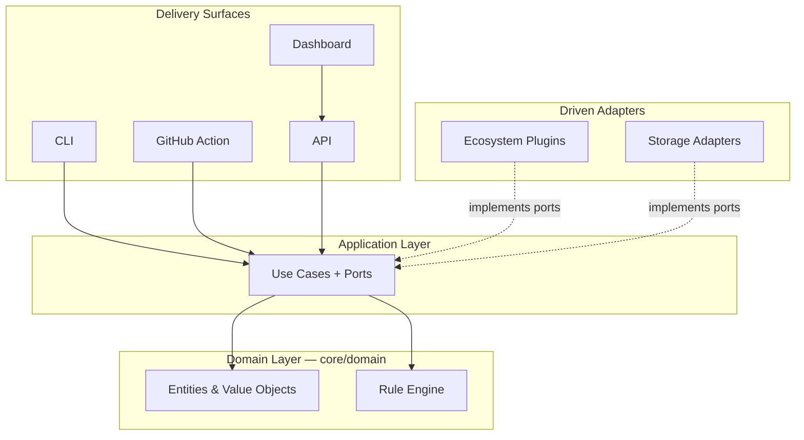

# Architecture Specification

## Status

This is the full architecture specification for Compass, locked before any implementation begins. [docs/architecture-overview.md](../architecture-overview.md) remains the conceptual introduction — the shape a reader meets first. Everything in this folder is the detailed specification underneath it: precise enough to build against, still free of any implementation choice (language, framework, database) that isn't required to fix the shape.

## Core Idea

Compass is an engineering intelligence engine. It continuously builds knowledge about an ecosystem — components, releases, dependencies, and the compatibility relationships between them — and persists that knowledge as a queryable graph. Everything else — the CLI, the GitHub Action, the API, the Dashboard — is a consumer of that knowledge, not a separate source of logic. **The engine is the product.** Every document in this folder exists to protect that fact: to keep the engine independently correct, testable, and complete regardless of how many consumers eventually sit on top of it.

## First Principle

Compass never hardcodes Midnight. The core understands `Repository`, `Release`, `Dependency`, `Package`, `Runtime`, `SDK`, `Compatibility Rule`, `Constraint`, `Capability`, `Breaking Change`, `Artifact`, `Evidence`, `Risk`, and `Recommendation` — concepts specific to no ecosystem. Midnight is a plugin that supplies instances of these concepts. See [domain-model.md](domain-model.md) for the precise definitions and [plugin-architecture.md](plugin-architecture.md) for how an ecosystem plugs in. If Compass ever reasons about a second ecosystem, it should require a new plugin, not a redesign of the engine — that claim is what [ADR 0001](../adr/0001-independent-compatibility-domain-model.md) commits to, and what every other decision in this folder is checked against.

## Layered Shape

Dependencies point inward, toward the Domain Layer, always. See [repository-structure.md](repository-structure.md#dependency-rules) for the enforced version of this rule, and [ADR 0003](../adr/0003-clean-architecture-with-enforced-dependency-rule.md) for why it's enforced in CI rather than left to convention.

## Reading Order

For a first pass through the full specification, this order builds concepts in the sequence they depend on each other:

1. [domain-model.md](domain-model.md) — the vocabulary everything else uses
2. [bounded-contexts.md](bounded-contexts.md) — where that vocabulary lives, and where translation boundaries are needed
3. [repository-structure.md](repository-structure.md) — the module layout and dependency rules that enforce the boundaries
4. [plugin-architecture.md](plugin-architecture.md) — how ecosystem-specific knowledge enters the system
5. [compatibility-engine.md](compatibility-engine.md) — how a compatibility answer actually gets computed
6. [knowledge-graph.md](knowledge-graph.md) — how that answer, and everything it's based on, is stored and queried over time
7. [data-flow-and-sequences.md](data-flow-and-sequences.md) — the same pieces traced through time, for the flows that matter most
8. [api-contracts.md](api-contracts.md) — what every consumer, first-party or third-party, actually calls
9. [interfaces.md](interfaces.md) — the CLI, GitHub Action, and Dashboard specifically
10. [cross-cutting-concerns.md](cross-cutting-concerns.md) — error handling, configuration, logging, testing, security, performance, and scalability
11. [midnight-plugin.md](midnight-plugin.md) — the first real ecosystem plugin: what it watches, how it extracts capabilities, and its rule pack
12. [ecosystem-analysis-algorithms.md](ecosystem-analysis-algorithms.md) — the Compatibility Matrix, Upgrade Advisor, and Breaking Change Analyzer algorithms built on top of the engine

Every major decision made across these documents has a corresponding entry in [docs/adr/](../adr/), recording the alternatives considered and why they were rejected — start there for the reasoning behind any specific choice that seems worth challenging.

## What This Specification Deliberately Does Not Fix

No programming language, framework, database, or build tool is named anywhere in this folder. That's not an oversight — it's the direct test of whether the architecture actually achieves the independence it claims. A specification that can only be read as "the design of a TypeScript service using Postgres" hasn't actually separated its domain from its implementation; it's just documented the implementation in prose first. Those choices come next, deliberately, as their own ADRs, once this specification has been reviewed.
