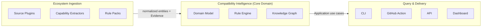

# Bounded Contexts

## Why So Few

A bounded context is a seam — a place where the model or the vocabulary genuinely changes, and where translation is required to cross it. Compass has one, tightly held core vocabulary (the [domain model](domain-model.md)), so it does not get many bounded contexts. Splitting the core domain into several contexts just because it has several sub-concerns (rules, evidence, risk) would create translation overhead at boundaries where none is needed — those sub-concerns share one ubiquitous language and evolve together. The real seams are where Compass's vocabulary meets something that isn't Compass's vocabulary: raw ecosystem data on the way in, and consumer-facing interaction on the way out.

## The Contexts

### Compatibility Intelligence (Core Domain)

Owns the [domain model](domain-model.md) in full: Component, Release, Artifact, Dependency, Capability, Constraint, Compatibility Rule, Compatibility Relationship, Breaking Change, Evidence, Risk, Recommendation. This is where the Rule Engine evaluates rules against ingested data and where the Knowledge Graph's logical structure lives (see [compatibility-engine.md](compatibility-engine.md) and [knowledge-graph.md](knowledge-graph.md)).

This context has no knowledge of GitHub, npm, Midnight, or any other concrete source or ecosystem. It has no knowledge of HTTP, CLI argument parsing, or dashboards either. It is the one part of the system every other context depends on and that depends on nothing else.

### Ecosystem Ingestion

Translates whatever a real ecosystem publishes — GitHub releases, registry manifests, compiler output, CI results — into the Core Domain's vocabulary: `Component`, `Release`, `Artifact`, `Dependency`, `Capability`, and the `Evidence` documenting where each fact came from. This is a classic anti-corruption layer: ecosystem-specific mess (inconsistent metadata, missing fields, source-specific quirks) is absorbed and normalized here, so it never leaks into the Core Domain's clean vocabulary.

An ecosystem's Rule Pack — its ecosystem-specific `Compatibility Rule` definitions — is conceptually part of this context too: rules describe how a specific ecosystem's compatibility semantics work, which is knowledge that belongs with the plugin supplying it, not with the engine evaluating it. See [plugin-architecture.md](plugin-architecture.md) for the concrete extension points this context exposes to plugin authors.

### Query & Delivery

Everything a human or a CI pipeline directly interacts with — the CLI, the GitHub Action, the public API, and the Dashboard. Each is a distinct delivery surface with its own concerns (argument parsing, HTTP routing, visual presentation), but none of them contain compatibility logic. They translate a request into a call against the Core Domain's application use cases (see [interfaces.md](interfaces.md)) and translate the result into their surface's native format. The Dashboard, specifically, is a client of the same public API as any third party — it has no private path into the Core Domain (see [ADR 0009](../adr/0009-dashboard-uses-public-api.md)).

## What Is Deliberately Not a Separate Context

**Storage** is infrastructure the Core Domain depends on through a port, not a bounded context with its own vocabulary — it stores and retrieves snapshots of the Core Domain's own model, translating nothing. See [knowledge-graph.md](knowledge-graph.md).

**Risk and Recommendation** are not a separate "Advisory" context from the rest of the Core Domain. They're derived views over Compatibility Relationships, Breaking Changes, and Evidence that already live in the Core Domain — splitting them out would mean re-importing the same vocabulary into a second context for no translation benefit.

## Context Map

| From | To | Relationship |
|---|---|---|
| Ecosystem Ingestion | Core Domain | Anti-corruption layer — ingestion translates into the core's model; the core never adapts to a source's shape |
| Core Domain | Query & Delivery | Open Host Service — the core exposes a stable set of application use cases; every delivery surface is a conformist client of that same service, none gets a bespoke contract |
| Query & Delivery | Core Domain | No context calls back into ingestion or storage directly; everything goes through the Core Domain's use cases |

The direction of these relationships is the same claim [repository-structure.md](repository-structure.md) makes at the module level: dependencies point at the Core Domain, never away from it.
