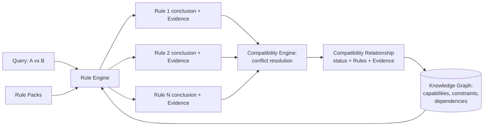

# Compatibility Engine, Rule Engine & Evidence Model

## Scope

Three tightly related pieces live in this document because none of them is meaningful in isolation: the Compatibility Engine orchestrates a query, the Rule Engine evaluates the rules that query needs, and the Evidence Model is what makes the Rule Engine's output trustworthy enough to act on. All three live inside the Core Domain ([bounded-contexts.md](bounded-contexts.md)) and operate purely on the types defined in [domain-model.md](domain-model.md) — neither knows anything about where that data came from.

## Compatibility Engine

The Compatibility Engine answers one question, asked at different scopes: *is this release compatible with that one?* A single pair, the whole matrix, or a proposed upgrade path are all the same question asked over a different slice of the [Knowledge Graph](knowledge-graph.md).

Given two releases (or a release and a runtime target):

1. Retrieve the relevant `Capability`, `Dependency`, and `Constraint` data already attached to each release in the Knowledge Graph.
2. Ask the Rule Engine to evaluate every `Compatibility Rule` whose `appliesTo` matches this pair.
3. If this pair is being evaluated because of a specific declared `Dependency` (not every pair is), evaluate that Dependency's own constraint against the candidate release too — [ADR 0011](../adr/0011-declared-dependency-constraints-are-first-class-compatibility-signal.md) treats this as an independent signal with equal standing to a fired rule, not something only a rule pack can express.
4. Aggregate every rule conclusion and the declared-dependency result (if any) into one `Compatibility Relationship`, following the conflict-resolution policy below.
5. Persist that relationship, with its full Evidence and Rule trail, back into the current Knowledge Graph snapshot.

The Compatibility Engine never parses ecosystem-specific data and never knows which ecosystem it's running against — everything it touches has already been normalized by ingestion before it gets here. This is what keeps it identical regardless of how many ecosystem plugins exist.

## Rule Engine

### Rules Are Declarative, Not Code

A `Compatibility Rule` is data — a condition (a `Constraint` expression over the two releases' capabilities, versions, and dependencies) plus a conclusion (`Compatible`, `Incompatible`, or `RequiresConstraint`). The Rule Engine interprets this data; it never executes rule-supplied code. See [ADR 0005](../adr/0005-declarative-rule-model.md) for why this boundary is load-bearing rather than incidental — it's what keeps every evaluation reproducible, what keeps a rule author from needing to reason about side effects, and what keeps a third-party rule pack safe to evaluate without sandboxing arbitrary code.

### Evaluation Is Order-Independent

Every applicable rule is evaluated against the same input; no rule's outcome depends on whether another rule ran first. This is a deliberate constraint on what a rule is allowed to express, not just an implementation detail — order-dependent rules are a well-known source of "it depends which order you check things in" bugs that become harder to reason about as a rule set grows into the hundreds. Each rule contributes one independent, fully-explained conclusion; the Compatibility Engine — not the rules themselves — is responsible for combining them.

### Conflict Resolution Is Fixed and Simple

Given the set of conclusions every applicable rule produced for a pair of releases:

- **Any `Incompatible` conclusion — from a rule, or from an unsatisfied declared Dependency constraint (ADR 0011) — makes the relationship `Incompatible`**, regardless of how many other rules concluded `Compatible`. A single confirmed incompatibility is a hard fact; it is not outvoted by the absence of other problems.
- **If nothing concludes `Incompatible` and at least one rule or a satisfied declared Dependency concludes `Compatible`, the relationship is `Compatible`.**
- **If no applicable rule fired and there was no declared Dependency to check, the relationship is `Unverified`.** This is not a third kind of conclusion a rule can produce — it's what the Compatibility Engine reports when there is simply nothing to say yet. See the Evidence Model below for why `Unverified` is the only safe default.

This policy is fixed in the Compatibility Engine, not configurable per rule pack. A rule pack contributes rules; it does not get to redefine how conflicting rules are resolved, which would reopen exactly the nondeterminism the declarative rule model exists to close off.

## Evidence Model

### Why Evidence Is Mandatory

Every `Compatibility Relationship`, `Breaking Change`, `Risk` level, and `Recommendation` must cite the `Evidence` that produced it. This isn't a nice-to-have audit trail bolted on afterward — it's the mechanism that makes the domain model's core invariant true (see [domain-model.md](domain-model.md#invariants)): a conclusion with no Evidence behind it cannot exist as anything other than `Unverified`. See [ADR 0006](../adr/0006-evidence-mandatory-fail-closed.md).

### What Evidence Looks Like

Evidence records a fact, its source, and how that source knows it:

- **DeclaredMetadata** — a fact stated directly by a release's own manifest or metadata (a declared dependency, a declared capability).
- **ObservedResult** — a fact observed from running something, most commonly a CI result (these two releases were tested together and the build passed or failed).
- **MaintainerDeclaration** — a fact a component's maintainer asserted directly (a documented compatibility statement, a migration note).
- **CommunityReport** — a fact reported by someone outside the component's own maintainers (used with lower evidentiary weight in rule conditions than the other three, since it is not first-party).

Each is a distinct `sourceType`, not a numeric confidence score. A rule's condition can require a minimum evidentiary strength (for example, "only conclude `Compatible` from `DeclaredMetadata` or `ObservedResult`, never from `CommunityReport` alone") by referencing `sourceType` directly in its condition. This keeps the reasoning inspectable in plain terms — "this concluded `Compatible` because of a declared dependency constraint and an observed CI pass" — rather than requiring a reader to interpret what a 0.73 confidence score was supposed to mean.

### Fail Closed, Never Fail Open

If ingestion cannot reach a source, if a Capability Extractor cannot parse a manifest, or if no rule applies to a given pair, the result is `Unverified` — never `Compatible`. A tool that silently treats "we don't know" as "probably fine" is worse than no tool at all for a system meant to gate a merge, because it creates false confidence exactly where confidence matters most. An `Unverified` result surfaced to a CI check is a legitimate, expected outcome — it tells a reviewer "Compass has no data on this, use judgment," which is honest. A `Compatible` result reached by assumption rather than Evidence would tell them something false with the same confidence as a result reached by real data, which is the one failure mode this entire architecture exists to prevent.

## Putting It Together

Everything downstream — the matrix, the upgrade advisor, breaking-change detection, risk — is a query over the `Compatibility Relationship` records this loop produces, not a separate computation with its own logic. See [knowledge-graph.md](knowledge-graph.md) for how these are stored and queried across time.
