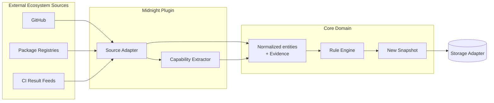
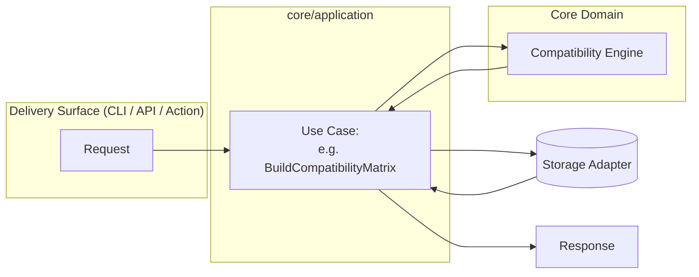
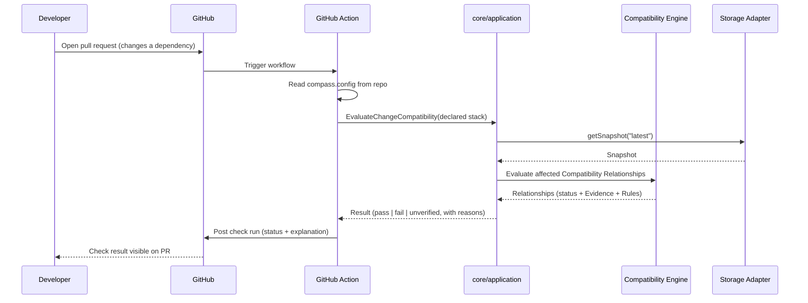
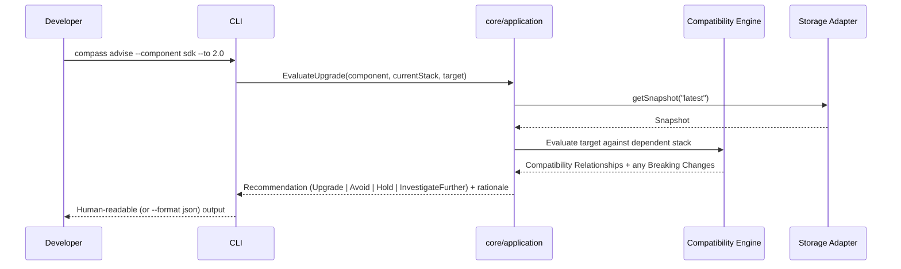
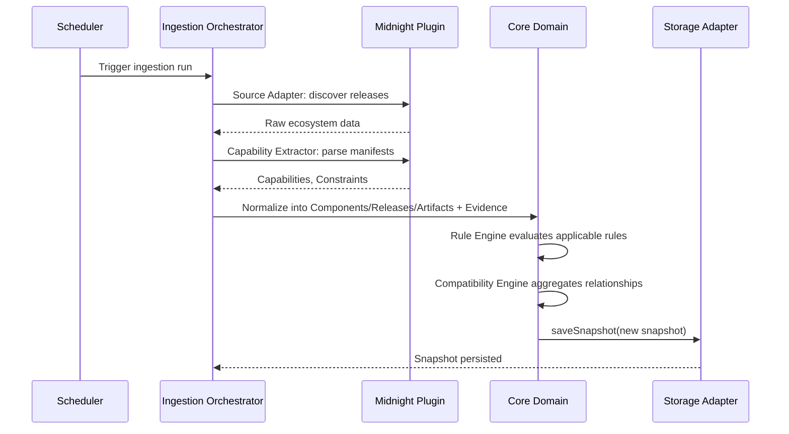

# Data Flow & Sequence Diagrams

These trace the same architecture described in [compatibility-engine.md](compatibility-engine.md), [knowledge-graph.md](knowledge-graph.md), and [interfaces.md](interfaces.md) through time, for the three flows that matter most in practice: getting ecosystem data in, answering a query, and gating a pull request. The shapes below are accurate; the illustrative command name (`compass advise`) and `compass.config` reference predate the shipped `forge-midnight` CLI and its actual flag-based configuration — see [interfaces.md](interfaces.md#cli) for the real command surface.

## Data Flow: Ingestion

How raw ecosystem data becomes a new Knowledge Graph snapshot.

Ingestion runs on a schedule and never blocks a query — see [cross-cutting-concerns.md](cross-cutting-concerns.md#performance-assumptions) for why that separation matters for CI latency.

## Data Flow: Query

How a delivery surface answers a question, against the latest completed snapshot.

Queries are read-only against an existing snapshot. They never trigger ingestion — a slow external source cannot make a query slow.

## Sequence: CI Compatibility Check on a Pull Request

The Action never re-ingests the ecosystem inline — it evaluates the PR's declared stack against the most recent completed snapshot, which is what keeps this fast enough to gate a merge (see [interfaces.md](interfaces.md#github-action)).

## Sequence: CLI Upgrade Advisor Query

## Sequence: Scheduled Ingestion Run

A failure at any plugin step is isolated to the data that plugin was responsible for — see [cross-cutting-concerns.md](cross-cutting-concerns.md#error-handling-strategy) for how partial ingestion failure is handled without discarding an otherwise-good snapshot.
