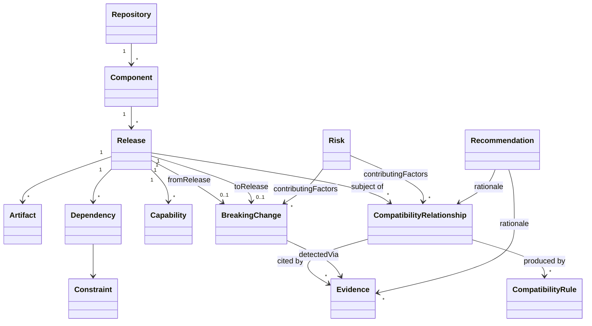

# Domain Model

## Purpose

This document defines the vocabulary the Compatibility Intelligence core reasons in — the entities and value objects every other part of the architecture is built from. Nothing in this document knows about Midnight, GitHub, npm, or any other concrete ecosystem or source. That is the point: an ecosystem plugin's entire job is to produce instances of these types from whatever raw data its ecosystem actually publishes. If a concept here can't be filled in by a plugin without ecosystem-specific hardcoding elsewhere in the core, the model is wrong and should be fixed before anything is built on top of it.

## Modeling Choices, Stated Up Front

Two decisions shape everything below, so it's worth naming them before the entity list:

**Repository and Component are not the same thing.** A repository is where source lives; a component is an independently versioned, independently released unit. Most of the time these are 1:1, but a monorepo publishing several packages is a single repository producing several components — collapsing the two would make that ordinary case unrepresentable.

**Package is a kind of Artifact, not a separate entity.** An artifact is anything a release produces — a package, a binary, compiled contract output, generated documentation. A package is specifically the kind other releases can declare a dependency on. Giving it a separate entity would duplicate everything a generic artifact already needs (a release it belongs to, a type, a location) for no additional expressive power.

## Entities

### Repository

A source code repository. The unit ingestion plugins discover first; everything else is reached through it.

`id · url · hostingPlatform · components[]`

### Component

An independently versioned, independently released unit of an ecosystem — a library, an SDK, a runtime, a compiler toolchain, an application, a template. Everything Compass reasons about compatibility for is a Component.

`id · name · type (SDK | Runtime | Toolchain | Application | Template | Tool | CLI | Library | Framework | Contract | Documentation) · repository`

`type` is what lets rules distinguish "this is an SDK" from "this is a runtime" without special-casing individual names. Runtime is a first-class `type`, not a separate entity, because a runtime *is* an independently released, versioned thing — a node or protocol release — that other components declare compatibility against; it doesn't need a different shape, just a different relationship pointed at it (see `TargetsRuntime`, below). The five later values (`CLI`, `Library`, `Framework`, `Contract`, `Documentation`) were added, additively, when the [Midnight plugin](midnight-plugin.md) needed to classify real repositories this set didn't yet distinguish — exactly the extension path this section already anticipated: existing values are never renamed or removed, only grown.

### Release

A specific published version of a Component.

`id · component · version · publishedAt · artifacts[] · dependencies[] · capabilities[]`

Releases are immutable once ingested. A republished or yanked version is a new fact recorded against the same release, not a mutation of history — this is what keeps the knowledge graph's later snapshots trustworthy (see [knowledge-graph.md](knowledge-graph.md)).

### Artifact

A concrete output a release produced.

`id · release · type (Package | Binary | CompiledContract | Documentation | Other) · locator`

A **Package** is simply an `Artifact` with `type = Package` — the kind of artifact that carries registry coordinates and can be the target of a `Dependency`.

### Compatibility Rule

A declarative statement, supplied by an ecosystem's rule pack, that evaluates a condition over two releases (or a release and a runtime) and produces a conclusion.

`id · description · appliesTo · condition (Constraint expression) · conclusion (Compatible | Incompatible | RequiresConstraint) · rulePack`

Rules never execute arbitrary code — see [ADR 0005](../adr/0005-declarative-rule-model.md) for why, and [compatibility-engine.md](compatibility-engine.md) for how they're evaluated.

### Breaking Change

A specific, identified change between two releases of the *same* component that invalidates a previously valid compatibility relationship or alters a capability.

`id · component · fromRelease · toRelease · affectedCapability? · description · detectedVia (Evidence)`

### Evidence

The atomic unit of provenance. Every conclusion Compass produces — a compatibility relationship, a breaking change, a risk level — must be able to point to the Evidence that produced it.

`id · subject · sourceType (DeclaredMetadata | ObservedResult | MaintainerDeclaration | CommunityReport) · producedBy (plugin/run) · payload · collectedAt · snapshot`

`sourceType` is a small, closed enum describing *what kind of fact this is*, not a fuzzy numeric confidence score — see [ADR 0006](../adr/0006-evidence-mandatory-fail-closed.md) for why that distinction matters.

### Risk

A derived signal summarizing unresolved incompatibility or staleness exposure over a component or a declared stack. Always computed, never authored directly.

`id · scope · level (Low | Medium | High) · contributingFactors[] (relationships, breaking changes, evidence) · snapshot`

### Recommendation

An actionable, derived suggestion — the output the Upgrade Advisor and CI check ultimately hand to a consumer.

`id · subject · action (Upgrade | Avoid | Hold | InvestigateFurther) · targetRelease? · rationale[] (evidence/relationship references)`

## Value Objects

**Version** — an ecosystem-pluggable version identifier. Most ecosystems use semantic versioning; the core treats version comparison as a pluggable scheme rather than assuming semver universally, since not every artifact type (compiled contracts, protocol versions) necessarily follows it.

**Constraint** — an expression limiting acceptable versions or capabilities: a version range, a required capability (optionally with its own version constraint), or a composite of other constraints via AND / OR / NOT. This is the shared expression language both `Dependency` declarations and `Compatibility Rule` conditions are built from.

**Capability** — a named, versioned feature a release provides or requires (e.g., a specific proof format, a specific contract language level), attached to a `Release` with a direction (`Provided` or `Required`). Capabilities are what let compatibility reasoning go beyond raw version numbers: two releases can be compatible across a major version bump if the capability they share is unchanged, or incompatible within a patch bump if it silently changed.

**Dependency** — a declared edge from a `Release` to a required `Component` (typically its `Package` artifact), expressed as a `Constraint`, with a kind (`Required | Optional | Peer | Dev`). Owned by the `Release` that declares it; it has no independent lifecycle.

**Compatibility Relationship** — the computed statement that two releases are `Compatible`, `Incompatible`, or `Unverified`, carrying the `Compatibility Rule`(s) and `Evidence` that produced it. This is the atomic unit the [Compatibility Engine](compatibility-engine.md) produces and the [Knowledge Graph](knowledge-graph.md) stores as an edge.

## Relationships at a Glance

## Invariants

These hold regardless of ecosystem, and are enforced in the domain layer, not left to convention:

1. **A Compatibility Relationship with zero Evidence is `Unverified` by construction.** Absence of data is never silently interpreted as compatible or incompatible.
2. **Every derived conclusion is traceable.** A Compatibility Relationship, Breaking Change, Risk level, or Recommendation always stores exactly which Rules and Evidence produced it — nothing is asserted without a pointer back to why.
3. **Releases are immutable once ingested.** New facts about a release are recorded as new Evidence, never as a mutation of a previously ingested Release.
4. **A Breaking Change always spans two releases of the same Component.** It never mixes components — cross-component impact is represented through Compatibility Relationships, not Breaking Changes.
5. **Risk and Recommendation are always derived, never authored directly.** Neither can exist without underlying Compatibility Relationships, Breaking Changes, or Evidence to point to — there is no path to inject a risk score or recommendation that isn't traceable to the data below it.

## Where This Model Comes From, and Where It Doesn't

Every entity above is justified by a query in [use-cases.md](../use-cases.md) or a capability in [roadmap.md](../roadmap.md) — nothing here exists because it seemed architecturally complete. If a future capability needs a concept this model doesn't have, that's a reason to extend this document deliberately (and record why, as an ADR if the extension is significant), not to smuggle a new shape into an existing entity's fields.
