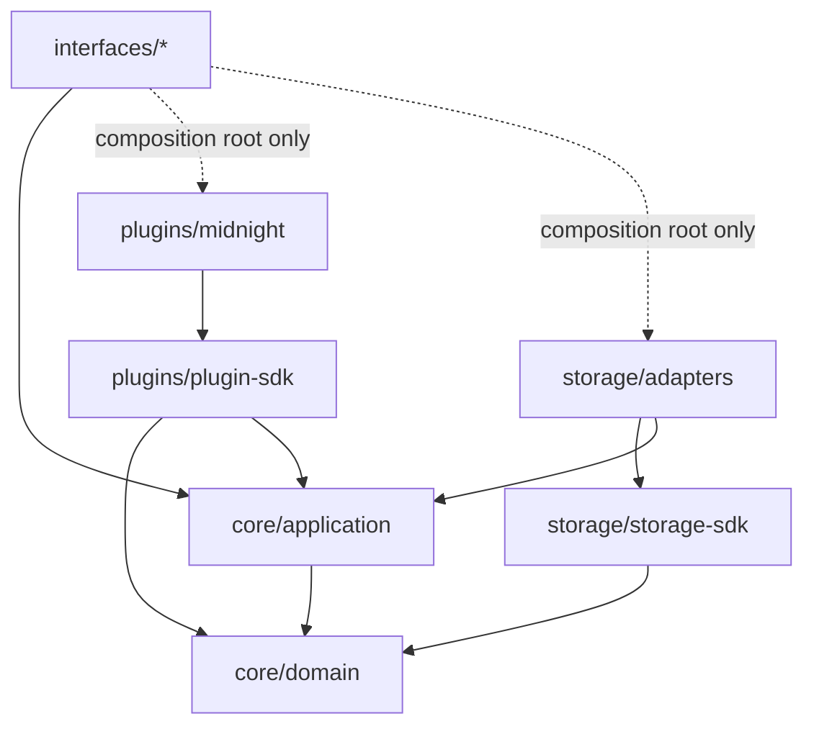

# Repository Structure, Module Responsibilities & Dependency Rules

## Status

This describes the logical module layout and the rules governing how modules may depend on each other. It intentionally does not name a language, build tool, or package manager — those are implementation-phase decisions and belong in their own ADR once written. What's fixed here is the shape and the boundaries, because those are what protect the architecture from erosion regardless of what technology ends up implementing them.

## Layout

```
/compass
├── core/
│   ├── domain/              # Entities, value objects, invariants — see domain-model.md
│   ├── application/         # Use cases + ports (interfaces the outside world must implement)
│   └── testing/              # Shared fixtures/builders for domain objects, used by every other module's tests
├── plugins/
│   ├── plugin-sdk/           # The contract a plugin implements: Source Adapter, Capability Extractor, Rule Pack ports
│   └── midnight/              # First-party Midnight plugin — the only place Midnight-specific knowledge lives
│       ├── ingestion/
│       ├── capability-extraction/
│       └── rules/
├── storage/
│   ├── storage-sdk/          # The SnapshotRepository port + shared snapshot types
│   └── adapters/              # Concrete implementations of the port (see knowledge-graph.md)
├── interfaces/
│   ├── cli/
│   ├── github-action/
│   ├── api/                   # Machine-readable query surface — see api-contracts.md
│   └── dashboard/              # Presentation layer, client of api/ only
└── docs/
```

## Module Responsibilities

**`core/domain`** — The vocabulary in [domain-model.md](domain-model.md): entities, value objects, and the invariants that hold regardless of ecosystem. Pure data and pure functions. No I/O, no framework, no knowledge that anything outside this module exists.

**`core/application`** — Use cases that orchestrate domain objects to answer the questions in [use-cases.md](../use-cases.md): build a compatibility matrix, evaluate an upgrade, detect breaking changes, compute risk. Defines the ports (interfaces) everything outside the core must implement to participate: a port for supplying ecosystem data, a port for persisting and retrieving snapshots, a port for the current time (so evaluation is reproducible in tests). This module knows *what* it needs from the outside world and defines the shape of that need; it never knows *how* that need gets fulfilled.

**`core/testing`** — Fixtures, builders, and in-memory fake implementations of the application ports (a fake plugin, an in-memory snapshot store), shared across the test suites of every other module so nothing has to reinvent a way to construct a valid `Release` or a fake `SnapshotRepository`.

**`plugins/plugin-sdk`** — The versioned contract a plugin implements, and nothing else: interfaces for a Source Adapter, a Capability Extractor, and a Rule Pack, plus a conformance test suite every plugin must pass. This module depends on `core/domain` and the port definitions in `core/application`, and on nothing else — a plugin author should never need to reach into `interfaces/` or `storage/` to write a plugin.

**`plugins/midnight`** — The first-party ecosystem plugin. Everything Midnight-specific — which repositories to watch, how to parse a Midnight SDK manifest, what Midnight's own compatibility rules are — lives here and only here. If this module were deleted, `core/` would still compile, test, and mean something; it would simply have no ecosystem to reason about. That property is the whole point of the plugin architecture (see [ADR 0001](../adr/0001-independent-compatibility-domain-model.md) and [plugin-architecture.md](plugin-architecture.md)).

**`storage/storage-sdk`** — The `SnapshotRepository` port `core/application` depends on, and the snapshot types that cross that boundary. Depends only on `core/domain`.

**`storage/adapters`** — Concrete implementations of the storage port. See [knowledge-graph.md](knowledge-graph.md) for why the first one is deliberately simple.

**`interfaces/cli`, `interfaces/github-action`, `interfaces/api`, `interfaces/dashboard`** — Driving adapters. Each translates its surface's native input (argv, a webhook payload, an HTTP request, a UI interaction) into a call against a `core/application` use case, and translates the result back into its surface's native output. See [interfaces.md](interfaces.md). Each owns a composition root — the one place it's allowed to know concretely which plugin and storage adapter implementations exist and wire them together.

## Dependency Rules



The rules this diagram encodes, stated plainly:

1. **`core/domain` depends on nothing else in the repository.** It is the one module every dependency arrow points toward, directly or transitively.
2. **`core/application` depends only on `core/domain`.** It defines ports as interfaces; it never imports a concrete plugin or a concrete storage adapter.
3. **Plugins depend on `plugins/plugin-sdk`, which depends only on `core/domain` and `core/application`'s port definitions.** Plugins never depend on `interfaces/*`, and never depend on each other.
4. **Storage adapters depend on `storage/storage-sdk` and implement `core/application`'s storage port.** They never depend on plugins or interfaces.
5. **Interfaces depend on `core/application` for all business logic.** They may depend on concrete plugins and storage adapters *only* at their composition root — the single wiring point where "which plugin, which storage backend" is decided — never scattered through the rest of the interface's code.
6. **No inward dependency ever crosses from `plugins/`, `storage/`, or `interfaces/` back into being depended upon by `core/`.** `core` does not know these modules exist.

This is not aspirational — it is enforced. A dependency-direction lint (whatever the equivalent is in the chosen implementation stack — import-boundary linting is available in effectively every modern language toolchain) runs in CI as a required check, alongside tests. A pull request that adds an import violating this graph fails CI the same way a failing test would, for the same reason Compass asks the rest of the Midnight ecosystem to gate merges on compatibility: a rule that isn't enforced gets violated exactly when time pressure makes violating it tempting.

## Why This Shape

The payoff shows up in what doesn't have to change when the ecosystem or the product grows: a second ecosystem plugin is a new sibling under `plugins/`, never a change to `core/`. A second storage backend is a new sibling under `storage/adapters/`, never a change to `core/application`'s port. A new delivery surface — say, a Slack integration — is a new module under `interfaces/` with its own composition root, never a change to how compatibility is computed. Every extension point named in the [plugin architecture](plugin-architecture.md) and the [extension model](plugin-architecture.md#extension-points) is a direct consequence of this dependency graph, not a separate mechanism layered on top of it.
