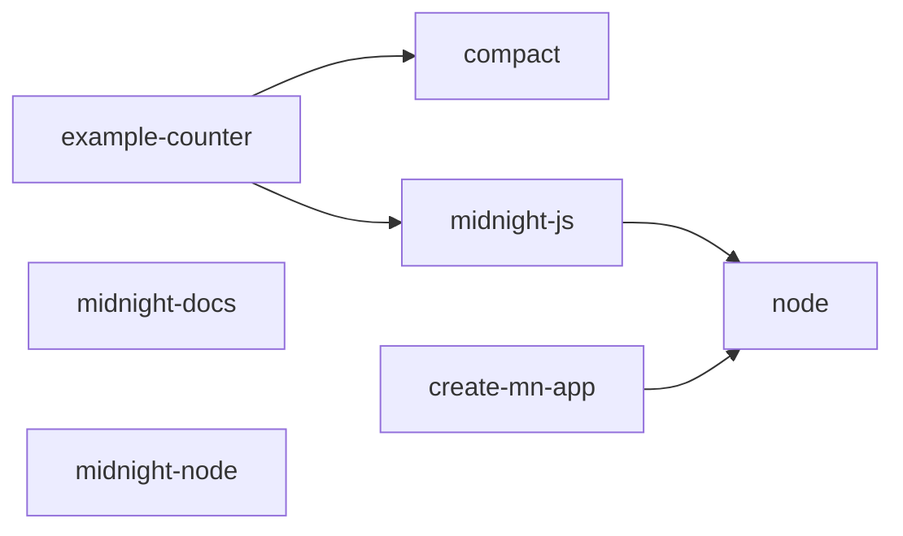

# Demo Package

Everything in this document is real, unedited output — either from the offline demo (`npm run demo`, replaying a fixture recorded once from the real `midnightntwrk` GitHub organization) or from the live CLI against the real GitHub API. Nothing here is mocked up for presentation. Where an example is illustrative rather than direct output, it's labeled as such.

**The finding this whole demo is built around:** `example-counter` — Midnight's own official reference template — declares a dependency on `@midnight-ntwrk/midnight-js` at `^4.0.4`. The tracked SDK release is `5.0.0-beta.6`. Compass found that from the components' own declared metadata, with zero hand-written rule for this specific pair ([ADR 0011](adr/0011-declared-dependency-constraints-are-first-class-compatibility-signal.md)). Screenshots below are that finding, live in the tool.

## Run It — Offline, Zero Network, 30 Seconds

```bash
npm install && npm run build
npm run demo
```

This is **the recommended way to demo Compass**, including in a judging room with no reliable Wi-Fi. It ingests a real, recorded snapshot of the Midnight ecosystem through the exact same engine (`IngestSnapshotUseCase`, the same rule pack, the same reporting layer) that live mode uses — the only difference is where the raw data comes from. It never calls GitHub, never depends on a rate limit, and produces byte-for-byte the same kind of output shown throughout this document.

<p align="center">
  
</p>

It writes `demo-output/matrix.md`, `demo-output/graph.mmd`, `demo-output/pr-comment.md`, and `demo-output/dashboard.html` — open the dashboard in any browser, no server needed:

<p align="center">
  
</p>

## Live Mode — Against the Real GitHub API

```bash
node interfaces/cli/dist/bin.js analyze          # pass --token <github-token> to avoid rate limits
node interfaces/cli/dist/bin.js matrix
node interfaces/cli/dist/bin.js dashboard --out dashboard.html
```

Same commands, same engine, live data instead of a recorded snapshot. Use this to prove the offline demo isn't a special path — run `matrix` both ways and the finding is the same.

## 2-Minute Demo

1. **Run `npm run demo`.** While it runs (under 2 seconds), say: *"This just ingested real release and dependency data recorded from Midnight's own GitHub organization and evaluated every declared compatibility relationship between them. No network call — I want this to work no matter what the Wi-Fi here is doing."*
2. **Point at the terminal's Compatibility Matrix.** `example-counter → midnight-js` is `❌ Incompatible`. Say the finding out loud: *"Midnight's own official reference template declares `midnight-js: ^4.0.4`. The tracked SDK is `5.0.0-beta.6`. Compass caught that from the components' own declared metadata — no rule was hand-written for this pair."*
3. **Open `demo-output/dashboard.html`.** Same finding, same data, a different consumer of the same engine.
4. **Close on the architecture, one sentence:** *"The domain and application layers have never heard of Midnight — everything Midnight-specific comes through one plugin, and the CLI, the GitHub Action, and this dashboard all call the exact same use cases, enforced by a CI boundary check, not a convention."*

## 5-Minute Demo

Everything in the 2-minute version, plus:

5. **Show the GitHub Action's PR comment output** (below, in [Sample Outputs](#sample-outputs)) — the same finding, formatted for a pull request, with a stable marker so it updates in place across pushes instead of spamming the thread.
6. **Run the dependency graph:**
   ```bash
   node interfaces/cli/dist/bin.js graph
   ```
   Show the Mermaid output rendering directly in a GitHub-flavored Markdown viewer — no extra tooling needed to read it.
7. **Open `docs/adr/0012-interfaces-ingest-fresh-per-invocation.md`.** Make the honesty point directly: *"This ADR exists because our own performance assumption from Step 2 turned out to be wrong once we actually built the Action — it ingests fresh every run instead of querying a pre-warmed snapshot, because that snapshot service doesn't exist yet. We wrote that down instead of quietly shipping around it."* This is the single best evidence a judge gets that the engineering discipline claimed in the docs is real.
8. **Run the full verification suite live:**
   ```bash
   npm run ci
   ```
   Build, lint, boundary check, 411+ tests, ~95% coverage — in front of them, not just claimed in a README.
9. **Close on the numbers:** 12 ADRs, zero architecture violations, real data, three consumer surfaces sharing one rendering layer.

## Judge Walkthrough (Self-Guided)

If you have 10–15 minutes and want to verify claims yourself rather than watch a demo:

1. `npm install && npm run build && npm run ci` — confirms build/lint/boundaries/tests all pass from a clean checkout.
2. `npm run demo` — offline, real data, no setup beyond the build.
3. Read [docs/architecture/repository-structure.md](architecture/repository-structure.md), then run `npm run boundaries` yourself and try to find an import that should be forbidden but isn't caught — it's enforced by `.dependency-cruiser.cjs`, not just described.
4. Pick any ADR in [docs/adr/](adr/) at random and check whether the code actually does what it says. [ADR 0011](adr/0011-declared-dependency-constraints-are-first-class-compatibility-signal.md) → `core/domain/src/compatibility-engine.ts`'s `evaluateCompatibility`. [ADR 0006](adr/0006-evidence-mandatory-fail-closed.md) → try to construct a `CompatibilityRelationship` with status `compatible` and no evidence in a test file; the domain layer's invariant-enforcing factory function rejects it.
5. Look for the deliberately disclosed gaps: [ADR 0012](adr/0012-interfaces-ingest-fresh-per-invocation.md) (Action performance), [docs/faq.md](faq.md)'s "Is this production-ready?" answer, and this document's own [breaking-change example](#example-breaking-change-report) caveat below. A submission that only shows you what works isn't the same claim as one that also shows you what doesn't, yet.

## Sample Outputs

### `forge-midnight --help`

<p align="center">
  
</p>

### Example Compatibility Analysis — `forge-midnight matrix`, real output

```markdown
| Component | Depends on | Status | Relationships |
|---|---|---|---|
| create-mn-app | node | ❌ Incompatible | 3 |
| example-counter | compact | ❌ Incompatible | 6 |
| example-counter | midnight-js | ❌ Incompatible | 8 |
| midnight-js | node | ❌ Incompatible | 3 |
```

Every cell aggregates multiple release-pair relationships to the worst status found ("incompatible" beats "unverified" beats "compatible") — `example-counter` → `compact` shows `❌` at the aggregate level even though the specific pairing against the latest tracked `compact` release (embedded Compact language `0.23.0`) is actually `✅ compatible` with `example-counter`'s `pragma language_version >=0.20`; older tracked `compact` releases in the matrix are not. The aggregate view is honest about the worst case; `forge-midnight compatibility` gives the release-pair-specific answer when that's what you need.

### GitHub Action PR Comment — real output

```markdown
<!-- forge-midnight:compatibility-report -->
## 🧭 Compass Compatibility Report

❌ **Incompatibilities found** — see below.

### Compatibility Matrix

| Component | Depends on | Status | Relationships |
|---|---|---|---|
| create-mn-app | node | ❌ Incompatible | 3 |
| example-counter | compact | ❌ Incompatible | 6 |
| example-counter | midnight-js | ❌ Incompatible | 8 |
| midnight-js | node | ❌ Incompatible | 3 |

### Ecosystem Risk

- 🔴 **nodejs/node** — High (6 contributing factor(s))
- 🔴 **midnightntwrk/midnight-js** — High (11 contributing factor(s))
- 🔴 **midnightntwrk/compact** — High (6 contributing factor(s))
- 🔴 **midnightntwrk/example-counter** — High (14 contributing factor(s))
- 🔴 **midnightntwrk/create-mn-app** — High (3 contributing factor(s))

<sub>Every result above is traceable to specific Evidence recorded during ingestion — see `docs/architecture/compatibility-engine.md` for how conclusions are reached. This report never guesses.</sub>
```

### Dependency Graph — real output (Mermaid, renders directly in GitHub)



(Node ids are synthesized from each component's real id — `owner/repo`, sanitized to Mermaid's identifier rules — not simplified for this document; see `renderDependencyGraphMermaid` in `interfaces/reporting/src/dependency-graph.ts`.)

### Example Breaking Change Report

The Breaking Change Analyzer (`forge-midnight breaking-changes --component <id> --from <snapshotId> --to <snapshotId>`) compares one component's latest release across two *persisted* snapshots — it needs real history over time (`--db`), which a single point-in-time fixture can't demonstrate. Its behavior is fully tested (`core/application/test/analyze-breaking-change-impact.use-case.test.ts`); the shape of its real output, rendered by the same `interfaces/reporting` function the CLI and Action both use:

```markdown
### Breaking Change Report: midnight-js

Comparing `midnight-js@4.0.4` → `midnight-js@5.0.0-beta.6`

**Added capabilities**
- zk-proof-v2

**Removed capabilities**
- `legacy-witness-format` — capability legacy-witness-format was removed

**Changed dependency constraints**
_None._

**Affected components**
- example-counter

**Risk:** 🔴 High (2 contributing factor(s))
```

To generate a real one: run `forge-midnight analyze --db compass.db` today, run it again after the ecosystem's next release, then `forge-midnight breaking-changes --component midnightntwrk/midnight-js --from <first-snapshot-id> --to <second-snapshot-id>`.

## Hackathon Presentation Outline

1. **The gap** (30s) — Midnight is N independently-versioned components; nothing records what works with what; teams find out from a broken build.
2. **The bet** (30s) — deterministic, evidence-cited, not AI-guessed. Show [ADR 0002](adr/0002-deterministic-rule-based-compatibility-engine.md) for 5 seconds.
3. **Live proof** (60–90s) — the 2-minute demo above, run for real, offline.
4. **The architecture that makes it trustworthy** (60s) — one engine, three consumers, one CI-enforced boundary; a bug can only ever be a rendering bug outside `core/`.
5. **The honesty** (30s) — ADR 0012, disclosed not hidden. This is the line that separates a hackathon demo from an engineering artifact.
6. **What's next** (15s) — scheduled ingestion service, hosted API, second ecosystem plugin as a template for growth — see [roadmap.md](roadmap.md).
