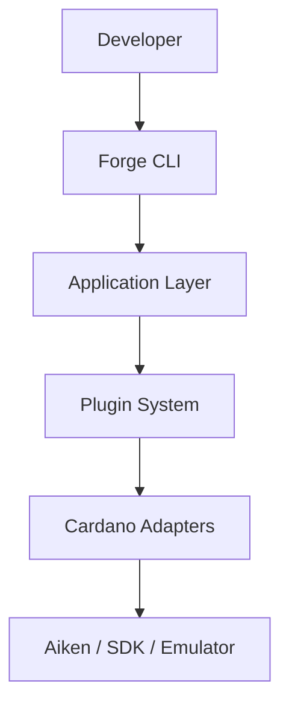

# Forge

**The AI-native developer platform for Cardano.** Describe a smart contract
in plain English; get back a real, compiled Aiken project, a typed
TypeScript SDK, passing tests, and a deployment artifact — with the
language model kept strictly out of the one place it can't be trusted:
writing the blockchain logic itself.

```bash
$ forge build "Build an escrow smart contract with milestone-based payments"
```

Built for the **IndiaCodeX Cardano Hackathon**. Status: feature-complete,
in the polish phase. See [`docs/DevelopmentProgress.md`](docs/DevelopmentProgress.md)
for the full build history.

---

## Table of contents

- [Problem statement](#problem-statement)
- [Why Forge?](#why-forge)
- [Features](#features)
- [Architecture](#architecture)
- [Quick start](#quick-start)
- [Demo](#demo)
- [Screenshots](#screenshots)
- [Project layout](#project-layout)
- [Roadmap](#roadmap)
- [Documentation](#documentation)
- [Contributing](#contributing)
- [License](#license)

---

## Problem statement

Cardano has excellent individual developer tools — Aiken as a modern
validator language, Lucid Evolution and Mesh for off-chain transaction
building, Blockfrost/Ogmios/Kupo for chain access — but no project owns
the integration between them. In practice, every team:

- hand-assembles its own project structure before writing any business
  logic,
- hand-writes TypeScript types for a validator's datum/redeemer with no
  compiler-enforced link back to the actual Aiken source (a shape change
  becomes a silent runtime failure, not a build error),
- hand-rolls its own deployment-tracking scheme (or skips it — deployment
  addresses often live in someone's notes, not in git), and
- has no systematic check for eUTxO-specific bugs like double
  satisfaction, which have no equivalent on account-based chains and no
  generic tool catches.

None of this is a flaw in Aiken, Lucid, or Blockfrost — it's a gap in
what sits _between_ them. See [`docs/Vision.md`](docs/Vision.md) for the
full problem analysis.

## Why Forge?

Forge unifies scaffolding, compilation, typed SDK generation, testing,
and deployment behind one platform — and adds a natural-language entry
point on top, with one non-negotiable design rule:

> **The language model never generates blockchain logic.** Its only two
> responsibilities are interpreting intent and narrating decisions the
> platform already made deterministically. A separate, deterministic
> template engine is the only thing that ever writes Aiken source.

This is the one architectural decision everything else follows from —
see [`docs/adr/ADR-003-ai-as-intent-parser-only.md`](docs/adr/ADR-003-ai-as-intent-parser-only.md).
It's also why the AI backend (`@forge/adapter-ai`) is local and
dependency-free: a task this narrow (classify among a few templates,
pull a number out of a sentence) doesn't need a hosted API call, and a
live demo should never be able to fail because of a network blip.

| Traditional development       | Forge                                               |
| ----------------------------- | --------------------------------------------------- |
| Set up project manually       | ✓ Automated                                         |
| Write boilerplate             | ✓ Generated                                         |
| Configure the compiler        | ✓ Automated                                         |
| Generate a typed SDK          | ✓ Automated                                         |
| Compile the contract          | ✓ Automated                                         |
| Run the emulator              | ✓ Automated                                         |
| Generate deployment artifacts | ✓ Automated                                         |
| AI assistance                 | Intent parsing only — never writes contract code    |
| Security model                | Deterministic, audited templates — not AI-generated |

## Features

| Capability                                                 | Package                       | Status                                                   |
| ---------------------------------------------------------- | ----------------------------- | -------------------------------------------------------- |
| Real Aiken compilation (`aiken build`/`aiken check`)       | `adapter-aiken`               | ✅ Real                                                  |
| CIP-57 blueprint parsing                                   | `adapter-aiken`               | ✅ Real                                                  |
| Deterministic contract generation from an audited template | `contract-templates`          | ✅ Real (3 templates: escrow, NFT royalty mint, vesting) |
| Typed TypeScript SDK generation from a blueprint           | `adapter-codegen-ts`          | ✅ Real                                                  |
| In-memory UTxO emulator for fast tests                     | `adapter-emulator`            | ✅ Real (generic scenario check — see limitations)       |
| Natural-language intent parsing & parameter extraction     | `adapter-ai`                  | ✅ Real, local, no hosted API                            |
| Confidence-gated template matching (`--min-confidence`)    | `application`                 | ✅ Real — refuses to scaffold a low-confidence guess     |
| Real CIP-19 deployment address + versioned manifest        | `adapter-providers`           | ✅ Real                                                  |
| `forge build "<description>"` CLI                          | `cli`                         | ✅ Real                                                  |
| Explainability (`forge explain` / inline "why" output)     | `application`                 | ✅ Real                                                  |
| Plugin system (ports + hooks, built-ins are plugins too)   | `plugin-api`, `plugin-loader` | ✅ Real                                                  |
| Security-pattern test generator (`ai-testgen`)             | —                             | 🔜 Roadmap                                               |
| Real off-chain transaction building / execution            | —                             | 🔜 Roadmap                                               |

See [`docs/FinalEngineeringReport.md`](docs/FinalEngineeringReport.md) for
the full feature matrix with test coverage per item.

## Architecture

Clean Architecture, strictly enforced: dependencies point inward only.
Nothing in `domain` or `application` knows about Aiken binary paths or a
CLI framework — those live in the outer layers, swapped via ports.



Each box above is swapped via a port — `domain` and `application` never
import an adapter directly. The full layered breakdown (Domain →
Application → Plugin API → Adapters → External Tools) and the build-flow
diagram live in [`docs/Architecture.md`](docs/Architecture.md). The six
architecture decisions worth reading first are in
[`docs/adr/`](docs/adr/).

## Quick start

Requirements: Node.js ≥ 22.13, [pnpm](https://pnpm.io) (pinned via
`packageManager` in `package.json` — `corepack enable` picks it up
automatically).

```bash
git clone <this-repo>
cd forge
pnpm install
pnpm build

# Run the full pipeline against the real Aiken compiler:
node packages/cli/dist/bin.js build "Build an escrow smart contract with milestone-based payments"
```

The first `aiken build` needs network access once, to fetch
`aiken-lang/stdlib`; subsequent runs are fully offline.

```bash
pnpm test              # fast unit suite — 150 tests, fully offline, a few seconds
pnpm test:integration   # real Aiken compiler + real network — 8 tests, under a minute
```

## Demo

```
$ forge build "Build an escrow smart contract with milestone-based payments"

Forge — building "Build an escrow smart contract with milestone-based payments"
(The model only classifies intent and extracts parameters — it never writes Aiken source; the deterministic template engine does.)

→ Scaffolded escrow-smart-contract
→ Compiling with the real Aiken compiler...
  compiled 1 validator(s) — CIP-57 blueprint parsed
→ Generated the typed TypeScript SDK
→ Running tests against the in-memory emulator...
  1 passed, 0 failed
→ Computing the deployment address on preview...
  address: addr_test1wqhkd0vf60ud73jnyysf3jp3y5m43ey4w6ayp526w226yxsh5zj26

Done.

Project:      /path/to/escrow-smart-contract
Contract:     validators/escrow_milestone.ak
Blueprint:    1 validator(s), plutus v3
Typed SDK:    sdk/generated/index.ts
Tests:        1 passed, 0 failed
Deployment:   addr_test1wqhkd0vf60ud73jnyysf3jp3y5m43ey4w6ayp526w226yxsh5zj26
Docs:         GENERATED_README.md

Why this template:
  • Selected template "Escrow with Milestone Payments", because intent category "escrow-milestone" exactly matches template category "escrow-milestone" and intent parsing confidence was 0.64 and match score 0.64 of 1.00.

Why these parameters:
  • "milestoneCount" = 3, because not present (or the wrong type) in the extracted parameters; used the template default and the total number of milestones the escrow is split into.
```

Captured verbatim from a real run in this repository — nothing above is
staged. See [`docs/DemoPlan.md`](docs/DemoPlan.md) for the full 5-minute
walkthrough script.

### Multiple templates, correctly disambiguated

Three templates exist today, each a real, audited Aiken contract:

1. **Escrow with Milestone Payments**
   Use Cases: Freelancing · Construction · Project funding
2. **NFT Minting with Royalties**
   Use Cases: NFT marketplaces · Creator royalties
3. **Token Vesting**
   Use Cases: Employee token vesting · Investor lockups

The same command, two different real-world descriptions, two different
real, compiled contracts — captured verbatim, same as above:

```
$ forge build "Mint an NFT collection with an 8% royalty on every sale"
...
Contract:     validators/nft_minting_royalty.ak
...
Why this template:
  • Selected template "NFT Minting with Royalties", because intent category "nft-minting-royalty" exactly matches template category "nft-minting-royalty" and intent parsing confidence was 0.69 and match score 0.69 of 1.00.
Why these parameters:
  • "royaltyPercent" = 8, because extracted from the description ("royaltyPercent" = 8) and the royalty percentage (0-100) paid to the royalty beneficiary on every mint.

$ forge build "Create a token vesting contract with a 6-period unlock schedule"
...
Contract:     validators/token_vesting.ak
...
Why this template:
  • Selected template "Token Vesting", because intent category "token-vesting" exactly matches template category "token-vesting" and intent parsing confidence was 0.69 and match score 0.69 of 1.00.
Why these parameters:
  • "vestingPeriods" = 6, because extracted from the description ("vestingPeriods" = 6) and the number of equal tranches the vesting schedule is split into.
```

See [`packages/contract-templates/README.md`](packages/contract-templates/README.md)
for what each template actually does and why. A description that doesn't
confidently match any of them is rejected outright, not guessed at — also
captured verbatim, real error, real exit code:

```
$ forge build "I want to build a decentralized voting system for governance proposals"

No supported template matched this description with sufficient confidence (detected confidence 0.30, required at least 0.60). Try rephrasing the description, or lower --min-confidence if this is intentional.

Supported Smart Contract Templates

1. Escrow with Milestone Payments
   Use Cases:
   • Freelancing
   • Construction
   • Project funding

2. NFT Minting with Royalties
   Use Cases:
   • NFT marketplaces
   • Creator royalties

3. Token Vesting
   Use Cases:
   • Employee token vesting
   • Investor lockups
```

See [Why Forge?](#why-forge) and
[ADR-006](docs/adr/ADR-006-confidence-gated-template-matching.md) for why
this rejects instead of guessing.

## Screenshots

Forge is CLI-first, so its "screenshots" are terminal captures — the
[Demo](#demo) section above is the primary one. A recorded
asciinema/GIF walkthrough is on the roadmap for a future submission
update; this repository doesn't ship one yet.

## Project layout

```
packages/
├── domain/              # pure entities, zero dependencies
├── plugin-api/          # the plugin/port/hook contract
├── application/         # use cases + ports + PlatformRegistry
├── plugin-loader/       # dependency-ordered plugin bootstrapping
├── platform-sdk/        # @forge/sdk — the Forge facade
├── adapter-aiken/        # real Aiken compiler integration
├── contract-templates/  # the Forge Engine + audited templates
├── adapter-codegen-ts/  # Blueprint -> typed TS SDK
├── adapter-emulator/    # in-memory UTxO ledger
├── adapter-filesystem/  # real IFileSystemPort
├── adapter-providers/   # real CIP-19 address + deployment store
├── adapter-ai/          # real, local ILanguageModelPort
└── cli/                 # the `forge` command
docs/
├── adr/                 # 6 Architecture Decision Records
└── *.md                 # Vision, PRD, Architecture, competitive analysis, ...
```

Every package's own `README.md` explains its specific responsibility.
See [`docs/FinalEngineeringReport.md`](docs/FinalEngineeringReport.md)
for the full dependency graph.

## Roadmap

- **`ai-testgen`** — the deterministic eUTxO vulnerability rule engine
  (double satisfaction, missing signer checks, etc.) plugged in as a real
  test generator.
- **A fourth contract template and beyond** — three templates
  (escrow-with-milestones, NFT minting with royalty, token vesting) prove
  the template-authoring process scales; growing the library further is
  now a content problem, not an architecture problem.
- **Real off-chain transaction building** (a real `ITxBuilderPort`
  implementation) and Plutus execution in the emulator, so
  `adapter-emulator` can evaluate actual redeemer logic instead of a
  generic spendable-UTxO check.
- **`adapter-devnet`** (real local devnet) and expanded chain providers
  (Maestro, Ogmios+Kupo) alongside the current Blockfrost-shaped path.
- **Additional presentation layers** (VS Code extension, web playground)
  built on the same `@forge/sdk` facade the CLI uses today.

Full detail, including what's explicitly _not_ planned and why, in
[`docs/PRD.md`](docs/PRD.md) and [`docs/FinalEngineeringReport.md`](docs/FinalEngineeringReport.md).

## Documentation

| Doc                                                                | Covers                                                          |
| ------------------------------------------------------------------ | --------------------------------------------------------------- |
| [`docs/Vision.md`](docs/Vision.md)                                 | Problem, why now, why Cardano                                   |
| [`docs/PRD.md`](docs/PRD.md)                                       | Users, requirements, MVP scope                                  |
| [`docs/Architecture.md`](docs/Architecture.md)                     | Layered architecture, build-flow diagram, ports and use cases   |
| [`docs/adr/`](docs/adr/)                                           | The 5 key architectural decisions, with alternatives considered |
| [`docs/CompetitiveAnalysis.md`](docs/CompetitiveAnalysis.md)       | vs. Hardhat, Foundry, Anchor, Brownie, Truffle                  |
| [`docs/BusinessCase.md`](docs/BusinessCase.md)                     | Why this should exist, for reviewers and funders                |
| [`docs/DemoPlan.md`](docs/DemoPlan.md)                             | The 5-minute demo script                                        |
| [`docs/DevelopmentProgress.md`](docs/DevelopmentProgress.md)       | Phase-by-phase build log                                        |
| [`docs/ProductionReadiness.md`](docs/ProductionReadiness.md)       | Honest strengths/weaknesses/security assessment                 |
| [`docs/JudgePreparation.md`](docs/JudgePreparation.md)             | Pitches (30s/2min/5min) + FAQ                                   |
| [`docs/FinalEngineeringReport.md`](docs/FinalEngineeringReport.md) | Architecture summary, feature matrix, known limitations         |

## Contributing

Contributions are welcome. Start with
[`CONTRIBUTING.md`](CONTRIBUTING.md) for local setup and PR expectations,
and [`CODE_OF_CONDUCT.md`](CODE_OF_CONDUCT.md) for community standards.
Changes to `domain`, `plugin-api`, or `application` (the platform's
stable contract) get a higher review bar than changes to an individual
adapter — see `CONTRIBUTING.md` for why.

## License

[Apache-2.0](LICENSE) — consistent with Aiken and the broader
IntersectMBO/Cardano tooling ecosystem.
