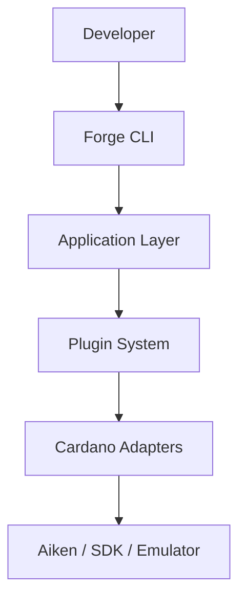
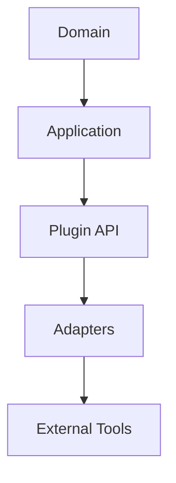
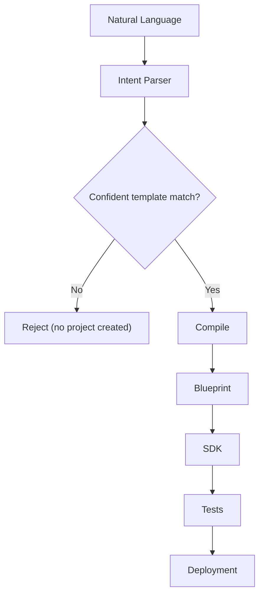

# Technical Architecture

This document is the living technical reference. If code and this document
disagree, that's a bug in one of them — update this file whenever a package
boundary, port, or hook changes.

Related: [Vision.md](./Vision.md) (why), [PRD.md](./PRD.md) (what),
[CompetitiveAnalysis.md](./CompetitiveAnalysis.md) (how this compares).

This document uses three diagrams, deliberately kept simple: the overall
architecture, the clean-architecture layering, and the build flow. Every
other detail below is explained in text and tables rather than additional
diagrams.

## Diagram 1 — Overall architecture



The CLI is the one real presentation layer today; the Application Layer
contains all use cases and ports; the Plugin System is how every adapter
(built-in or third-party) registers itself; the adapters are what actually
talk to Aiken, generate the TypeScript SDK, and run the in-memory emulator.

## Diagram 2 — Clean Architecture layering



Dependencies point strictly inward only. Nothing in `domain` or
`application` knows about Aiken binary paths, the in-memory emulator's
internals, or a CLI framework — those live in the outer layers and are
swapped via ports.

- **Domain** — pure entities, zero runtime dependencies: `Project`,
  `Blueprint`, `ValidatorBlueprint`, `Network`, `DeploymentManifest`,
  `TestScenario`, `Wallet`, `Utxo`, `ContractIntent`, `ContractTemplate`,
  `ContractParameters`, `GeneratedContract`, `Rationale`, `Explanation`,
  `ReviewReport`.
- **Application** — 12 use cases (`ScaffoldProject`, `Compile`,
  `GenerateSdk`, `RunTests`, `Deploy`, `GenerateSecurityTests`,
  `GenerateContract`, `SelectTemplate`, `ReviewContract`, `Explain`,
  `GenerateDocs`, `BuildFromDescription`), 10 ports (`IAikenCompilerPort`,
  `ITxBuilderPort`, `IChainProviderPort`, `ISdkGeneratorPort`,
  `IEmulatorPort`, `IDeploymentStorePort`, `IDevnetPort`,
  `IFileSystemPort`, `ILanguageModelPort`,
  `IContractTemplateEnginePort`), and the `PlatformRegistry` hook bus.
- **Plugin API** — the `ForgePlugin` / `PluginContext` contract every
  adapter (built-in or third-party) registers through.
- **Adapters** — implement one or more ports and do the real I/O:
  `adapter-aiken`, `adapter-codegen-ts`, `adapter-emulator`,
  `adapter-filesystem`, `adapter-providers` (which implements both
  `IChainProviderPort` and `IDeploymentStorePort` — there is no separate
  `adapter-storage` package), `adapter-ai`, and `contract-templates` (the
  Forge Engine) are real and shipped. `IDevnetPort` is the one declared
  port with no implementation yet (roadmap: `adapter-devnet`). `ai-testgen`
  is not a port implementation at all — it's a generator that would
  register into `GenerateSecurityTestsUseCase`'s existing pipeline; see
  the Build Flow section below.
- **External tools** — the real Aiken compiler binary, the generated
  TypeScript SDK's consumers, and the in-memory emulator.

`ILanguageModelPort` and `IContractTemplateEnginePort` are the two ports
this platform's AI-native pivot added; every other port, use case, and
domain entity is unchanged from the original design. `IExplainerPort` (an
earlier, narrower ai-testgen-only hook) was retired — its one
responsibility (turning a structured rationale into prose) is now handled
by `ILanguageModelPort`, consumed the same way by `ai-testgen` and by the
`Explain` use case.

## Component overview (package view)

Enforced rule: no adapter depends on another adapter, and `cli` never
imports application logic directly — only adapters (for plugin
composition, listed above) and a handful of `import type` declarations
from `domain`/`plugin-api` for convenience (erased at compile time, no
runtime coupling). This isn't just a convention: pnpm's per-package,
non-hoisted `node_modules` means a package can only resolve an import from
another workspace package if it's listed in its own `package.json`
`dependencies` — an undeclared cross-adapter import fails to resolve at
build time, not merely at lint time. This is what lets a future
`vscode-extension` or `web-playground` reuse every use case with zero
duplicated logic.

```
domain             → (none)
plugin-api         → domain
application        → domain, plugin-api
adapter-aiken      → domain, plugin-api, application                  [real]
adapter-codegen-ts → domain, plugin-api, application                  [real]
adapter-emulator   → domain, plugin-api, application                  [real, in-memory]
adapter-filesystem → plugin-api, application                          [real]
adapter-providers  → domain, plugin-api, application                  [real — IChainProviderPort + IDeploymentStorePort]
adapter-ai         → domain, plugin-api, application                  [real, local, no hosted API]
contract-templates → domain, plugin-api, application                  [real]
plugin-loader      → domain, plugin-api, application
platform-sdk       → all of the above (auto-registers built-ins)
cli                → @forge/sdk, and every adapter above (composition only — no business logic)  [real]

[roadmap — no package exists yet]
adapter-devnet     → domain, plugin-api, application  [would implement IDevnetPort]
ai-testgen         → domain, plugin-api, application, adapter-aiken, adapter-codegen-ts
                     [a generator registered into GenerateSecurityTestsUseCase, not a port implementation]

[roadmap, same rule]
vscode-extension   → platform-sdk only
web-playground     → platform-sdk only
github-action      → platform-sdk only
```

`adapter-emulator` is a self-built, in-memory UTxO ledger — not a Lucid
Evolution wrapper as originally sketched — and `adapter-filesystem` was
added during Phase 3 (not originally named) because `ScaffoldProjectUseCase`
needed a real `IFileSystemPort` binding for the pipeline to write an
actual project to disk. Both are ordinary leaf adapters, loaded the same
way as everything else.

`adapter-ai`, `adapter-providers`, and `cli` are the Phase 4 additions.
`adapter-ai` depends on nothing but the ports it implements — it is a
local, deterministic intent/parameter extractor, not a hosted-API client,
by deliberate design (ADR-003). `cli` is the first real presentation
layer: it composes plugins and calls `Forge`, exactly like any other
consumer of `platform-sdk` would — it contains no business logic of its
own, only argument parsing, plugin wiring, and progress narration via the
existing hook system.

## Plugin lifecycle

Every plugin — built-in or third-party — goes through the same sequence:

1. `plugin-loader` receives the list of plugins (built-in defaults plus
   any user-added ones from `forge.config.ts`) and topologically sorts
   them by their `dependsOn` field.
2. For each plugin, in dependency order: instantiate it, create its
   `PluginContext`, and call `register(ctx)`.
3. Inside `register`, a plugin calls `ctx.bindPort(...)` to provide a port
   implementation, `ctx.onHook(...)` to subscribe to lifecycle events, and
   optionally `ctx.registerCommand(...)` / `ctx.registerGenerator(...)`.
4. `PlatformRegistry` records every binding, hook, command, and generator
   as plugins register them.
5. Once all plugins have registered, the loader verifies every required
   port has a binding — a missing one fails fast with a diagnostic naming
   the unbound port, rather than failing later with a confusing error.

Built-in adapters (`adapter-aiken`, `adapter-emulator`, etc.) and the
planned `ai-testgen` generator are loaded through this exact same
mechanism as any third-party `forge-plugin-*` package — there is no
core-only fast path. That's a deliberate design choice (mirroring Hardhat's
own architecture): if the built-ins need something the plugin API can't do,
the plugin API is wrong, and we find out immediately rather than after a
third party tries to extend it.

Plugin contract:

```ts
interface ForgePlugin {
  name: string; // "@forge/adapter-emulator" or "forge-plugin-mesh"
  version: string;
  dependsOn?: string[];
  register(ctx: PluginContext): void | Promise<void>;
}

interface PluginContext {
  bindPort<T>(port: PortToken<T>, impl: T): void;
  onHook<E extends HookEvent>(event: E, handler: HookHandler<E>): void;
  registerCommand(cmd: CommandDefinition): void;
  registerGenerator(gen: GeneratorDefinition): void;
  logger: Logger;
  config: ResolvedForgeConfig;
}
```

Lifecycle hooks: `onProjectInit`, `beforeCompile` / `afterCompile`,
`beforeTest` / `afterTest`, `beforeDeploy` / `afterDeploy`,
`onSdkGenerated`.

## Diagram 3 — Build flow

This is the flagship flow behind `forge build "<description>"`:



Per-stage detail:

- **Intent Parser** (`GenerateContractUseCase` → `ILanguageModelPort`,
  `adapter-ai`) — classifies the description into a `ContractIntent`
  (category + confidence). This is one of exactly two places the language
  model is called anywhere in the platform, and it never produces code.
- **Template Engine** (`SelectTemplateUseCase` +
  `IContractTemplateEnginePort`, `contract-templates`) — deterministically
  scores the intent against the registered templates (no model call). If
  the best match scores below a configurable confidence threshold
  (`--min-confidence`, default 0.6 — see [ADR-006](adr/ADR-006-confidence-gated-template-matching.md)),
  `SelectTemplateUseCase` throws `LowConfidenceTemplateMatchError` —
  naming the detected confidence, the threshold, and every currently
  supported template — and the pipeline stops there: no parameters are
  extracted, no source is rendered, and no project directory is scaffolded
  at all (`BuildFromDescriptionUseCase` runs template selection before
  scaffolding for exactly this reason). Only once a match clears the
  threshold does the language model get called a second and final time, to
  extract raw parameters from the description against the chosen
  template's schema. Parameters are then validated deterministically
  (rejecting malformed/missing/out-of-range values) before the Forge Engine
  renders Aiken source by pure string substitution into an audited template
  — the only thing in this platform that ever writes Aiken source. Both the
  template choice and each parameter's value are recorded as a `Rationale`
  at this step, which is what `Explain` later narrates.
- **Compile** (`CompileUseCase` → `IAikenCompilerPort`, `adapter-aiken`) —
  runs the real `aiken build` and parses its CIP-57 `plutus.json` output
  into a domain `Blueprint`. Compilation treats generated and hand-written
  Aiken source identically.
- **Blueprint** — the parsed CIP-57 blueprint fans out to SDK generation,
  test generation, `ReviewContractUseCase`, `GenerateDocsUseCase`, and
  `DeployUseCase`.
- **SDK** (`GenerateSdkUseCase` → `ISdkGeneratorPort`, `adapter-codegen-ts`)
  — emits typed `Datum`/`Redeemer` types and a `buildTx()` helper into
  `sdk/generated/`.
- **Tests** (`RunTestsUseCase` → `IAikenCompilerPort` +
  `IEmulatorPort`) — runs native Aiken unit/property tests and, in
  parallel, TypeScript integration tests against the in-memory emulator
  using the generated SDK, merged into one unified `TestReport`.
- **Deployment** (`DeployUseCase` → `IChainProviderPort`,
  `adapter-providers`) — computes a real CIP-19 script address and writes
  a versioned `DeploymentManifest` to `deployments/<network>/`.

Two use cases sit alongside this flow rather than inside it, both
consuming already-computed facts rather than adding new logic:
`ReviewContractUseCase` (a `ReviewReport` grounded in the same rule-engine
findings `ai-testgen` would surface) and `GenerateDocsUseCase` (a
generated README describing the contract and SDK). Both use
`ILanguageModelPort` only to organize and phrase facts already on hand —
neither has its own port.

`Explain` (`forge explain`, and the inline "why" output `forge build`
prints per stage) works the same way: it looks up the `Rationale` already
recorded by the deterministic step responsible for a decision and narrates
it. If no language model is configured, it prints the structured
`Rationale` fields directly instead of prose — degraded formatting,
identical facts, never invented reasoning.

`ai-testgen` (roadmap, not yet implemented) plugs into this flow after
Compile: given a `Blueprint`, a rule engine would check for eUTxO-specific
patterns — double satisfaction, missing signer checks, unbounded value,
missing validity interval, unpinned token authenticity, missing min-ADA
handling — and emit a targeted Aiken test plus a `Rationale` for each
triggered rule. `GenerateSecurityTestsUseCase` and the pipeline it plugs
into already exist and are wired in; today it honestly returns an empty
report because no rule engine is registered.

## Data flow summary

1. **Intent, not code, is where AI enters**: a natural-language
   description is parsed into a structured `ContractIntent` via
   `ILanguageModelPort`, and separately used to extract parameters against
   a chosen template's schema — both narrow, structured extraction calls,
   never freehand code generation.
2. **The Forge Engine is the only thing that writes Aiken source**: given a
   `ContractTemplate` and validated `ContractParameters`, rendering is a
   pure, deterministic, unit-testable function with no model in the loop.
3. **Source of truth**: Aiken validator source (hand-written, or produced
   by the Forge Engine — compilation treats them identically) → compiled
   by `adapter-aiken` → CIP-57 `plutus.json` → parsed into domain
   `Blueprint`.
4. **Blueprint fans out** to `adapter-codegen-ts` (typed SDK), `ai-testgen`
   (security and functional test generation), `ReviewContractUseCase`,
   `GenerateDocsUseCase`, and `DeployUseCase` (address computation).
5. **Every deterministic decision records a `Rationale`**: template
   selection, parameter defaults, and each generated test all carry a
   structured reason. `ExplainUseCase` (and `ReviewContractUseCase` /
   `GenerateDocsUseCase`) only ever narrate rationale that already exists —
   the language model organizes and phrases facts, it does not originate
   them.
6. **Tests run against two backends unified by one report**: Aiken's native
   engine for on-chain unit/property tests, and the in-memory emulator for
   off-chain integration tests using the generated SDK.
7. **Deployment produces an artifact, not just a side effect**: every
   `deploy` call writes a versioned `DeploymentManifest`, making deployments
   reviewable in a pull request the same way code changes are.
8. **Everything is mediated through ports**, never through direct adapter
   imports — this is what makes each stage, including both AI-backed
   adapters, independently replaceable.

## Roadmap

| Phase                 | Scope                                                                                                                                                                                                                                                                                                                                                                                                                                                       | Status                                                                                                                                                                                                                                                                             |
| --------------------- | ----------------------------------------------------------------------------------------------------------------------------------------------------------------------------------------------------------------------------------------------------------------------------------------------------------------------------------------------------------------------------------------------------------------------------------------------------------- | ---------------------------------------------------------------------------------------------------------------------------------------------------------------------------------------------------------------------------------------------------------------------------------- |
| 0 — Foundation        | pnpm monorepo; `domain`/`plugin-api`/`application` with in-memory fakes; CI skeleton                                                                                                                                                                                                                                                                                                                                                                        | Done                                                                                                                                                                                                                                                                               |
| 1 — Core Platform MVP | `adapter-aiken`, `adapter-codegen-ts`, `adapter-emulator` (in-memory), `adapter-filesystem`, `plugin-loader` + `platform-sdk`, `examples/vesting`, real end-to-end integration test (Phase 3 of implementation)                                                                                                                                                                                                                                             | Done, minus `examples/vesting`                                                                                                                                                                                                                                                     |
| 2 — AI-Native Core    | `ILanguageModelPort` + `adapter-ai`; `IContractTemplateEnginePort` + `contract-templates` (one template: escrow with milestones); `GenerateContractUseCase`, `SelectTemplateUseCase`, `ExplainUseCase`; broadened `ai-testgen`; `forge build` (a standalone `forge explain` subcommand remains scoped, not built)                                                                                                                                           | Done except `ai-testgen` — `adapter-ai` is a real, local, deterministic implementation (no hosted API), by design (ADR-003). The template library has since grown to three (escrow, NFT minting royalty, token vesting) — see the Post-hackathon row, delivered ahead of schedule. |
| 3 — Polish & Demo     | `ReviewContractUseCase`, `GenerateDocsUseCase`; Docker (`Dockerfile.cli`, devcontainer), full docs, end-to-end CI integration test, demo script                                                                                                                                                                                                                                                                                                             | `ReviewContractUseCase`/`GenerateDocsUseCase`/CLI/integration tests done; Docker and a scripted demo recording still pending                                                                                                                                                       |
| Post-hackathon        | ~~Additional contract templates~~ (done: NFT minting royalty and token vesting shipped, proving the template-authoring process scales — see [ADR-004](adr/ADR-004-template-engine.md)); optional open-ended generation on top of the template library; `adapter-devnet` (real Yaci DevKit/cardano-testnet); `adapter-providers` expansion (Maestro, Ogmios+Kupo); `vscode-extension`, `web-playground`, reusable `github-action`; community plugin registry | Two contract templates delivered; the rest not started                                                                                                                                                                                                                             |

Note: this table's phase numbers are logical scope groupings from the
original design and do not map 1:1 to the sequential implementation
phases tracked in [DevelopmentProgress.md](./DevelopmentProgress.md) — see
that file for what was actually built, when, and in what order.
