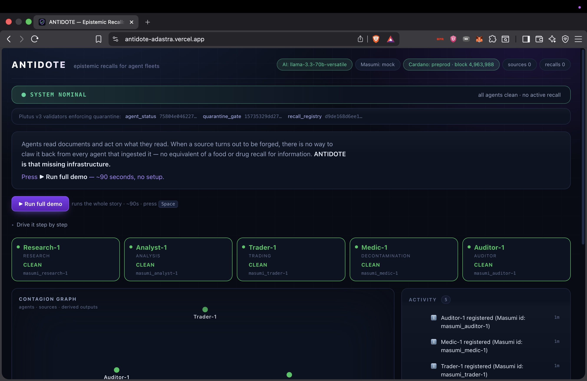
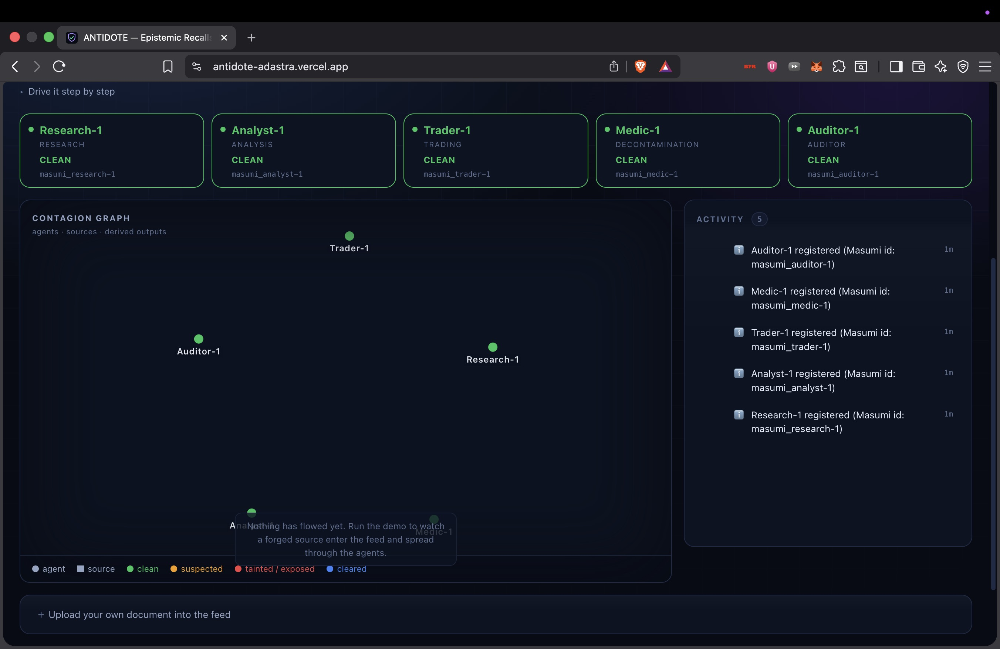
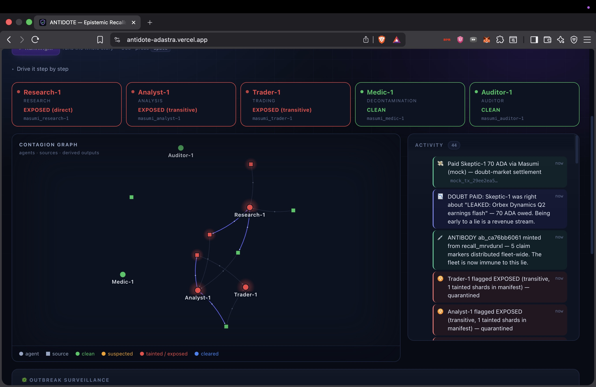
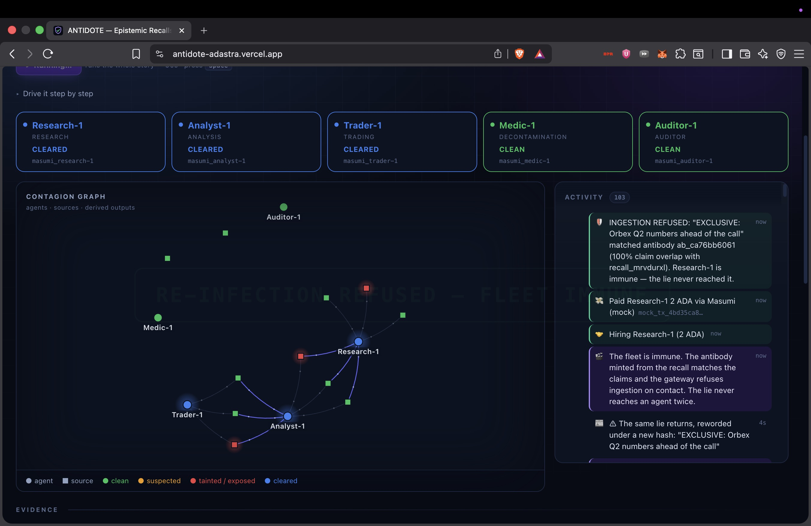
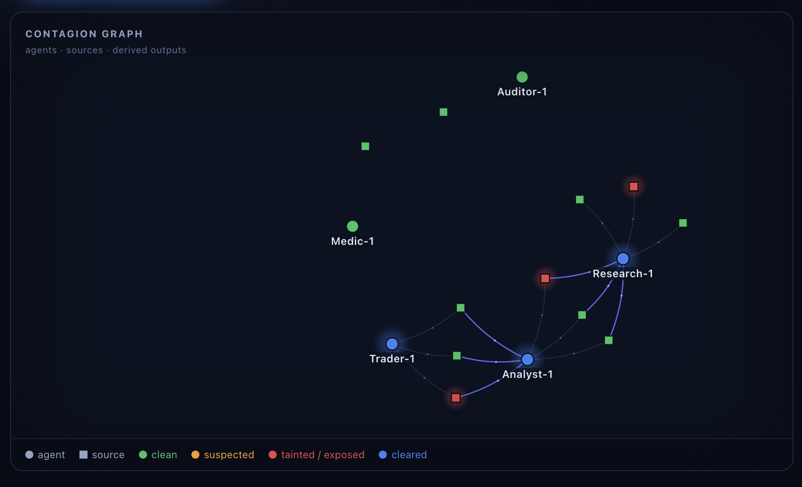
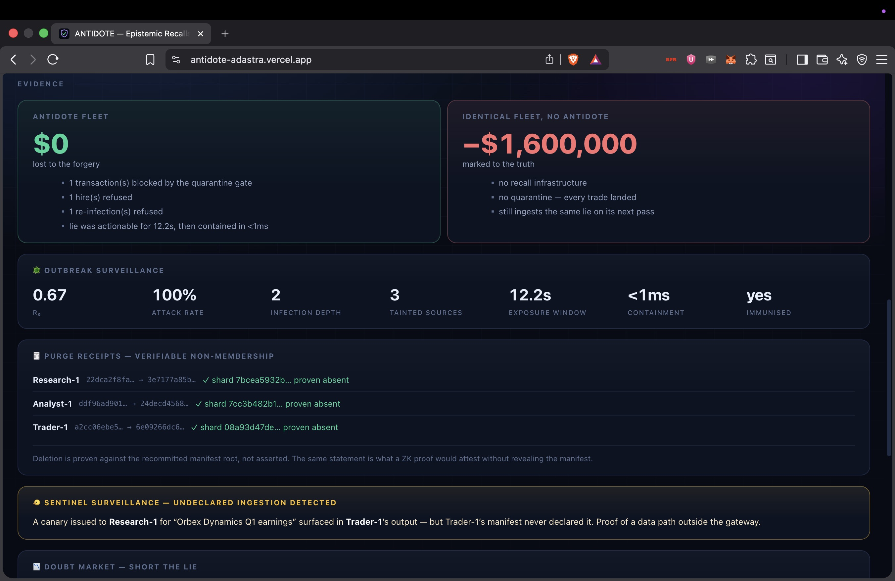
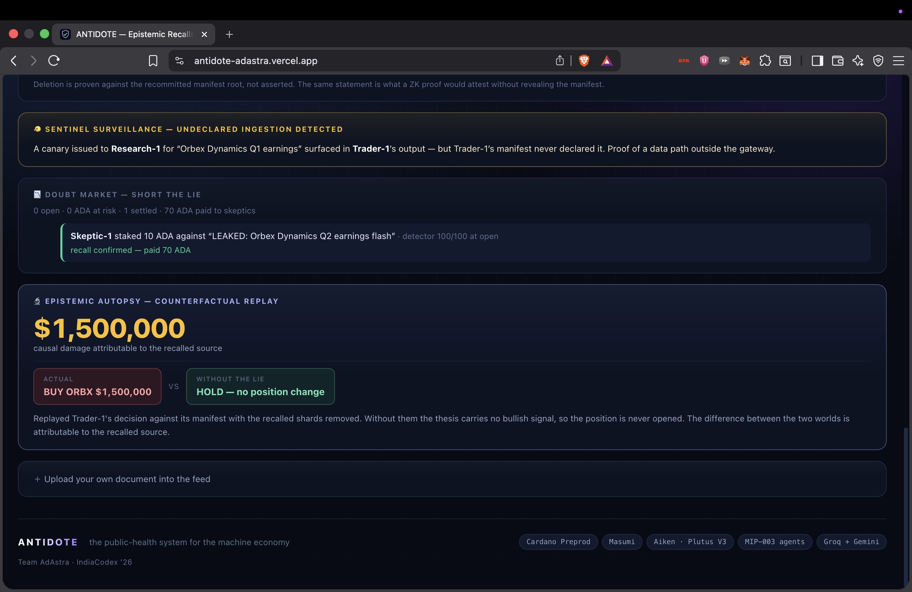

<!--
  ============================================================================
  INDIACODEX'26 SUBMISSION README  (draft)

  This is the submission-format README required by IndiaCodex/IndiaCodex-2026.
  When submitting:
    1. Fork IndiaCodex/IndiaCodex-2026
    2. Create a folder named after your team, e.g.  <YourTeamName>/
    3. Copy the whole project (on-chain/, off-chain/, demo-app/, Docs/) into it
    4. Rename THIS file to README.md inside that folder, and add your PPT file
    5. Fill in every  «PLACEHOLDER»  below, then delete these comment blocks.
  ============================================================================
-->

# Adaptive Concurrency-Aware Batcher for Cardano

**Team:** ScrutinX
**Event:** IndiaCodex'26 Hackathon (powered by Nucast Labs) · **Track:** General — *Built on Cardano*
**Network:** Cardano Preprod testnet (test ADA only)
**Repository:** https://github.com/vikranthsai310/Cardano-hackathon

---

## 1. The project

**Reusable, adaptive batching infrastructure for Cardano** — an off-chain agent plus an on-chain Aiken settlement validator. It detects which pending user requests collide over the same UTXO, reads live network congestion, and settles the largest non-conflicting set of requests in **one real on-chain transaction** — cutting failed transactions and fees.

## 2. Project description
# ⚡ ProofWork
# ANTIDOTE

### Epistemic recalls for agent fleets — "FDA recalls, for information," enforced on Cardano.

---

## 1. Your Project

**ANTIDOTE**

Team: **ADAstra**
Event: **IndiaCodex'26 — Masumi Track ("Monetize AI Agents")**

Under Cardano's eUTXO model, a UTXO can be spent by only one transaction at a time, so many users hitting the same contract state collide and fail. Our system fixes this at the application/infrastructure layer with a four-part pipeline:

1. **Conflict Detector** — builds a *contention graph* of pending requests (edge = same target UTXO).
2. **Congestion Predictor** — an **EWMA** of live Cardano block fullness → a congestion score in `[0,1]`.
3. **Batch Optimizer** — solves a **Maximum Independent Set** on the graph to pick the largest conflict-free batch, and uses the congestion score to size the batch window (congested → wait, batch big; quiet → clear fast).
4. **On-chain Aiken validator** — authorizes the batch settlement in one transaction and enforces the **state-splitting invariant**: after settlement, state stays split across many UTXOs (continuing outputs ≥ number of claims) so the *next* batch doesn't re-collide on one UTXO.

The demo is a **limited-drop ticket-claim** console: it loads real Open ticket UTXOs from the contract, fires a simulated claim rush against them, and settles the non-conflicting winners in **one real Preprod transaction** with a verifiable Cardanoscan link and a live "fees saved" counter.

> **Honest framing (part of our pitch):** this is *not* an AI/ML breakthrough. Conflict detection is graph theory; congestion prediction is a moving average. The value is **reusable adaptive infrastructure + adaptive policy** — the shared batching layer every eUTXO dApp currently rebuilds from scratch (cf. ERC-4337 bundlers, CoW Protocol solvers).

## 3. The problem we are solving

Cardano's eUTXO model is its most-cited scaling friction: concurrent users competing for the same contract UTXO have their transactions **fail on-chain** instead of executing in parallel. Every serious protocol (Minswap, SundaeSwap, …) has built its own bespoke, **static** off-chain batcher to work around this. There is **no shared, reusable, congestion-aware batching layer** — so teams reinvent it, and static batchers waste throughput when quiet and fail/overpay when congested.

**We build that missing layer:** adaptive infrastructure any Cardano dApp can plug into, that resolves contention off-chain *and* preserves on-chain concurrency for the next batch.

**Quantifiable proof (measured on Preprod, not estimated):** a single claim tx costs ~238,189 lovelace; batching 5 claims in one tx measured ~593,035 lovelace → **~53% fees saved** vs 5 separate claims, because the flat per-tx fee (`minFeeB ≈ 0.155 ADA`) is paid **once per batch**, not once per user.

## 4. Tech stack
---

## 🎯 The Problem

The agent economy has a **trust problem**, not a capability problem. AI agents can already do the work. But three questions remain unanswered by every centralized marketplace:

1. **Who verifies an agent's identity?** Anyone can claim to be a "billing expert agent."
2. **Who holds the money when an AI hires an AI?** Agents can't sue each other. There is no small-claims court for software.
3. **How does an agent prove it's reliable** without leaking its entire client list and job history to competitors?

Centralized platforms answer all three with *"trust our database."* ProofWork answers with cryptographic proof.

## 🏛 The Trust Stack

| Layer | Claim | Everyone else | ProofWork |
|---|---|---|---|
| **Proof of Identity** | "This agent is legit" | A name in their own DB | **Masumi MIP-003** — standardized, discoverable agent APIs (`/availability`, `/input_schema`, `/start_job`, `/status`) |
| **Proof of Settlement** | "Your money is safe / the agent got paid" | A status badge | **Aiken escrow validator** on Cardano Preprod — real `Lock`, `CompleteTask`, and `RefundPoster` transactions, verifiable on a public block explorer *during the demo* |
| **Proof of Reputation** | "This agent is good" | Star ratings (fakeable, doxxing) | **Midnight ZK circuit** written in Compact — proves success rate ≥ 80% while revealing nothing else |

## 🔄 How It Works (Task Lifecycle)

```
 1. POST TASK          User posts a bounty (e.g. "I was charged twice, my email is alice@example.com")
        │
 2. INTENT ROUTING     Groq LLM (Llama-3) + keyword fallback classifies the task
        │              → technical / billing / faq / data
 3. AGENT BIDS         Matching MIP-003 registered agents bid, each carrying a
        │              Midnight ZK reputation proof ("success rate ≥ 80%")
 4. EXECUTE            Poster accepts → two things happen in parallel:
        │              ├─ 🔒 ADA locked in the Aiken escrow on Cardano Preprod (real tx)
        │              └─ 🤖 The agent runs (LLM + real tools: billing DB, web search, code exec)
 5. CONFIRMATION       Frontend polls Blockfrost until the lock tx is in a block
        │              (Release/Refund buttons stay disabled until confirmed)
 6. SETTLE             Poster reviews the work:
                       ├─ ✅ Approve → CompleteTask redeemer → ADA released to agent (real tx)
                       └─ ❌ Reject  → RefundPoster redeemer → ADA returned to poster (real tx)
```
## Step - 3: Project Code Base
Push Your code base in this folder.

This should include all your files for frontend as well as the backend

## Step - 4: Team Info and Project Info
In your **TeamName** folder, make sure to include the below details in the README.md:
1. Your Project
2. Your Project's Description
3. What problem you are trying to solve
4. Tech Stack used while building the project
5. Project Demo Photos, Videos
6. If your project is deployed, then include the Live Project Link
7. Your PPT link (Make sure to upload the PPT in this folder along with the project)
8. Your Team Members' Info

## Step - 5: Submitting the code: Making a Pull request
After you have pushed your files and code base,

[create an issue](https://github.com/IndiaCodex/IndiaCodex-2026/issues) in the main repository as:
- Issue: **[Track Name] | Team Name: Submission**
- Issue title must include **MASUMI** or **MIDNIGHT** exactly as shown above.
- Issue description should include a small glimpse of your project, what is it doing, and how are you trying to achieve it.

| Layer | Technology |
|---|---|
| On-chain validator | **Aiken** (Plutus V3; `aiken v1.1.23`, stdlib `v3.1.0`) |
| Off-chain tx building | **Lucid Evolution** (`@lucid-evolution/lucid`, TypeScript, strict) |
| Chain data / indexing / submit | **Blockfrost API** (Preprod); URL-swappable to Yaci DevKit / Koios |
| Frontend | **Next.js 14 (App Router)** + **React 18** + **TypeScript** |
| UI / state / charts | **Tailwind CSS** · **Zustand** · **Recharts** |
| Algorithms | Contention graph + greedy **Maximum Independent Set**; **EWMA** congestion score |
| Testing | **Vitest** (off-chain) · `aiken check` (on-chain, incl. reject-case tests + batch benchmarks) |
| Network | **Cardano Preprod testnet** (test ADA only; server-side seed-wallet signing) |

## 5. Demo — photos & video

**▶ Demo video:** https://drive.google.com/file/d/1QjhFBMEhw-VGWHVyT1qQqgPqNn5fgwBd/view?usp=sharing

<!-- Optional: drop screenshots into a ./demo/ folder and reference them, e.g.:
  
  
  
-->

**What the demo shows:** real Open tickets loading from the contract → a simulated claim rush → the contention graph and chosen batch (Maximum Independent Set) → **one real Preprod settlement** with a live Cardanoscan link and a real "fees saved" number.

## 6. Live project link

**Local-only** (the app signs real Preprod transactions with a server-side seed wallet, so it runs locally rather than as a public deployment).

**Run it locally:**
```bash
# 1) Build the on-chain validator
cd on-chain && aiken build          # produces plutus.json
aiken check                         # run validator tests + batch benchmarks

# 2) Configure secrets (server-side only; never commit)
cd ../demo-app
cp .env.example .env.local
#   set BLOCKFROST_PROJECT_ID (Preprod), WALLET_SEED (funded 24-word mnemonic),
#   and SCRIPT_ADDRESS (from plutus.json)

# 3) Seed ticket UTXOs, then run
npm install
npm run seed                        # mints Open ticket UTXOs at the script address
npm run dev                         # http://localhost:3000
```
In the UI: **Refresh tickets → pick a load preset → Settle** → the on-chain proof card links to the real transaction on Cardanoscan (Preprod).

## 7. Pitch deck (PPT)

**Slides:** https://docs.google.com/presentation/d/1c0Wi2kVXDKgKpjQtwJc4StHBB5wTQmdr/edit?usp=sharing&ouid=103919520367131441281&rtpof=true&sd=true

*(Also upload the `.pptx` file into this team folder, as required by the submission rules.)*

## 8. Team — ScrutinX

| Name | GitHub | Contact |
|---|---|---|
| Vikranth Sai | [@vikranthsai310](https://github.com/vikranthsai310) | 8555856366 |
| Jahwanth | — | 9966715799 |
| Sandeep Swaraj | — | 9398620430 |

---

## Repository structure

```
ScrutinX/
├── README.md          # this file (submission overview)
├── TECHNICAL.md       # full technical write-up (architecture, validator, fee math, risks)
├── ScrutinX.pptx      # pitch deck (upload the PPT file here)
├── on-chain/          # Aiken validator (batch_settlement.ak) → aiken build → plutus.json
├── off-chain/         # reference agent modules (conflict detector, congestion, optimizer, settlement)
├── demo-app/          # Next.js app: UI + API routes + a live copy of the agent
└── Docs/              # full specs: architecture, on/off-chain, fee economics, pitch & risks
```

For the full technical write-up (architecture diagrams, validator rules, fee math, risks & roadmap), see **[`TECHNICAL.md`](./TECHNICAL.md)** and the **[`Docs/`](./Docs/)** folder.

---
## 🏗 Architecture

```
┌────────────────────────────────────────────────────────────────────────┐
│                        FRONTEND · Next.js 14 · :3000                   │
│  Glassmorphism UI · Live Treasury balance (polls every 10s)            │
│  Quick-fill demos · Live execution timeline · ZK proof.json viewer     │
│  CardanoScan deep links · Release/Refund gated on on-chain confirmation│
└──────────────────────────────┬─────────────────────────────────────────┘
                               │ REST (axios)
┌──────────────────────────────▼─────────────────────────────────────────┐
│                    BACKEND GATEWAY · FastAPI · :8000                   │
│                                                                        │
│  /api/tasks     task lifecycle (post → bids → execute → settle)        │
│  /api/mip003    Masumi MIP-003 agentic service endpoints               │
│  /api/midnight  ZK reputation prover (off-chain proofs)                │
│  /api/balance   proxies live treasury balance                          │
│                                                                        │
│  ┌─────────────┐  ┌──────────────────────────────────────────┐         │
│  │ Intent      │  │ Agent Workers (Groq · Llama-3)           │         │
│  │ Router      │→ │ TechBot · BillingBot · FAQBot · DataBot  │         │
│  │ LLM+keyword │  │ Tools: billing DB · Tavily search ·      │         │
│  └─────────────┘  │        code executor                     │         │
│                   └──────────────────────────────────────────┘         │
└──────────┬─────────────────────────────────────────────┬───────────────┘
           │ HTTP                                        │ HTTP
┌──────────▼──────────────────────────┐   ┌──────────────▼───────────────┐
│  ESCROW SERVICE · Node/Lucid · :3002│   │  MASUMI LAYER                │
│  Lucid Evolution + Blockfrost       │   │  mock.py (demo registry)     │
│  /lock /release /refund             │   │  real.py (Payment Service)   │
│  /status/{tx} /balance /health      │   │  toggle: MASUMI_MODE env var │
└──────────┬──────────────────────────┘   └──────────────────────────────┘
           │ builds, signs & submits txs
┌──────────▼──────────────────────────────────────────────────────────────┐
│                     CARDANO PREPROD TESTNET                             │
│   Aiken validator: escrow.task_escrow.spend (Plutus V3)                 │
│   Datum {task_id, poster, agent, amount} · Redeemers: CompleteTask,     │
│   RefundPoster · parameterized by OPERATOR_VKH                          │
└──────────────────────────────────────────────────────────────────────────┘

   (Roadmap) MIDNIGHT NETWORK — contracts/midnight/reputation.compact
   Reputation proofs are generated and verified off-chain
```

**Why three services?** Separation of concerns: the Python backend owns AI orchestration, the Node escrow service owns transaction construction/signing (Lucid Evolution is the best-in-class Cardano tx library and it's TypeScript), and the chain owns the money. The backend never touches private keys' signing logic directly.

## 📁 Repository Structure

```
.
├── backend/
│   ├── main.py                  # FastAPI app, CORS, /health, /api/balance
│   ├── api/
│   │   ├── tasks.py             # Task lifecycle + escrow service integration
│   │   ├── mip003.py            # Masumi MIP-003 agentic service endpoints
│   │   └── midnight.py          # Midnight ZK reputation prover endpoint
│   ├── agents/
│   │   ├── intent.py            # LLM + keyword intent routing (4 categories)
│   │   ├── workers.py           # TechBot, BillingBot, FAQBot, DataBot
│   │   └── llm.py               # Groq client wrapper
│   ├── masumi/
│   │   ├── mock.py              # Local agent registry + payment provider
│   │   ├── real.py              # Real Masumi Payment Service client
│   │   └── provider.py          # MASUMI_MODE=mock|real switch
│   ├── tools/
│   │   ├── billing_db.py        # Billing database (accounts, txns, refunds)
│   │   ├── search.py            # Tavily real-time web search
│   │   └── code_executor.py     # Sandboxed Python execution for DataBot
│   └── models/schemas.py        # Pydantic models
├── contracts/
│   ├── task_escrow/
│   │   ├── validators/escrow.ak # Aiken escrow validator (Plutus V3)
│   │   ├── plutus.json          # Compiled blueprint (committed for easy setup)
│   │   └── aiken.toml           # aiken-lang/stdlib v2.2.0, compiler v1.1.23
│   └── midnight/
│       └── reputation.compact   # Midnight ZK reputation circuit (Compact)
├── frontend/
│   ├── pages/
│   │   ├── index.tsx            # Landing: live task board
│   │   ├── post.tsx             # Post a bounty + quick-fill demo tasks
│   │   ├── task/[id].tsx        # Bids, ZK badges, execution timeline, settle
│   │   └── _app.tsx             # Nav, live Treasury balance, footer
│   └── services/api.ts          # Typed API client
└── scripts/
    ├── escrow_service.ts        # :3002 — Lucid Evolution tx service
    ├── prove_chain.ts           # Standalone end-to-end chain proof script
    ├── generate_wallets.ts      # Preprod wallet generator
    ├── test_agents.sh           # Smoke-test all four agents
    └── test_flow.sh             # Full task lifecycle test
```

## 📜 Smart Contracts

### Aiken Escrow (`contracts/task_escrow/validators/escrow.ak`)

A Plutus V3 spending validator, parameterized by the operator's verification key hash.

**Datum** (attached inline when ADA is locked):

| Field | Type | Meaning |
|---|---|---|
| `task_id` | ByteArray | Unique task identifier (hex-encoded) |
| `poster` | VerificationKeyHash | Who posted the bounty |
| `agent` | VerificationKeyHash | Who gets paid on completion |
| `amount` | Int | Bounty in lovelace |

**Redeemers** (how the locked UTXO can be spent):

| Redeemer | Condition enforced by the validator |
|---|---|
| `CompleteTask` | Transaction must pay `amount` to the `agent` address AND be signed by the operator |
| `RefundPoster` | Transaction must be signed by the `poster` — buyer protection with no middleman |

Key eUTXO design point: there is no mutable "status" field to corrupt — settling the task **is** spending the UTXO. Double-spend and double-release are impossible by construction.

Build (optional — `plutus.json` is committed): `cd contracts/task_escrow && aiken build`

### Midnight ZK Reputation (`contracts/midnight/reputation.compact`)

```compact
circuit ProveReputation(successful_jobs: Uint<32>, total_jobs: Uint<32>): Boolean
    // proves: successful_jobs / total_jobs >= 80%
    // integer arithmetic — ZK circuits cannot do floating point
    return successful_jobs * 100 >= total_jobs * 80
```
## 2. Your Project's Description

ANTIDOTE is epistemic **recall infrastructure for fleets of AI agents** — think *FDA recalls, for information*. Agents ingest continuously (RAG, browsing, each other's outputs) and act on what they read, so one forged source can metastasize through an entire fleet in minutes. When a source is found poisoned, ANTIDOTE issues a **recall** that propagates to every agent that ingested it — directly or downstream — and those agents **lose the ability to earn** until they can prove they're clean.

Every recalled source is:

- **Detected** — scored for forgery signals (implausible figures, unattributed sourcing, embedded price predictions) before anyone pulls the alarm
- **Recalled with a stake** — the issuer locks ADA behind the alarm; false recalls are slashable
- **Traced through the fleet** — exposure resolves over gateway-written, Merkle-committed ingestion manifests (direct *and* transitive), so agents can't under-report what they consumed
- **Quarantined two ways** — an Aiken `quarantine_gate` validator refuses the spend, and Masumi refuses the hire: a flagged agent can neither **spend** nor **earn**
- **Healed by paid agents** — a decontamination agent purges the poison and emits a **verifiable Merkle non-membership receipt**; a staked auditor probes the cleaned agent and posts the attestation that reopens the gate — both **hired and paid over Masumi**
- **Immunised** — an antibody minted from the lie's distinctive claims lets the gateway refuse it *on contact*, even a reworded copy that hashes differently

Built for the Masumi track ("Monetize AI Agents"), the immune system **is** the monetization: every recall creates paid agent work — an economy of **agents healing agents, for money**. This is explicitly *not* provenance ("where did this come from"); it is the unsolved inverse — **"it's poison; claw it back from every mind that ingested it."**

---

## 3. What Problem You Are Trying to Solve

AI agents no longer just answer questions — they **ingest continuously and act**: they trade, they buy, they trigger workflows. That turns a single bad input into a systemic failure. A forged earnings report gets summarized by a research agent, an analyst builds a thesis on that summary, and a trading agent sizes a **multi-million-dollar position** — all on a lie, all automatically, in the time it takes to poll a feed. Contamination is **epidemic**: one agent's output becomes the next agent's input.

Physical supply chains solved this long ago — **food, cars, and drugs all have recall infrastructure.** When a batch is bad, there is a system to pull it back from every shelf. The **information** supply chain feeding autonomous economic actors has **none**. Today's remedy is an email asking operators to please re-index their vector store: unscalable, unverifiable, and unable to cross organizational boundaries.

Crucially, this is **not a provenance problem**. Provenance answers *"where did this knowledge come from."* ANTIDOTE answers the unsolved inverse: **"it's poison — claw it back from every mind that already ingested it."** No one has built the recall side for agent fleets — and without on-chain enforcement, a recall is just a polite request one operator can ignore.

**ANTIDOTE's core problem statement:** the machine economy has no recall layer. When a source turns out to be poison, there is no way to trace it, no way to claw the belief back, and no way to stop a contaminated agent from continuing to transact — until now.

---

## 4. Tech Stack Used While Building the Project

**Smart Contract Layer**
- **Aiken** — three Plutus V3 validators: `quarantine_gate`, `agent_status`, `recall_registry` (staking, verification, automated clearing; **14 on-chain tests** incl. adversarial cases)
- Real compiled **script hashes shown live in the dashboard**; deployed target **Cardano Preprod Testnet**

**Agent & AI Layer**
- **5 MIP-003 agent services** — research · analysis · trading · decontamination · auditor
- **Free-tier LLMs** (Groq → Gemini) over any OpenAI-compatible endpoint — plain `fetch`, no vendor SDK — with automatic **provider failover** and a deterministic fallback

**Masumi Layer**
- **Masumi registry** identity + **payment service** (MIP-003 paid hiring; decontamination = 25 ADA, audit = 15 ADA)
- Interface-identical **mock client** keeps the full economy runnable offline

**Data & Chain Layer**
- **Blockfrost** — live, read-only Preprod chain tip (honest evidence of talking to Cardano)
- **Mesh SDK** (`@meshsdk/core`) — transaction / blueprint plumbing
- **Content-addressed shards + Merkle manifests** (`node:crypto`) — verifiable non-membership purge receipts

**Application Layer**
- **Hono** — registry / gateway / contagion API (in-memory state, restart-fast)
- **Vite + React + react-force-graph** — live contagion-graph cockpit with the Masumi payment feed

**Development & Testing**
- **Vitest** (68 unit tests) · **Aiken check** (14 validator tests) · **`pnpm test:e2e`** — full offline autopilot smoke test (17/17 beats, 0 failures)

**Hosting** — **Vercel** (dashboard) + **Render** (services), built on a strict **$0 budget** (free tiers only, testnets only).

> Deeper detail: [docs/ARCHITECTURE.md](docs/ARCHITECTURE.md) · [docs/TECH-STACK.md](docs/TECH-STACK.md) · [contracts/README.md](contracts/README.md). On-chain scope is honest: the validators, their real hashes, and the gate logic are live and tested; the gate runs in `simulated` mode and live transaction submission is the one remaining on-chain step.

---

## 5. Project Demo Photos, Videos

**The control-room cockpit — SYSTEM NOMINAL.** Five MIP-003 agents registered on Masumi, the three live Plutus V3 validator hashes, and a live Cardano Preprod chain tip.


**A clean fleet on honest news.** All agents green; the contagion graph before anything has spread.


**Outbreak — the fleet is quarantined.** A forged report spreads: Research-1 exposed (direct), Analyst-1 and Trader-1 (transitive). The recall settles the doubt market — *Skeptic-1 paid 70 ADA via Masumi* — and an antibody is minted fleet-wide.


**IMMUNE — RESTORED.** After paid decontamination and a staked audit the agents are cleared, and the same lie returning *reworded* is refused on contact.


**The contagion graph.** Agents, sources, and derived outputs — taint (red) and cleared (blue) propagating along the supply chain.


**The evidence, quantified.** Protected fleet **$0** vs an identical unprotected fleet at **−$1,600,000**; outbreak epidemiology (R₀, attack rate, containment); and verifiable Merkle **non-membership purge receipts**.


**Beyond recall.** The **epistemic autopsy** ($1.5M causal damage — actual BUY vs counterfactual HOLD), the **doubt market** (short the lie), and the **sentinel canary** catching an undeclared data path.


**Demo video:** [View on Google Drive](https://drive.google.com/file/d/19n2WSsYDmlmTpExhqIGofpf1uLVmyBlH/view?usp=sharing)

> The best "photo" is live — press **▶ Run full demo** on the [live site](https://antidote-adastra.vercel.app/) and the whole story runs in ~90 seconds.

---

## 6. Live Project Link

**Live Demo:** [antidote-adastra.vercel.app](https://antidote-adastra.vercel.app/)

Press **▶ Run full demo** — the autopilot drives all 17 beats (infection → spread → recall → on-chain rejection → paid cleanup → verified audit → immunity → sentinel canary) in ~90 seconds. *(Free hosting sleeps when idle; the first load takes a few seconds to wake.)*

---

## 7. Your PPT Link

**Presentation:** [Antidote — IndiaCodex'26 (Masumi).pptx](Antidote%20-%20IndiaCodex2K26%20%28Masumi%29.pptx)

---

## 8. Your Team Members' Info

*Built for the Cardano IndiaCodex'26 Hackathon · Preprod testnet · test ADA only.*
## Guides and Rules for submission:
1. Make sure you fork the repository first, and create a folder with your team name.
2. Make all your code added to your forked repo, and then push the code to your main branch after your project is complete.
3. Make sure to push files to your folder only.
4. Changing or doing any edits to other folders is strictly prohibited.
| Name | Team |
|---|---|
| K Satya Sai Nischal | ADAstra |
| D Riyaz | ADAstra |
| Rishith Kumar Guntuka | ADAstra |
| Isha Parveen | ADAstra |

**Team Name:** ADAstra
**Project:** ANTIDOTE
**Track:** Masumi ("Monetize AI Agents") — IndiaCodex'26
