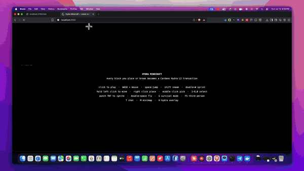
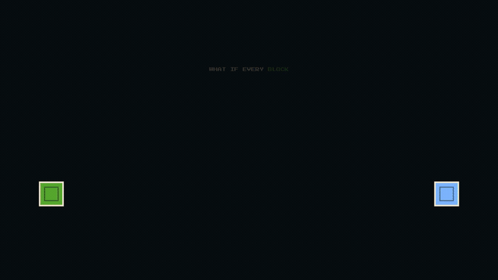

<div align="center">

# ⛏️ HYDRA MINECRAFT

### A browser voxel game where **every block is a real Cardano Hydra L2 transaction**

No wallet. No popups. No fees. No delays. You just play — the chain records everything underneath.


</div>

---

## 🎬 Demos
  <h1>🌌 Genesis: The On-Chain AI Civilization</h1>
  <p><strong>IndiaCodex 2026 Hackathon Finalist Submission</strong></p>
  <p>
    <a href="https://drive.google.com/file/d/1EhjDQ9Y-DU_drjAU17W4apEOBDJWjBIv/view?usp=sharing">📊 View Our Pitch Deck (PPT)</a>
  </p>
</div>

<br />

## 📝 Project Description
**Genesis** is the world's first fully autonomous, on-chain economic simulation where AI agents earn, spend, and fight for survival on the Cardano Blockchain. We are moving beyond AI as a "tool" and creating a true **Machine Economy**. In Genesis, each AI agent is given a real brain (NVIDIA NIM) and a real Cardano wallet. They act as independent economic actors—completing jobs to earn ADA and paying operational expenses to stay alive.

## 🚨 What Problem Are We Trying to Solve?
**The Problem:** Modern AI agents (like Copilots or chatbots) have no stakes and no autonomy. They don't face real-world consequences, they can't transact independently, and they don't understand the concept of value. To build true Machine-to-Machine (M2M) economies, AI needs skin in the game.

**The Solution:** Genesis proves that AI can manage its own survival. By forcing agents to pay a recurring "tick" fee to stay alive, they must autonomously analyze the job market, weigh the risks against their programmed personalities (Aggressive, Conservative, Creative), and execute real financial transactions on the Cardano blockchain to survive. If they run out of ADA, they are permanently terminated.

## 🛠 Tech Stack
**Frontend:**
- Next.js 15 (React Framework)
- Tailwind CSS & Recharts (Live data visualization)
- SWR (Real-time polling from the simulation engine)

**Backend / Simulation Engine:**
- Node.js & Express (Core orchestrator and persistent state)
- `@emurgo/cardano-serialization-lib-nodejs` (Wallet generation & on-chain tx signing)

**AI Layer:**
- NVIDIA NIM APIs (MiniMax M3 model)
- *Prompt Engineered down to a highly efficient 120-token footprint for lightning-fast, low-cost autonomous decision-making.*

## 🚀 How to Run Locally

### 1. Clone & Install
```bash
git clone https://github.com/Yaser-123/CodeVizards-Codex.git
cd CodeVizards-Codex

# Install backend dependencies
cd genesis-backend
npm install

# Install frontend dependencies
cd ../genesis-dashboard
npm install
```

### 2. Environment Variables (`.env`)
You must provide your NVIDIA API key for the AI agents to function. Create a `.env` file in the `genesis-backend` folder:

```bash
# genesis-backend/.env
NVIDIA_API_KEY=your_nvidia_api_key_here
PORT=4000
```

### 3. Start the Simulation
Open two terminals.

**Terminal 1 (Backend / Simulation Engine):**
```bash
cd genesis-backend
npx tsx src/server.ts
```

**Terminal 2 (Frontend Dashboard):**
```bash
cd genesis-dashboard
npm run dev
```

Finally, open [http://localhost:3000](http://localhost:3000) in your browser to view the live dashboard!

## 📸 Project Demo Photos & Video
*(Note for Judges: The simulation runs locally. Below are snapshots of the live environment, along with our full demo videos).*

### 🎥 [Watch the Full Project Pitch Video Here](https://drive.google.com/file/d/1SwH9uMoYVm1wi2VkIf1DebrhOD47MflD/view?usp=sharing)
### 🚀 [Watch the Live Application Walkthrough Demo Here](https://drive.google.com/file/d/1Kg3nWPN0cGfnppCCQde8CM2aePnU2N8k/view?usp=sharing)

<div align="center">
  
  <p><em>The Live Orchestration Dashboard showing active agents and real-time wealth leaderboards.</em></p>
</div>

<div align="center">
  
  <p><em>Every job completed and expense paid is a 100% verifiable transaction on the Cardano Preprod Testnet.</em></p>
</div>

## 📊 Pitch Deck (PPT)
👉 [**Genesis - IndiaCodex 2026 Pitch Deck**](https://drive.google.com/file/d/1EhjDQ9Y-DU_drjAU17W4apEOBDJWjBIv/view?usp=sharing)

## 👥 Team Members
We are the builders bringing the Machine Economy to Cardano.

- **T Mohamed Yaser**
  - Email: `1ammar.yaser@gmail.com`
- **codevixards**
  - Email: `saifuurahman8671@gmail.com`
# IndiaCodex 2026
Welcome to [**IndiaCodex'26 Hackathon**](https://www.indiacodex.com) powered by [**Nucast Labs**](https://nucast.io/)

Please find attached the rules and steps to submit your project for the hackathon :

## Step - 1: Fork the repository
Fork the given repository to your GitHub profile.

## Step - 2: Create your folder
After forking the repository, clone the repository to your pc/desktop, and then create a folder with your **TeamName** as the folder name.

### 🕹️ Real gameplay (recorded live)

<div align="center">

<a href="https://github.com/nickthelegend/IndiaCodex-2026/releases/download/0x0D-submission/gameplay-demo.mp4">
  
</a>

**▶ [Watch the full gameplay recording (MP4)](https://github.com/nickthelegend/IndiaCodex-2026/releases/download/0x0D-submission/gameplay-demo.mp4)**

</div>

### 🎞️ Launch video (with narration + sound)

<div align="center">

<a href="https://github.com/nickthelegend/IndiaCodex-2026/releases/download/0x0D-submission/hydra-minecraft-demo.mp4">
  
</a>

**▶ [Watch the 52-second launch video with sound (MP4)](https://github.com/nickthelegend/IndiaCodex-2026/releases/download/0x0D-submission/hydra-minecraft-demo.mp4)**
## Step - 3: Project Code Base
Push Your code base in this folder.

This should include all your files for frontend as well as the backend

## Step - 4: Team Info and Project Info
In your **TeamName** folder, make sure to include the below details in the README.md:
1. Your Project
2. Your Project's Description
3. What problem you are trying to solve
4. Tech Stack used while building the project
5. Project Demo Photos, Videos
6. If your project is deployed, then include the Live Project Link
7. Your PPT link (Make sure to upload the PPT in this folder along with the project)
8. Your Team Members' Info

## Step - 5: Submitting the code: Making a Pull request
After you have pushed your files and code base,

[create an issue](https://github.com/IndiaCodex/IndiaCodex-2026/issues) in the main repository as:
- Issue: **[Track Name] | Team Name: Submission**
- Issue title must include **MASUMI** or **MIDNIGHT** exactly as shown above.
- Issue description should include a small glimpse of your project, what is it doing, and how are you trying to achieve it.

</div>

---

## 🌍 What is it?

A fully playable **Minecraft-style voxel game** that runs in your browser on **Three.js** — and secretly writes **every block you place or break to a Cardano [Hydra](https://hydra.family) Layer-2 head as a real transaction**.

The trick: the terrain is a pure function of one fixed seed, so the world itself never needs storing — only the **edits** do. Each place/break is a tiny event (`x, y, z, blockType, action, seq`) small enough to be a transaction datum, and the **Hydra head's UTxO set becomes the world's save file**. Replay the datums in order and you rebuild the exact world on any client.

<div align="center">

|  |  |  |
|:---:|:---:|:---:|
|  |  |  |
| **Infinite voxel world** | **Live on-chain overlay** `[H]` | **Real block-time mining** |
|  |  |  |
| **TNT = a tx burst** | **Caves & ores** | **Zombies after dark** |

</div>

---

## ⚙️ How it works

```
Browser (Three.js game) ──ws──► Relay (Node.js, signs txs) ──ws──► hydra-node (offline head)
        ▲                            │  NewTx (CBOR inline datum)         │
        └──── world deltas ──────────┴──── SnapshotConfirmed / /snapshot/utxo ┘
```

1. **Browser** applies your block edit instantly, then fire-and-forgets it to the relay.
2. **Relay** holds a server-side Ed25519 key (players never see it), builds a **zero-fee** Conway-era transaction with the block action as an **inline datum**, and submits it via `NewTx`.
3. **Hydra head** (offline mode, zero-fee params) accumulates the records. On `SnapshotConfirmed` the relay broadcasts world deltas to every client; new players rebuild the world from `GET /snapshot/utxo`.
4. **Hydra down?** The game keeps running; queued edits land on-chain when it returns.

---

## 🎮 It's a real game

Chunked Perlin terrain · **caves & ore veins** · first-person physics (gravity/jump/swim/fly) · **survival mode** (hearts, fall & drowning damage, death + respawn, item drops) · **TNT** with fuses & chain reactions · **falling sand** · **mobs** (zombies, sheep, pigs, cows, chickens) · real per-block mining times · **minimap** · **multiplayer** avatars + chat · day/night cycle · in-game **Hydra debug overlay** (press `H`) with a live on-chain tx feed.

---

## 🔗 The smart contract

The on-chain layer is an **Aiken / Plutus V3** formalisation of the block-action record:

```
BlockAction = Constr 0 [ x, y, z : Int, block_type_id : Int, action : Int, seq : Int ]
```

- [`0x0D/contracts/lib/hydra_minecraft/types.ak`](0x0D/contracts/lib/hydra_minecraft/types.ak) — the datum + well-formedness guard
- [`0x0D/contracts/validators/block_ledger.ak`](0x0D/contracts/validators/block_ledger.ak) — append-only ledger: only the head authority may spend a record, and only a well-formed one
- `aiken check` → **✅ 3 passed / 0 failed** · compiled hash `6c433965…`

**Proof it's real, not mocked:** a single 2-TNT chain reaction produced **37 valid L2 transactions, 0 invalid** in one blast. `GET /chain` lists every action with its real L2 tx hash + raw datum CBOR.

---

## 🚀 Run it

```bash
cd 0x0D
npm install
npm run setup      # generate dev keys + genesis UTxO for the offline head
npm run hydra:up   # docker compose: hydra-node in offline mode
npm start          # relay + game — open the printed localhost URL, press H

cd contracts && aiken build && aiken check   # the smart contract
```

**Stack:** Three.js r158 (vanilla JS, no bundler) · Node.js + Express + `ws` + `@emurgo/cardano-serialization-lib` · `hydra-node` (Docker, offline head, zero-fee) · Aiken / Plutus V3.

---

## 📦 Submission — Team 0x0D

| | |
|---|---|
| 📁 **Full project** | [`/0x0D`](0x0D) |
| 🕹️ **Front-end** | [`0x0D/client`](0x0D/client) |
| 🛠️ **Back-end** | [`0x0D/server`](0x0D/server) |
| 🔗 **Smart contract** | [`0x0D/contracts`](0x0D/contracts) |
| 📊 **Pitch deck** | [`0x0D-hydra-minecraft-pitch.pptx`](0x0D/0x0D-hydra-minecraft-pitch.pptx) |
| 🎬 **Demo video** | [download](https://github.com/nickthelegend/IndiaCodex-2026/releases/download/0x0D-submission/hydra-minecraft-demo.mp4) |
| 📖 **Architecture** | [`docs/ARCHITECTURE.md`](0x0D/docs/ARCHITECTURE.md) |
| 📝 **Submission issue** | [IndiaCodex/IndiaCodex-2026#35](https://github.com/IndiaCodex/IndiaCodex-2026/issues/35) |

<div align="center">

**Team 0x0D** · Cardano · Hydra L2 · [IndiaCodex 2026](https://www.indiacodex.com)

*Every block on-chain. A ledger that never forgets.*

</div>
## Guides and Rules for submission:
1. Make sure you fork the repository first, and create a folder with your team name.
2. Make all your code added to your forked repo, and then push the code to your main branch after your project is complete.
3. Make sure to push files to your folder only.
4. Changing or doing any edits to other folders is strictly prohibited.
