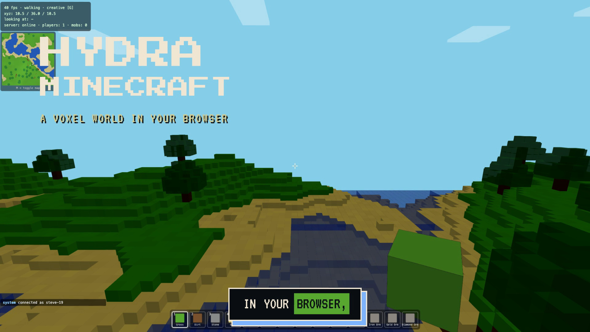
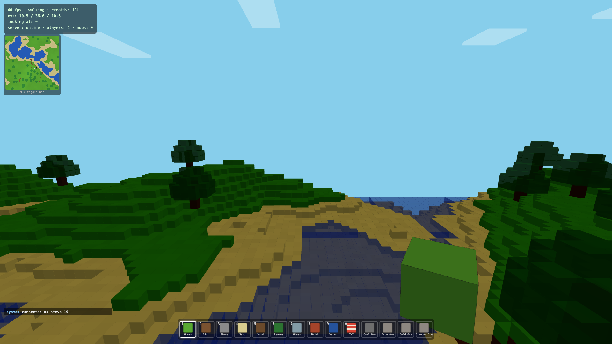
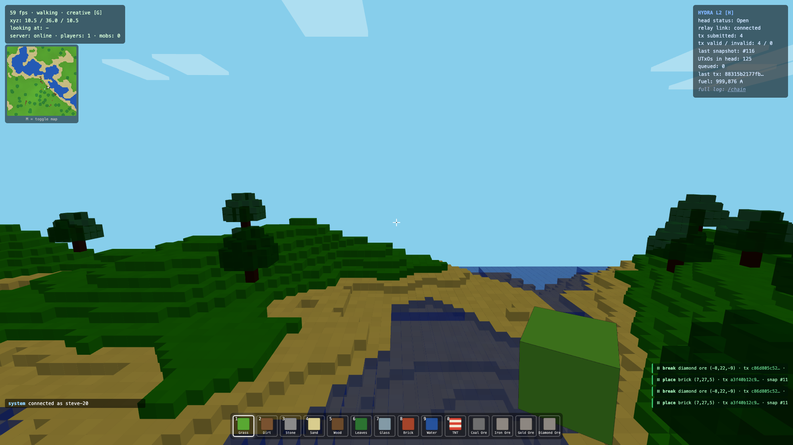
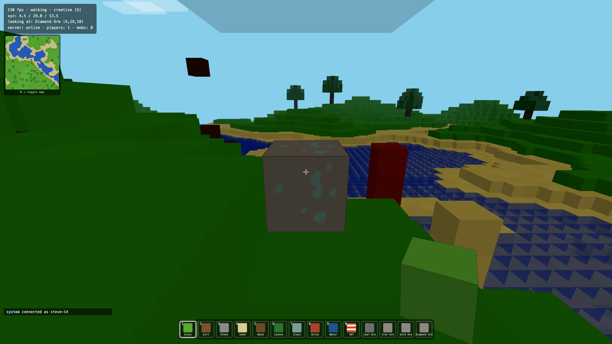
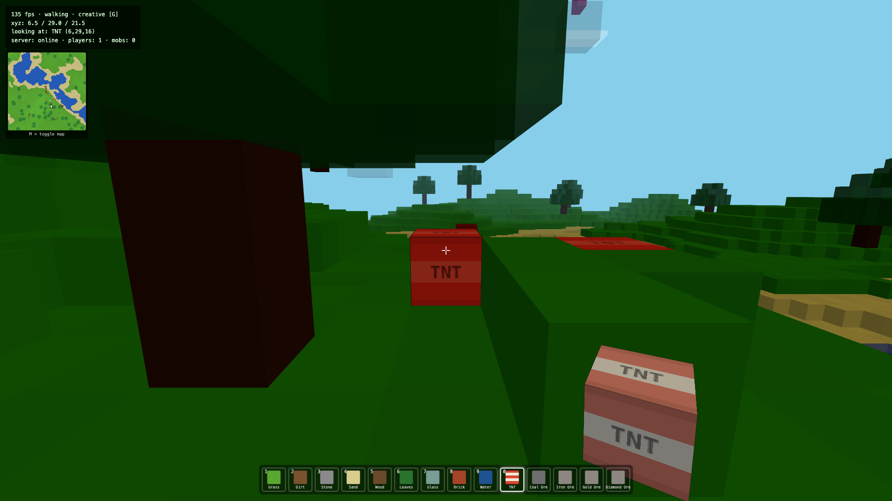
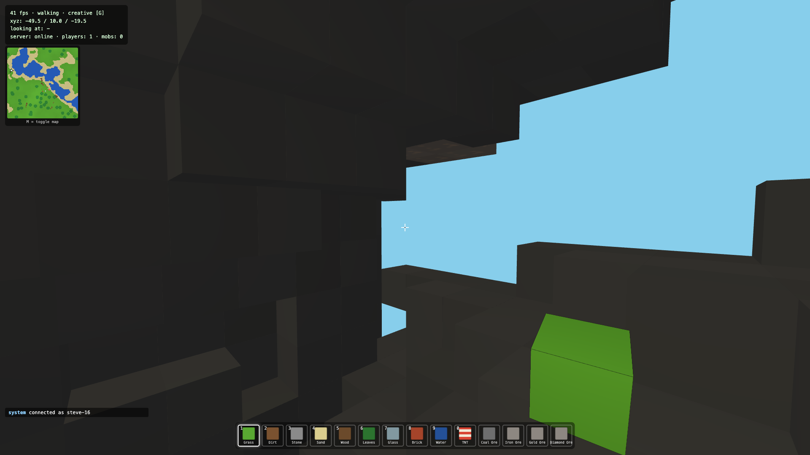
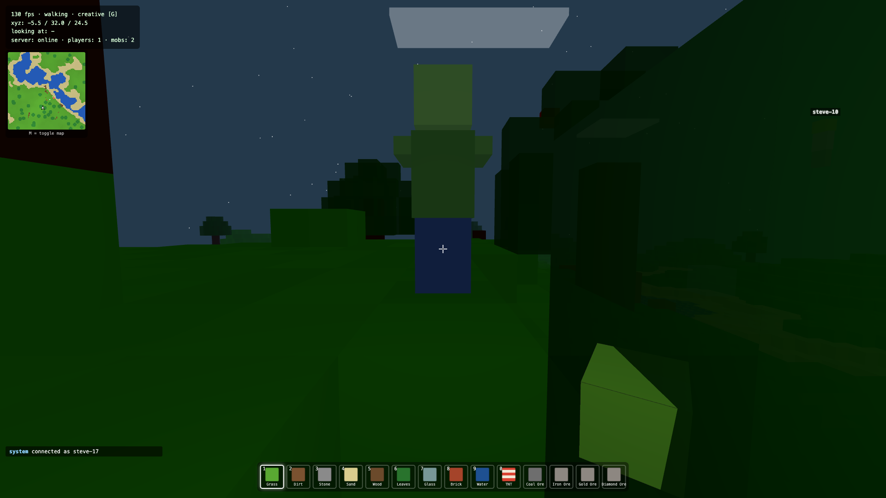

<div align="center">

# ⛏️ HYDRA MINECRAFT

### A browser voxel game where **every block is a real Cardano Hydra L2 transaction**

No wallet. No popups. No fees. No delays. You just play — the chain records everything underneath.


</div>

---

## 🎬 Demo

<div align="center">

https://github.com/nickthelegend/IndiaCodex-2026/releases/download/0x0D-submission/hydra-minecraft-demo.mp4

<video src="https://github.com/nickthelegend/IndiaCodex-2026/releases/download/0x0D-submission/hydra-minecraft-demo.mp4" poster="media/poster.png" controls width="90%"></video>

<br/>

<a href="https://github.com/nickthelegend/IndiaCodex-2026/releases/download/0x0D-submission/hydra-minecraft-demo.mp4">
  
</a>

**▶ [Click to watch the 52-second demo](https://github.com/nickthelegend/IndiaCodex-2026/releases/download/0x0D-submission/hydra-minecraft-demo.mp4)**

</div>

---

## 🌍 What is it?

A fully playable **Minecraft-style voxel game** that runs in your browser on **Three.js** — and secretly writes **every block you place or break to a Cardano [Hydra](https://hydra.family) Layer-2 head as a real transaction**.

The trick: the terrain is a pure function of one fixed seed, so the world itself never needs storing — only the **edits** do. Each place/break is a tiny event (`x, y, z, blockType, action, seq`) small enough to be a transaction datum, and the **Hydra head's UTxO set becomes the world's save file**. Replay the datums in order and you rebuild the exact world on any client.

<div align="center">

|  |  |  |
|:---:|:---:|:---:|
|  |  |  |
| **Infinite voxel world** | **Live on-chain overlay** `[H]` | **Real block-time mining** |
|  |  |  |
| **TNT = a tx burst** | **Caves & ores** | **Zombies after dark** |

</div>

---

## ⚙️ How it works

```
Browser (Three.js game) ──ws──► Relay (Node.js, signs txs) ──ws──► hydra-node (offline head)
        ▲                            │  NewTx (CBOR inline datum)         │
        └──── world deltas ──────────┴──── SnapshotConfirmed / /snapshot/utxo ┘
```

1. **Browser** applies your block edit instantly, then fire-and-forgets it to the relay.
2. **Relay** holds a server-side Ed25519 key (players never see it), builds a **zero-fee** Conway-era transaction with the block action as an **inline datum**, and submits it via `NewTx`.
3. **Hydra head** (offline mode, zero-fee params) accumulates the records. On `SnapshotConfirmed` the relay broadcasts world deltas to every client; new players rebuild the world from `GET /snapshot/utxo`.
4. **Hydra down?** The game keeps running; queued edits land on-chain when it returns.

---

## 🎮 It's a real game

Chunked Perlin terrain · **caves & ore veins** · first-person physics (gravity/jump/swim/fly) · **survival mode** (hearts, fall & drowning damage, death + respawn, item drops) · **TNT** with fuses & chain reactions · **falling sand** · **mobs** (zombies, sheep, pigs, cows, chickens) · real per-block mining times · **minimap** · **multiplayer** avatars + chat · day/night cycle · in-game **Hydra debug overlay** (press `H`) with a live on-chain tx feed.

---

## 🔗 The smart contract

The on-chain layer is an **Aiken / Plutus V3** formalisation of the block-action record:

```
BlockAction = Constr 0 [ x, y, z : Int, block_type_id : Int, action : Int, seq : Int ]
```

- [`0x0D/contracts/lib/hydra_minecraft/types.ak`](0x0D/contracts/lib/hydra_minecraft/types.ak) — the datum + well-formedness guard
- [`0x0D/contracts/validators/block_ledger.ak`](0x0D/contracts/validators/block_ledger.ak) — append-only ledger: only the head authority may spend a record, and only a well-formed one
- `aiken check` → **✅ 3 passed / 0 failed** · compiled hash `6c433965…`

**Proof it's real, not mocked:** a single 2-TNT chain reaction produced **37 valid L2 transactions, 0 invalid** in one blast. `GET /chain` lists every action with its real L2 tx hash + raw datum CBOR.

---

## 🚀 Run it

```bash
cd 0x0D
npm install
npm run setup      # generate dev keys + genesis UTxO for the offline head
npm run hydra:up   # docker compose: hydra-node in offline mode
npm start          # relay + game — open the printed localhost URL, press H

cd contracts && aiken build && aiken check   # the smart contract
```

**Stack:** Three.js r158 (vanilla JS, no bundler) · Node.js + Express + `ws` + `@emurgo/cardano-serialization-lib` · `hydra-node` (Docker, offline head, zero-fee) · Aiken / Plutus V3.

---

## 📦 Submission — Team 0x0D

| | |
|---|---|
| 📁 **Full project** | [`/0x0D`](0x0D) |
| 🕹️ **Front-end** | [`0x0D/client`](0x0D/client) |
| 🛠️ **Back-end** | [`0x0D/server`](0x0D/server) |
| 🔗 **Smart contract** | [`0x0D/contracts`](0x0D/contracts) |
| 📊 **Pitch deck** | [`0x0D-hydra-minecraft-pitch.pptx`](0x0D/0x0D-hydra-minecraft-pitch.pptx) |
| 🎬 **Demo video** | [download](https://github.com/nickthelegend/IndiaCodex-2026/releases/download/0x0D-submission/hydra-minecraft-demo.mp4) |
| 📖 **Architecture** | [`docs/ARCHITECTURE.md`](0x0D/docs/ARCHITECTURE.md) |
| 📝 **Submission issue** | [IndiaCodex/IndiaCodex-2026#35](https://github.com/IndiaCodex/IndiaCodex-2026/issues/35) |

<div align="center">

**Team 0x0D** · Cardano · Hydra L2 · [IndiaCodex 2026](https://www.indiacodex.com)

*Every block on-chain. A ledger that never forgets.*

</div>
