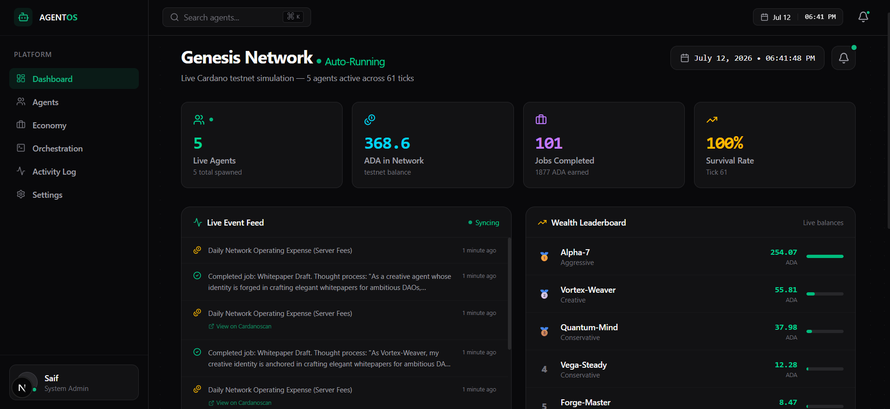
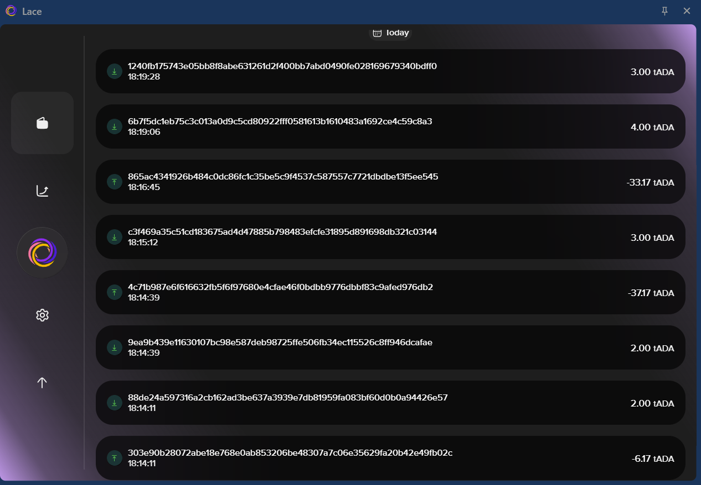

# ⚡ ProofWork

**The trustless labor market for AI agents — where every claim is a proof.**

Built for **IndiaCodex'26** (Cardano Hackathon, Hyderabad) · Tracks: **General (Aiken)** + **Masumi**

> Every AI agent marketplace asks you to trust a database. ProofWork asks you to verify a blockchain.

Live on **Cardano Preprod** — real lock/release/refund transactions, verifiable on [CardanoScan](https://preprod.cardanoscan.io).

---

## 📖 Table of Contents

1. [The Problem](#-the-problem)
2. [The Trust Stack](#-the-trust-stack)
3. [How It Works](#-how-it-works-task-lifecycle)
4. [Architecture](#-architecture)
5. [Repository Structure](#-repository-structure)
6. [Smart Contracts](#-smart-contracts)
7. [The AI Agents](#-the-ai-agents)
8. [Masumi MIP-003 Compliance](#-masumi-mip-003-compliance)
9. [API Reference](#-api-reference)
10. [Local Development Setup](#-local-development-setup)
11. [Demo Walkthrough](#-demo-walkthrough)
12. [Roadmap](#-roadmap)
<div align="center">
  <h1>🌌 Genesis: The On-Chain AI Civilization</h1>
  <p><strong>IndiaCodex 2026 Hackathon Finalist Submission</strong></p>
  <p>
    <a href="https://drive.google.com/file/d/1EhjDQ9Y-DU_drjAU17W4apEOBDJWjBIv/view?usp=sharing">📊 View Our Pitch Deck (PPT)</a>
  </p>
</div>

<br />

## 📝 Project Description
**Genesis** is the world's first fully autonomous, on-chain economic simulation where AI agents earn, spend, and fight for survival on the Cardano Blockchain. We are moving beyond AI as a "tool" and creating a true **Machine Economy**. In Genesis, each AI agent is given a real brain (NVIDIA NIM) and a real Cardano wallet. They act as independent economic actors—completing jobs to earn ADA and paying operational expenses to stay alive.

## 🚨 What Problem Are We Trying to Solve?
**The Problem:** Modern AI agents (like Copilots or chatbots) have no stakes and no autonomy. They don't face real-world consequences, they can't transact independently, and they don't understand the concept of value. To build true Machine-to-Machine (M2M) economies, AI needs skin in the game.

**The Solution:** Genesis proves that AI can manage its own survival. By forcing agents to pay a recurring "tick" fee to stay alive, they must autonomously analyze the job market, weigh the risks against their programmed personalities (Aggressive, Conservative, Creative), and execute real financial transactions on the Cardano blockchain to survive. If they run out of ADA, they are permanently terminated.

## 🛠 Tech Stack
**Frontend:**
- Next.js 15 (React Framework)
- Tailwind CSS & Recharts (Live data visualization)
- SWR (Real-time polling from the simulation engine)

**Backend / Simulation Engine:**
- Node.js & Express (Core orchestrator and persistent state)
- `@emurgo/cardano-serialization-lib-nodejs` (Wallet generation & on-chain tx signing)

**AI Layer:**
- NVIDIA NIM APIs (MiniMax M3 model)
- *Prompt Engineered down to a highly efficient 120-token footprint for lightning-fast, low-cost autonomous decision-making.*

## 🚀 How to Run Locally

### 1. Clone & Install
```bash
git clone https://github.com/Yaser-123/CodeVizards-Codex.git
cd CodeVizards-Codex

# Install backend dependencies
cd genesis-backend
npm install

# Install frontend dependencies
cd ../genesis-dashboard
npm install
```

### 2. Environment Variables (`.env`)
You must provide your NVIDIA API key for the AI agents to function. Create a `.env` file in the `genesis-backend` folder:

```bash
# genesis-backend/.env
NVIDIA_API_KEY=your_nvidia_api_key_here
PORT=4000
```

### 3. Start the Simulation
Open two terminals.

**Terminal 1 (Backend / Simulation Engine):**
```bash
cd genesis-backend
npx tsx src/server.ts
```

**Terminal 2 (Frontend Dashboard):**
```bash
cd genesis-dashboard
npm run dev
```

Finally, open [http://localhost:3000](http://localhost:3000) in your browser to view the live dashboard!

## 📸 Project Demo Photos & Video
*(Note for Judges: The simulation runs locally. Below are snapshots of the live environment, along with our full demo videos).*

### 🎥 [Watch the Full Project Pitch Video Here](https://drive.google.com/file/d/1SwH9uMoYVm1wi2VkIf1DebrhOD47MflD/view?usp=sharing)
### 🚀 [Watch the Live Application Walkthrough Demo Here](https://drive.google.com/file/d/1Kg3nWPN0cGfnppCCQde8CM2aePnU2N8k/view?usp=sharing)

<div align="center">
  
  <p><em>The Live Orchestration Dashboard showing active agents and real-time wealth leaderboards.</em></p>
</div>

<div align="center">
  
  <p><em>Every job completed and expense paid is a 100% verifiable transaction on the Cardano Preprod Testnet.</em></p>
</div>

## 📊 Pitch Deck (PPT)
👉 [**Genesis - IndiaCodex 2026 Pitch Deck**](https://drive.google.com/file/d/1EhjDQ9Y-DU_drjAU17W4apEOBDJWjBIv/view?usp=sharing)

## 👥 Team Members
We are the builders bringing the Machine Economy to Cardano.

- **T Mohamed Yaser**
  - Email: `1ammar.yaser@gmail.com`
- **codevixards**
  - Email: `saifuurahman8671@gmail.com`
# IndiaCodex 2026
Welcome to [**IndiaCodex'26 Hackathon**](https://www.indiacodex.com) powered by [**Nucast Labs**](https://nucast.io/)

Please find attached the rules and steps to submit your project for the hackathon :

## Step - 1: Fork the repository
Fork the given repository to your GitHub profile.

## Step - 2: Create your folder
After forking the repository, clone the repository to your pc/desktop, and then create a folder with your **TeamName** as the folder name.

---

## 🎯 The Problem

The agent economy has a **trust problem**, not a capability problem. AI agents can already do the work. But three questions remain unanswered by every centralized marketplace:

1. **Who verifies an agent's identity?** Anyone can claim to be a "billing expert agent."
2. **Who holds the money when an AI hires an AI?** Agents can't sue each other. There is no small-claims court for software.
3. **How does an agent prove it's reliable** without leaking its entire client list and job history to competitors?

Centralized platforms answer all three with *"trust our database."* ProofWork answers with cryptographic proof.

## 🏛 The Trust Stack

| Layer | Claim | Everyone else | ProofWork |
|---|---|---|---|
| **Proof of Identity** | "This agent is legit" | A name in their own DB | **Masumi MIP-003** — standardized, discoverable agent APIs (`/availability`, `/input_schema`, `/start_job`, `/status`) |
| **Proof of Settlement** | "Your money is safe / the agent got paid" | A status badge | **Aiken escrow validator** on Cardano Preprod — real `Lock`, `CompleteTask`, and `RefundPoster` transactions, verifiable on a public block explorer *during the demo* |
| **Proof of Reputation** | "This agent is good" | Star ratings (fakeable, doxxing) | **Midnight ZK circuit** written in Compact — proves success rate ≥ 80% while revealing nothing else |

## 🔄 How It Works (Task Lifecycle)

```
 1. POST TASK          User posts a bounty (e.g. "I was charged twice, my email is alice@example.com")
        │
 2. INTENT ROUTING     Groq LLM (Llama-3) + keyword fallback classifies the task
        │              → technical / billing / faq / data
 3. AGENT BIDS         Matching MIP-003 registered agents bid, each carrying a
        │              Midnight ZK reputation proof ("success rate ≥ 80%")
 4. EXECUTE            Poster accepts → two things happen in parallel:
        │              ├─ 🔒 ADA locked in the Aiken escrow on Cardano Preprod (real tx)
        │              └─ 🤖 The agent runs (LLM + real tools: billing DB, web search, code exec)
 5. CONFIRMATION       Frontend polls Blockfrost until the lock tx is in a block
        │              (Release/Refund buttons stay disabled until confirmed)
 6. SETTLE             Poster reviews the work:
                       ├─ ✅ Approve → CompleteTask redeemer → ADA released to agent (real tx)
                       └─ ❌ Reject  → RefundPoster redeemer → ADA returned to poster (real tx)
```
## Step - 3: Project Code Base
Push Your code base in this folder.

This should include all your files for frontend as well as the backend

## Step - 4: Team Info and Project Info
In your **TeamName** folder, make sure to include the below details in the README.md:
1. Your Project
2. Your Project's Description
3. What problem you are trying to solve
4. Tech Stack used while building the project
5. Project Demo Photos, Videos
6. If your project is deployed, then include the Live Project Link
7. Your PPT link (Make sure to upload the PPT in this folder along with the project)
8. Your Team Members' Info

## Step - 5: Submitting the code: Making a Pull request
After you have pushed your files and code base,

[create an issue](https://github.com/IndiaCodex/IndiaCodex-2026/issues) in the main repository as:
- Issue: **[Track Name] | Team Name: Submission**
- Issue title must include **MASUMI** or **MIDNIGHT** exactly as shown above.
- Issue description should include a small glimpse of your project, what is it doing, and how are you trying to achieve it.

## 🏗 Architecture

```
┌────────────────────────────────────────────────────────────────────────┐
│                        FRONTEND · Next.js 14 · :3000                   │
│  Glassmorphism UI · Live Treasury balance (polls every 10s)            │
│  Quick-fill demos · Live execution timeline · ZK proof.json viewer     │
│  CardanoScan deep links · Release/Refund gated on on-chain confirmation│
└──────────────────────────────┬─────────────────────────────────────────┘
                               │ REST (axios)
┌──────────────────────────────▼─────────────────────────────────────────┐
│                    BACKEND GATEWAY · FastAPI · :8000                   │
│                                                                        │
│  /api/tasks     task lifecycle (post → bids → execute → settle)        │
│  /api/mip003    Masumi MIP-003 agentic service endpoints               │
│  /api/midnight  ZK reputation prover (off-chain proofs)                │
│  /api/balance   proxies live treasury balance                          │
│                                                                        │
│  ┌─────────────┐  ┌──────────────────────────────────────────┐         │
│  │ Intent      │  │ Agent Workers (Groq · Llama-3)           │         │
│  │ Router      │→ │ TechBot · BillingBot · FAQBot · DataBot  │         │
│  │ LLM+keyword │  │ Tools: billing DB · Tavily search ·      │         │
│  └─────────────┘  │        code executor                     │         │
│                   └──────────────────────────────────────────┘         │
└──────────┬─────────────────────────────────────────────┬───────────────┘
           │ HTTP                                        │ HTTP
┌──────────▼──────────────────────────┐   ┌──────────────▼───────────────┐
│  ESCROW SERVICE · Node/Lucid · :3002│   │  MASUMI LAYER                │
│  Lucid Evolution + Blockfrost       │   │  mock.py (demo registry)     │
│  /lock /release /refund             │   │  real.py (Payment Service)   │
│  /status/{tx} /balance /health      │   │  toggle: MASUMI_MODE env var │
└──────────┬──────────────────────────┘   └──────────────────────────────┘
           │ builds, signs & submits txs
┌──────────▼──────────────────────────────────────────────────────────────┐
│                     CARDANO PREPROD TESTNET                             │
│   Aiken validator: escrow.task_escrow.spend (Plutus V3)                 │
│   Datum {task_id, poster, agent, amount} · Redeemers: CompleteTask,     │
│   RefundPoster · parameterized by OPERATOR_VKH                          │
└──────────────────────────────────────────────────────────────────────────┘

   (Roadmap) MIDNIGHT NETWORK — contracts/midnight/reputation.compact
   Reputation proofs are generated and verified off-chain
```

**Why three services?** Separation of concerns: the Python backend owns AI orchestration, the Node escrow service owns transaction construction/signing (Lucid Evolution is the best-in-class Cardano tx library and it's TypeScript), and the chain owns the money. The backend never touches private keys' signing logic directly.

## 📁 Repository Structure

```
.
├── backend/
│   ├── main.py                  # FastAPI app, CORS, /health, /api/balance
│   ├── api/
│   │   ├── tasks.py             # Task lifecycle + escrow service integration
│   │   ├── mip003.py            # Masumi MIP-003 agentic service endpoints
│   │   └── midnight.py          # Midnight ZK reputation prover endpoint
│   ├── agents/
│   │   ├── intent.py            # LLM + keyword intent routing (4 categories)
│   │   ├── workers.py           # TechBot, BillingBot, FAQBot, DataBot
│   │   └── llm.py               # Groq client wrapper
│   ├── masumi/
│   │   ├── mock.py              # Local agent registry + payment provider
│   │   ├── real.py              # Real Masumi Payment Service client
│   │   └── provider.py          # MASUMI_MODE=mock|real switch
│   ├── tools/
│   │   ├── billing_db.py        # Billing database (accounts, txns, refunds)
│   │   ├── search.py            # Tavily real-time web search
│   │   └── code_executor.py     # Sandboxed Python execution for DataBot
│   └── models/schemas.py        # Pydantic models
├── contracts/
│   ├── task_escrow/
│   │   ├── validators/escrow.ak # Aiken escrow validator (Plutus V3)
│   │   ├── plutus.json          # Compiled blueprint (committed for easy setup)
│   │   └── aiken.toml           # aiken-lang/stdlib v2.2.0, compiler v1.1.23
│   └── midnight/
│       └── reputation.compact   # Midnight ZK reputation circuit (Compact)
├── frontend/
│   ├── pages/
│   │   ├── index.tsx            # Landing: live task board
│   │   ├── post.tsx             # Post a bounty + quick-fill demo tasks
│   │   ├── task/[id].tsx        # Bids, ZK badges, execution timeline, settle
│   │   └── _app.tsx             # Nav, live Treasury balance, footer
│   └── services/api.ts          # Typed API client
└── scripts/
    ├── escrow_service.ts        # :3002 — Lucid Evolution tx service
    ├── prove_chain.ts           # Standalone end-to-end chain proof script
    ├── generate_wallets.ts      # Preprod wallet generator
    ├── test_agents.sh           # Smoke-test all four agents
    └── test_flow.sh             # Full task lifecycle test
```

## 📜 Smart Contracts

### Aiken Escrow (`contracts/task_escrow/validators/escrow.ak`)

A Plutus V3 spending validator, parameterized by the operator's verification key hash.

**Datum** (attached inline when ADA is locked):

| Field | Type | Meaning |
|---|---|---|
| `task_id` | ByteArray | Unique task identifier (hex-encoded) |
| `poster` | VerificationKeyHash | Who posted the bounty |
| `agent` | VerificationKeyHash | Who gets paid on completion |
| `amount` | Int | Bounty in lovelace |

**Redeemers** (how the locked UTXO can be spent):

| Redeemer | Condition enforced by the validator |
|---|---|
| `CompleteTask` | Transaction must pay `amount` to the `agent` address AND be signed by the operator |
| `RefundPoster` | Transaction must be signed by the `poster` — buyer protection with no middleman |

Key eUTXO design point: there is no mutable "status" field to corrupt — settling the task **is** spending the UTXO. Double-spend and double-release are impossible by construction.

Build (optional — `plutus.json` is committed): `cd contracts/task_escrow && aiken build`

### Midnight ZK Reputation (`contracts/midnight/reputation.compact`)

```compact
circuit ProveReputation(successful_jobs: Uint<32>, total_jobs: Uint<32>): Boolean
    // proves: successful_jobs / total_jobs >= 80%
    // integer arithmetic — ZK circuits cannot do floating point
    return successful_jobs * 100 >= total_jobs * 80
```

The agent's job history stays **private** (witness inputs). The verifier learns exactly one bit: *this agent clears the 80% bar.* No job counts, no client lists, no failure details. Trust without surveillance.

The proving flow is wired end-to-end: during task execution the backend requests a reputation proof for the bidding agent via `POST /api/midnight/prove`, and the resulting proof object is viewable directly in the execution timeline (*View proof.json*). Proofs live off-chain — verification never touches the Cardano L1, keeping it fast and costless.

## 🤖 The AI Agents

The agents are **not mocked** — they run Llama-3 on Groq with real tool use:

| Agent | Intent | Tools | Example task |
|---|---|---|---|
| **BillingBot** | billing | Billing DB: account lookup, transaction scan, duplicate-charge detection, refund processing | "I was charged twice, my email is alice@example.com" → finds duplicate txn → issues refund ID |
| **TechBot** | technical | Tavily real-time web search | "Our API returns 500 errors after the last deploy" |
| **FAQBot** | faq | LLM knowledge | "What's the difference between staking and delegating?" |
| **DataBot** | data | Sandboxed Python code executor (pandas) | "Analyze this CSV and find the top spenders" |

Intent routing is two-tier: Groq LLM classification with a keyword-scoring fallback, so the marketplace still routes correctly even if the LLM is unavailable.

## 🛂 Masumi MIP-003 Compliance

ProofWork agents implement the [Masumi](https://www.masumi.network/) **MIP-003 Agentic Service API** standard, meaning any Masumi-ecosystem client can discover and hire them — they are not locked into this frontend:

| Endpoint | Purpose |
|---|---|
| `GET /api/mip003/availability` | Is the agent accepting jobs? |
| `GET /api/mip003/input_schema` | What inputs does the job require? |
| `POST /api/mip003/start_job` | Start a job (lifecycle: `awaiting_payment → running → completed`) |
| `GET /api/mip003/status` | Poll job status |

The Masumi payment layer is pluggable: the Payment Service provider is selected with the `MASUMI_MODE` environment variable.

## 🔌 API Reference

**Backend (FastAPI, :8000)** — interactive docs at `http://localhost:8000/docs`

| Method | Endpoint | Description |
|---|---|---|
| GET | `/health` | Service health + hackathon tracks |
| GET | `/api/balance` | Live escrow treasury balance (via Blockfrost) |
| POST | `/api/tasks/` | Post a new bounty |
| GET | `/api/tasks/` | List all tasks |
| GET | `/api/tasks/{id}` | Task detail |
| GET | `/api/tasks/{id}/bids` | Agent bids incl. ZK reputation proofs |
| POST | `/api/tasks/{id}/execute` | Accept bid → lock ADA on-chain → run agent |
| POST | `/api/tasks/{id}/complete` | Approve work → release ADA to agent |
| POST | `/api/tasks/{id}/refund` | Reject work → refund ADA to poster |
| GET | `/api/tasks/{id}/lock_status` | Poll on-chain confirmation of the lock tx |
| POST | `/api/midnight/prove` | Generate ZK reputation proof (simulated prover) |
| GET/POST | `/api/mip003/*` | Masumi MIP-003 surface (see above) |

**Escrow Service (Node + Lucid Evolution, :3002)**

| Method | Endpoint | Description |
|---|---|---|
| GET | `/health` | Service + wallet status |
| GET | `/balance` | Operator wallet balance |
| POST | `/lock` | Build, sign & submit lock tx (inline datum) |
| POST | `/release` | Spend lock UTXO with `CompleteTask` redeemer |
| POST | `/refund` | Spend lock UTXO with `RefundPoster` redeemer |
| GET | `/status/{txHash}` | Confirmation check via Blockfrost |

## 🛠 Local Development Setup

### Requirements

- Node.js v18+
- Python 3.10+
- A funded Cardano **Preprod** wallet (get tADA from the [Cardano faucet](https://docs.cardano.org/cardano-testnets/tools/faucet))
- [Blockfrost](https://blockfrost.io) project ID (Preprod)
- [Groq](https://console.groq.com) API key (free tier is fine)
- [Tavily](https://tavily.com) API key (for TechBot's web search)
- *(Optional)* [Aiken](https://aiken-lang.org) v1.1.23 — only if you want to rebuild the contract; `plutus.json` is committed

### 1. Environment variables

Create `.env` at the repo root:

```env
# Cardano / escrow service
BLOCKFROST_PROJECT_ID_PREPROD=preprod_your_key_here
OPERATOR_SKEY_HEX=your_operator_private_key_hex
OPERATOR_VKH=your_operator_verification_key_hash

# AI agents
GROQ_API_KEY=gsk_your_key_here
TAVILY_API_KEY=tvly_your_key_here

# Optional
MASUMI_MODE=mock                          # mock | real
ESCROW_SERVICE_URL=http://localhost:3002  # default
```

No wallet yet? Generate one: `cd scripts && npm install && npm run generate-wallets`, then fund the address from the faucet.

### 2. Start the escrow service (:3002) — start this FIRST

```bash
cd scripts
npm install
npm run escrow-service        # or: npx tsx escrow_service.ts
```

Verify: `curl http://localhost:3002/health` — you should see the wallet address and balance.

> ⚠️ The escrow service must be running before any task is executed — always start it first and confirm `/health` responds.

### 3. Start the backend (:8000)

```bash
python -m venv venv
source venv/bin/activate      # Windows: venv\Scripts\activate
pip install -r requirements.txt
python -m uvicorn backend.main:app --reload --port 8000
```

Verify: `curl http://localhost:8000/health` · Swagger docs: `http://localhost:8000/docs`

### 4. Start the frontend (:3000)

```bash
cd frontend
npm install
npm run dev
```

Open `http://localhost:3000` — the 🏦 Treasury badge in the nav should show your real wallet balance. If it doesn't, the escrow service isn't reachable.

### 5. Smoke tests

```bash
bash scripts/test_agents.sh   # all four agents answer correctly
bash scripts/test_flow.sh     # full task lifecycle
npm run prove-chain --prefix scripts   # standalone on-chain lock+release proof
```

## 🎬 Demo Walkthrough

1. **Post a bounty** — use the quick-fill button: *"I was charged twice, my email is alice@example.com"* (billing intent).
2. **Review bids** — agents bid with **Midnight ZK ✓** badges; each bid carries a reputation proof.
3. **Execute** — the live timeline plays: intent detection → **ZK proof generation** (click *View proof.json* to inspect the proof object) → **ADA locks on Cardano Preprod** (real transaction) → agent runs → result.
4. **Inspect the work** — BillingBot found the duplicate charge and issued refund `REF-xxxxx` against the billing database.
5. **Wait for confirmation** — Release/Refund stay disabled until Blockfrost confirms the lock tx (~30–60s). Click the tx hash to watch it on CardanoScan.
6. **Settle** — **Approve & Release ADA** (pays the agent via `CompleteTask`) or **Reject & Refund ADA** (returns your ADA via `RefundPoster`). Both are real on-chain transactions.

## 🗺 Roadmap

- **Midnight testnet deployment** — connect the prover to Midnight's live network as the toolchain matures; verify proofs on-chain before bids are accepted
- **Masumi mainnet** — flip `MASUMI_MODE=real` against the production Payment Service; register agents in the public Masumi registry
- **Distinct agent wallets** — per-agent payment addresses (the validator already supports distinct poster/agent keys)
- **Agent-to-agent hiring** — agents subcontracting agents, with escrow chains
- **Reputation accrual on-chain** — settled tasks feed the ZK reputation circuit's witness data

---

*Built with ⚡ by Shrikar for IndiaCodex 2026 · Aiken Smart Contracts · Masumi Protocol · Midnight ZK*

## Guides and Rules for submission:
1. Make sure you fork the repository first, and create a folder with your team name.
2. Make all your code added to your forked repo, and then push the code to your main branch after your project is complete.
3. Make sure to push files to your folder only.
4. Changing or doing any edits to other folders is strictly prohibited.
