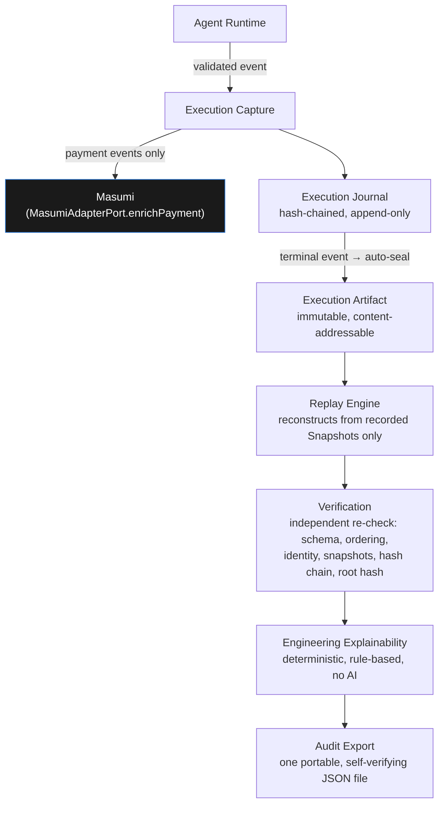
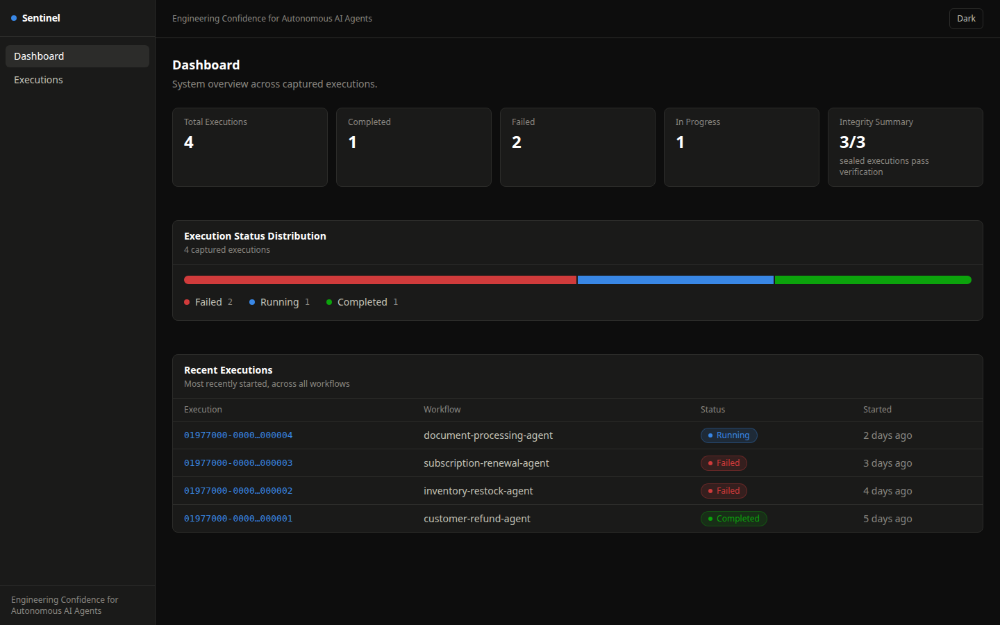
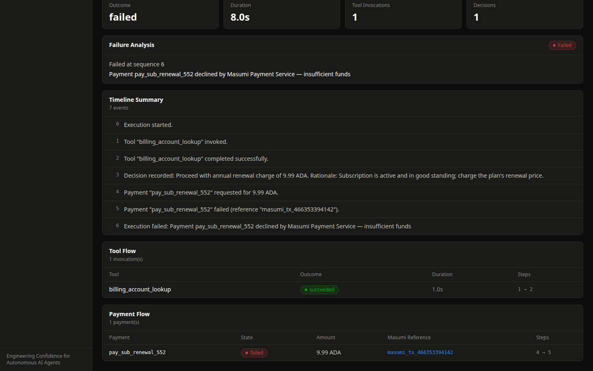
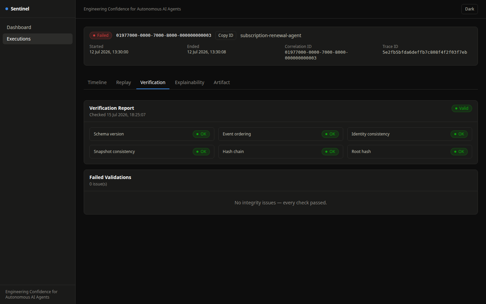
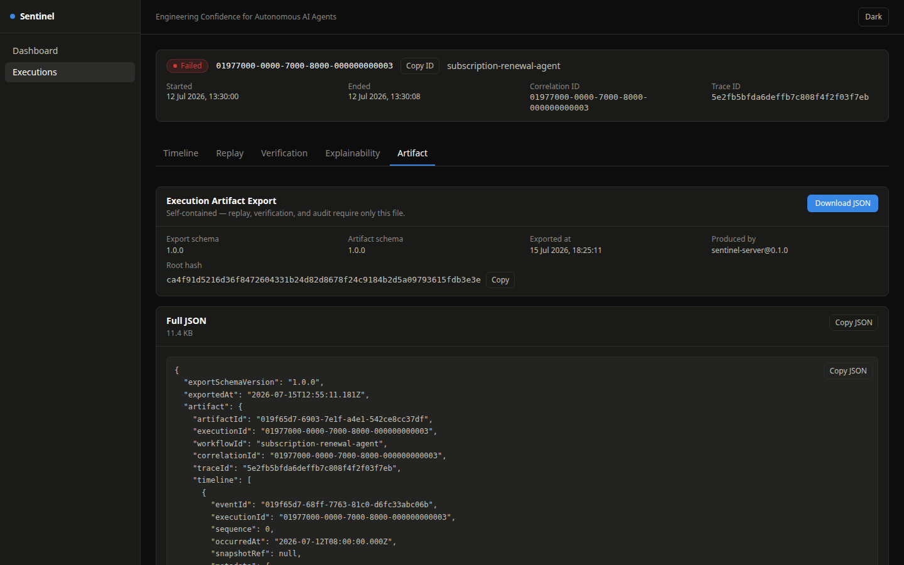

<p align="center">
  <picture>
    <source media="(prefers-color-scheme: dark)" srcset="docs/assets/logo-dark-mode.svg">
    
  </picture>
</p>

<p align="center"><strong>Engineering Confidence for Autonomous AI Agents — the Assurance Layer for Masumi</strong></p>

<p align="center">
  
  
  
  
  
</p>

---

## IndiaCodex 2026 Submission

| | |
| --- | --- |
| **Project** | Sentinel |
| **Track** | MASUMI |
| **Team** | Younus |
| **PPT** | [`presentation/Sentinel-RC1-Presentation.pptx`](presentation/Sentinel-RC1-Presentation.pptx) — 12 slides, dark theme, real screenshots and diagrams, speaker notes on every slide |
| **Live demo** | Not deployed — runs locally from a single command (`pnpm demo`, see [Running the Demo](#running-the-demo)). No public hosted instance exists; nothing below claims otherwise. |
| **2-minute demo script** | [`DEMO.md`](DEMO.md) — second-by-second, every command and click |

## Table of Contents

- [Project Description](#project-description)
- [Problem Statement](#problem-statement)
- [Why the Problem Matters](#why-the-problem-matters)
- [Solution](#solution)
- [Architecture Overview](#architecture-overview)
- [Key Features](#key-features)
- [Technical Innovation](#technical-innovation)
- [Engineering Highlights](#engineering-highlights)
- [Tech Stack](#tech-stack)
- [Repository Structure](#repository-structure)
- [Installation](#installation)
- [Running the Demo](#running-the-demo)
- [Demo Screenshots](#demo-screenshots)
- [Future Roadmap](#future-roadmap)
- [Team Members](#team-members)
- [License](#license)

---

## Project Description

Sentinel is an engineering-assurance platform for autonomous AI agents: it
captures every event an agent produces into an immutable, hash-chained
journal; deterministically replays it without ever calling a live LLM,
tool, or payment service again; independently re-verifies its integrity;
explains what happened in plain, rule-based language with no AI involved;
and exports the whole thing as one portable, self-verifying file. It
integrates with Masumi — a protocol for agent identity, registry, and
payments — as the layer that sits around it, the way OpenTelemetry sits
around a distributed system, without becoming part of the system it
observes.

## Problem Statement

An autonomous agent calls an LLM, invokes tools, makes a Masumi payment,
and finishes — or doesn't. Three weeks later someone asks *"why did this
agent pay this counterparty?"*, *"why did this run fail?"*, or *"can you
prove this execution actually happened the way the logs say?"* — and most
teams have nothing but scattered application logs: no cryptographic proof
the record wasn't altered, and no way to replay the run without
re-invoking a live (and by now different) LLM.

## Why the Problem Matters

Masumi gives agents the ability to hold identity and move money
autonomously. The moment an agent can spend real value without a human in
the loop, "we trust the logs" stops being an acceptable answer to a
disputed payment or a failed run — an auditor, a counterparty, or an
engineering team needs proof, not assertion. No existing category solves
this: LLM observability platforms produce a call graph you have to trust
their database for, not a portable artifact you can re-verify yourself;
blockchain explorers show a settled transaction with no visibility into
the agent reasoning that produced it; generic logging has no structural
guarantee that every nondeterministic decision was actually captured.
Masumi deliberately doesn't solve this either — it owns identity and
payment settlement, not the durable record of *why* an agent acted. That
gap is what Sentinel exists to close.

## Solution

Sentinel captures, journals, replays, verifies, explains, and exports —
six deterministic stages, with one hard rule enforced structurally rather
than just documented: **no code path in Execution Capture, the Execution
Journal, Replay, Verification, or Explainability may call an LLM or any
nondeterministic service.** The platform that verifies agents cannot
itself be a second unverifiable AI layer.

Concretely, every Masumi payment an agent makes is captured as a
two-phase event (`requested` → `completed`), and — live, during capture,
not as a batch job afterward — routed through a `MasumiAdapterPort` that
enriches the payment with a Masumi settlement reference. That reference
becomes part of the permanent, tamper-evident record, visible even on a
payment that was **declined** — proof that the integration is real and
unconditional, not a happy-path demo trick.

## Architecture Overview

Clean Architecture, enforced structurally: `packages/domain` has zero
dependency on any framework, database, or adapter. Everything it needs
from the outside world is expressed as a port; adapters implement those
ports and are wired together only at each app's composition root.



Seven diagrams covering the full system — generated from the actual code,
not drawn from memory — live in [`docs/diagrams/`](docs/diagrams/): system
architecture, Clean Architecture, execution flow, replay flow,
verification flow, Masumi integration, and the package dependency graph.
A formal validation pass (dependency direction, cyclic-import check, port-
interface leak check) confirming these boundaries hold in the current
source is in
[`docs/architecture-validation.md`](docs/architecture-validation.md).

## Key Features

| Capability | What it does |
| --- | --- |
| **Execution Capture** | Validates and records every event an agent runtime reports — lifecycle transitions, tool invocations, decisions, and Masumi payments — through a typed HTTP API. Payment events are enriched live via `MasumiAdapterPort`. |
| **Execution Journal** | An append-only, hash-chained record. No updates, no deletes, ever. |
| **Replay Engine** | Deterministically reconstructs a sealed execution from its recorded Snapshots after independently re-verifying it. Never invokes a live LLM, tool, external API, or Masumi service. |
| **Verification Engine** | Independently re-verifies a sealed Execution Artifact — six checks — using only data embedded in the artifact itself, no database access. |
| **Engineering Explainability** | Deterministic, rule-based explanations: execution summary, timeline narrative, tool flow, payment flow, failure analysis. No AI anywhere in this path. |
| **Execution Artifact Export** | One self-contained, portable JSON file sufficient on its own to audit an execution with no database access. |
| **Engineering Console** | Dashboard, Executions list with search/filter, and five per-execution tabs. Dark by default, light theme available. |

## Technical Innovation

- **A structurally enforced determinism boundary.** `appendJournalEntry`
  rejects an Event missing a required Snapshot, or one carrying a
  Snapshot it shouldn't — checked at the moment of write, not asserted
  afterward. This is what makes "no AI in the trust path" a verifiable
  property of the code, not a policy someone could quietly violate.
- **Independent, portable re-verification.** `verifyArtifact` recomputes
  the entire SHA-256 hash chain from an artifact's own `timeline` and
  `snapshots` alone — no database, no `StoragePort`. A single exported
  JSON file is sufficient to catch tampering, offline, with zero access
  to Sentinel itself.
- **A live Masumi integration, not a mock bolted on for a demo.**
  `CaptureEventUseCase` calls `MasumiAdapterPort.enrichPayment()` during
  capture, on every payment event, including declined ones — visible in
  both the terminal output and the Explainability tab's Payment Flow
  table.
- **Full assurance on executions that never finish.** Replay,
  verification, and explainability all run identically on an interrupted,
  non-terminal execution as on a completed one — most tooling in this
  space assumes a finished run.

## Engineering Highlights

- **171 tests across 28 files**, stable across repeated runs, including a
  shared `StoragePort` contract suite proving the SQLite and in-memory
  adapters are genuinely interchangeable, not just structurally similar.
- **Nine Architecture Decision Records** documenting every significant,
  hard-to-reverse decision — including two mid-build corrections, kept
  rather than hidden.
- **Zero known dependency vulnerabilities** (`pnpm audit`), zero TODO/
  FIXME/dead code, zero broken documentation links across 45+ markdown
  files, verified programmatically.
- **A formal architecture validation pass** (dependency direction, cyclic-
  import check via `madge`, port-interface leak check) — see
  [`docs/architecture-validation.md`](docs/architecture-validation.md).
- **MIT licensed with a complete open-source health-file set**:
  `SECURITY.md`, `CODE_OF_CONDUCT.md`, `CONTRIBUTING.md`, `SUPPORT.md`,
  `CHANGELOG.md`, issue/PR templates, `CODEOWNERS`.

## Tech Stack

**Backend:** TypeScript, Fastify, better-sqlite3, Zod
**Frontend:** React 19, Vite, TanStack Query, react-router, Tailwind CSS
**Testing:** Vitest, Playwright
**Tooling:** pnpm workspaces, ESLint, Prettier
**Integration:** Masumi (via `MasumiAdapterPort`)

## Repository Structure

```
Sentinel/
  apps/
    server/          Fastify HTTP API — the composition root
    web/              React console (Vite, Tailwind v4, TanStack Query, react-router)
  packages/
    domain/                    Entities, value objects, ports, pure domain services. Zero dependencies.
    application/                Use cases (CaptureEventUseCase, explainability, audit export).
    execution-journal/           Implements ExecutionJournalPort: append, seal, replay.
    explainability/               Engineering Mode explanation generation. Pure, no I/O.
    testkit/                      Shared test fixtures.
    adapters/
      storage-sqlite/              StoragePort over better-sqlite3.
      storage-memory/               StoragePort in-memory — contract suite reference implementation.
      masumi/                       MasumiAdapterPort — live integration, mock settlement backend today.
      export-json/                  ExportPort — portable JSON.
  docs/                            Architecture, API reference, ADRs, diagrams, roadmap, screenshots.
  presentation/                    Hackathon presentation deck (source + generated .pptx).
  DEMO.md                          Second-by-second 2-minute demo script.
```

Full package-by-package responsibilities and the enforced dependency
direction are in [`docs/architecture.md`](docs/architecture.md).

## Installation

Requirements: Node.js ≥ 22, pnpm ≥ 11.

```bash
cd Sentinel
pnpm install
```

## Running the Demo

```bash
pnpm demo
```

This builds every package, seeds four realistic demo executions — a clean
success, a tool failure, a **declined Masumi payment**, and an execution
that was simply interrupted mid-run — and starts both the API and the web
console. Open **http://localhost:5173**.

Watch the terminal while it seeds — this line is the proof the Masumi
integration is live, not staged:

```
[7] payment/completed — enriched via MasumiAdapterPort (masumiReference=masumi_tx_351b0dea5202)
```

For the manual, step-by-step alternative and the full second-by-second
walkthrough judges can follow along with, see [`DEMO.md`](DEMO.md).

## Demo Screenshots

<table>
<tr>
<td width="50%">

**Dashboard** — real status distribution, live integrity summary

</td>
<td width="50%">

**Explainability** — the live Masumi settlement reference, on a declined payment

</td>
</tr>
<tr>
<td width="50%">

**Verification** — six independent integrity checks, recomputed from scratch

</td>
<td width="50%">

**Export** — one portable, self-verifying JSON audit bundle

</td>
</tr>
</table>

Full set of eight (including the Executions list, Replay, execution
details, and the light theme) in
[`docs/screenshots/`](docs/screenshots/).

## Future Roadmap

In priority order — see [`docs/roadmap.md`](docs/roadmap.md) for full
detail:

1. A real Masumi client behind `MasumiAdapterPort`, replacing today's
   deterministic mock.
2. Artifact signing for genuine third-party auditability.
3. A PostgreSQL `StoragePort` adapter, validated against the existing
   contract suite.
4. AuthN/AuthZ and multi-tenancy, redaction policy for captured payloads.
5. TypeScript project references, server-side search once client-side
   filtering stops being sufficient.

Stated honestly rather than hidden: Sentinel does not yet have
authentication, rate limiting, or concurrency control on concurrent
writes to the same execution. See [`SECURITY.md`](SECURITY.md) for the
full current posture.

## Team Members

**Team Younus**

- younusbasha

## License

[MIT](LICENSE)

---

*Full engineering self-assessment, including an independent architecture
validation and an overall readiness score, is in
[`FINAL_RELEASE_REPORT.md`](FINAL_RELEASE_REPORT.md).*
