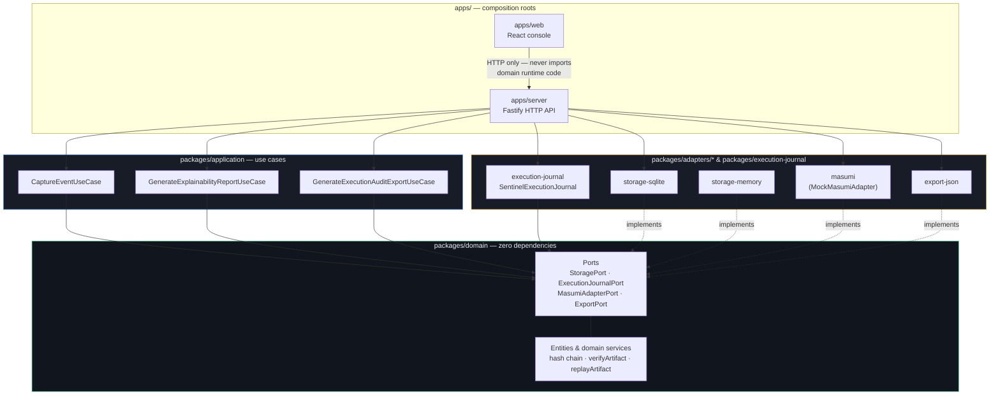

# Clean Architecture (Ports &amp; Adapters)

The dependency direction the codebase actually enforces: `apps/* →
packages/adapters/* & packages/application → packages/domain`.
`packages/domain` depends on nothing else in this repository — verified by
grepping the package for `@sentinel/*` imports and finding none outside doc
comments.

**Reading it:** dependencies only ever point inward and down. Domain defines
ports as interfaces and never imports a concrete adapter; adapters implement
those interfaces and are swapped in only at the composition root
(`apps/server/src/composition.ts`). Swapping SQLite for PostgreSQL, or the
mock Masumi adapter for a real client, means writing a new adapter package —
it never touches `packages/domain` or `packages/application`.

Source of truth: [`docs/architecture.md`](../architecture.md) §1–§4.
