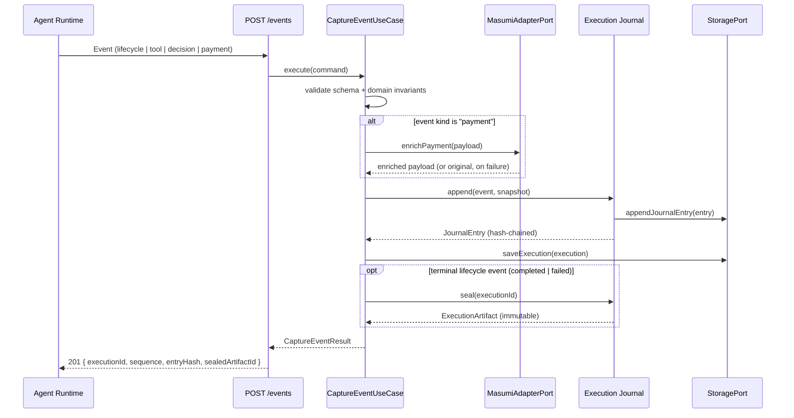

# Execution Flow (Capture)

What happens between an agent reporting an event and that event becoming
part of a permanent, hash-chained record — including the point where a
terminal lifecycle event triggers automatic sealing.

**Reading it:** every event is validated before it touches the Journal.
Payment events are the one place a live external call happens
(`MasumiAdapterPort.enrichPayment`, detailed in
[`masumi-integration.md`](masumi-integration.md)) — and it never blocks
capture even if that call fails. Sealing into an immutable
`ExecutionArtifact` is automatic the moment a terminal lifecycle event
arrives; nothing about capture requires a caller to explicitly "finish" an
execution.

Source of truth: [`packages/application/src/capture/capture-event-use-case.ts`](../../packages/application/src/capture/capture-event-use-case.ts).
