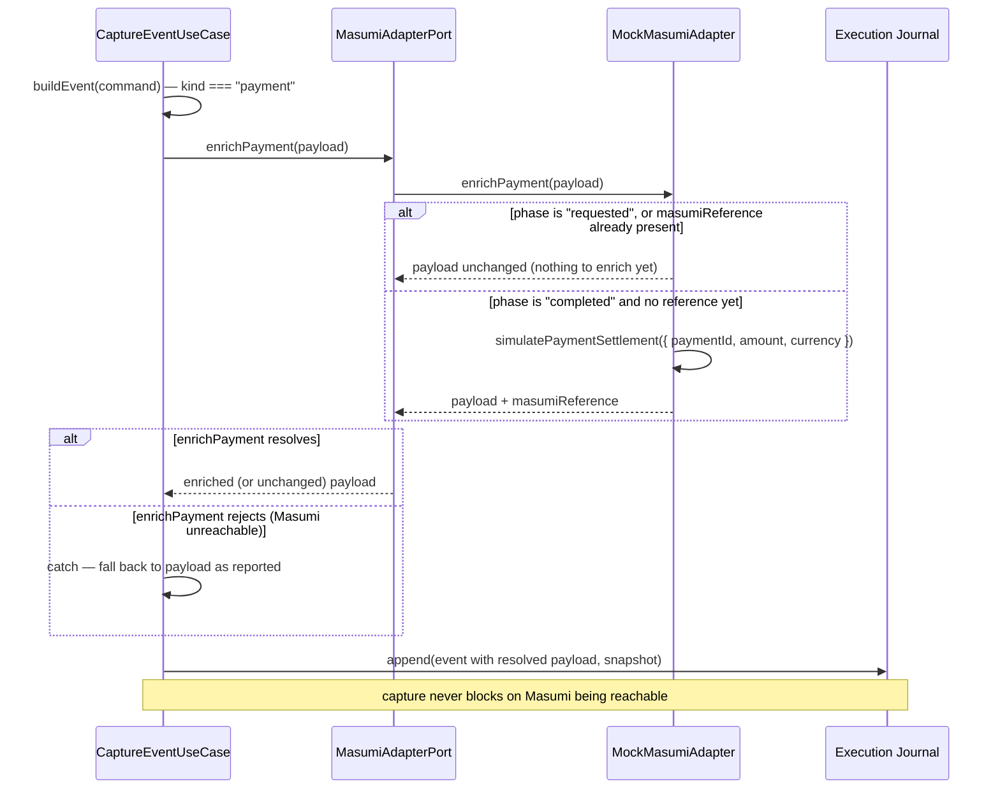

# Masumi Integration

Sentinel's one live touchpoint with Masumi: a single port, called during
capture, with a hard rule that a Masumi outage degrades enrichment but never
blocks the record from being captured at all.

**Reading it:** `MockMasumiAdapter` is a real implementation of
`MasumiAdapterPort`, not a hardcoded stub — it has its own deterministic
settlement algorithm and its own test suite. The architectural point this
diagram makes is the call site and the failure contract, both of which are
production code exercised on every capture: a real Masumi client is a
drop-in replacement behind the same port, changing zero lines in
`CaptureEventUseCase`.

Source of truth: [`packages/application/src/capture/capture-event-use-case.ts`](../../packages/application/src/capture/capture-event-use-case.ts)
(`resolvePaymentPayload`), [`packages/adapters/masumi/src/mock-masumi-adapter.ts`](../../packages/adapters/masumi/src/mock-masumi-adapter.ts),
[ADR-0009](../adr/0009-live-masumi-enrichment-at-capture.md).
