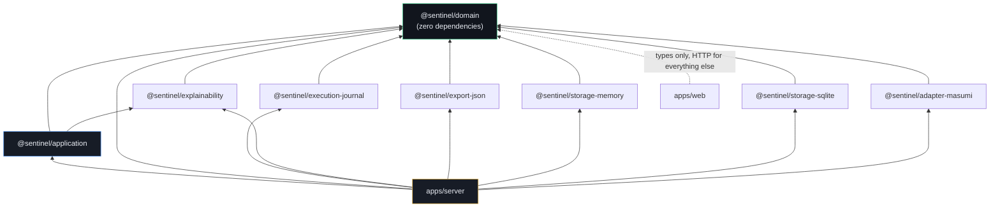

# Package Dependency Graph

The actual `dependencies` edges declared across every workspace
`package.json` — not an idealized version. Generated by reading the
manifests directly, not hand-drawn from memory. Dev-only dependencies (test
fixtures, contract-suite reuse) are omitted; they don't constrain the
runtime dependency direction.

**Reading it:** `@sentinel/domain` sits at the bottom with nothing pointing
out of it — every arrow in this graph either originates there or points into
it, never through it sideways. `apps/server` is the only package that
depends on every adapter simultaneously, because it's the composition root
(`apps/server/src/composition.ts`) — the one place concrete adapters get
wired to ports. `apps/web` is deliberately the thinnest edge on the graph:
it imports only `@sentinel/domain`'s pure string-literal union types (which
survive JSON serialization unchanged), never its runtime code, and talks to
everything else over HTTP.

`@sentinel/testkit` is omitted from this graph entirely — it's a
test-fixtures-only package, a `devDependency` everywhere it appears, never a
runtime dependency of anything.
