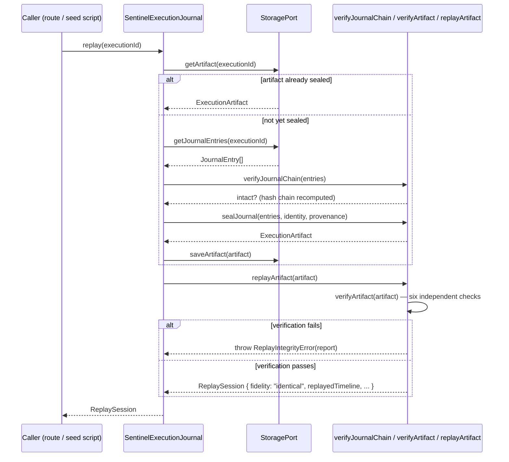

# Replay Flow

Replay never re-invokes a live LLM, tool, external API, or Masumi service —
it reconstructs an execution purely from what was already captured, after
independently re-verifying that record twice: once at the Journal level,
once at the Artifact level.

**Reading it:** two layers of integrity checking gate every replay — journal
integrity first (has the live, append-only store been altered since
write time), then artifact integrity second (does the sealed, portable
artifact still hash-verify on its own). `fidelity` is `"identical"`
whenever verification passes, because Sentinel reconstructs from its own
recorded Events rather than re-executing independent agent code — there is
nothing external for the reconstruction to diverge from. Replay is
idempotent: re-sealing an already-sealed execution returns the existing
artifact rather than minting a new one.

Source of truth: [`packages/execution-journal/src/execution-journal.ts`](../../packages/execution-journal/src/execution-journal.ts),
[`packages/domain/src/replay/replay-artifact.ts`](../../packages/domain/src/replay/replay-artifact.ts).
