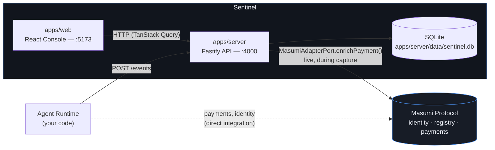

# System Architecture

Where Sentinel sits relative to an agent runtime and Masumi. Sentinel is
infrastructure that observes and verifies — never the agent, never the
payment protocol.

**Reading it:** an agent's own code talks to Masumi directly for identity and
payment settlement, exactly as it does today. It additionally reports every
event it produces to Sentinel's capture API. The one place Sentinel itself
talks to Masumi is a single, narrow call — `MasumiAdapterPort.enrichPayment()`
— fired live while a payment event is being captured (see
[`masumi-integration.md`](masumi-integration.md) for that call in detail).

Source of truth: [`apps/server/src/composition.ts`](../../apps/server/src/composition.ts),
[`apps/server/src/app.ts`](../../apps/server/src/app.ts).
