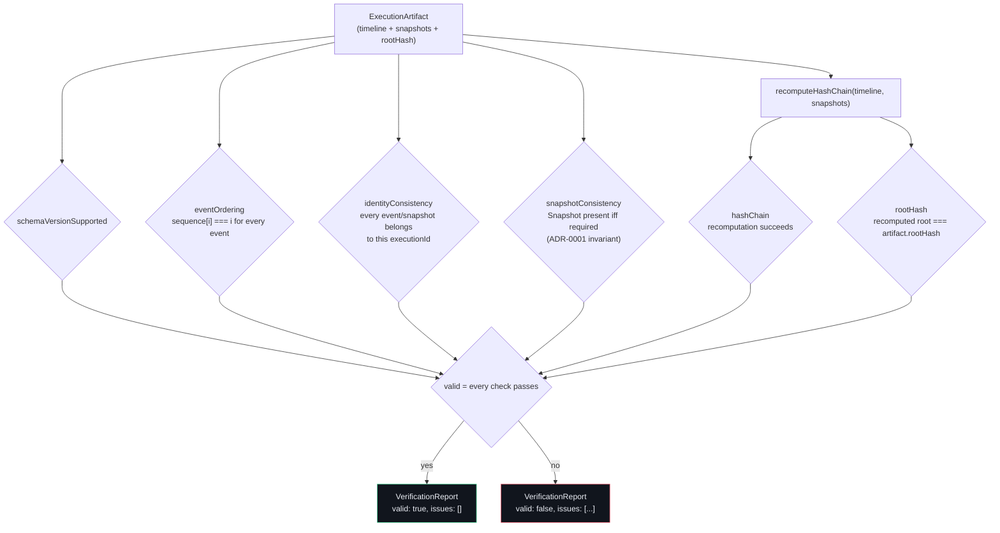

# Verification Flow

`verifyArtifact` recomputes six independent checks from an
`ExecutionArtifact`'s own `timeline` and `snapshots` — no database, no
`StoragePort`, no access to the live Journal. This is what makes an exported
audit bundle sufficient on its own: anyone with the file can run the same
checks Sentinel ran.

**Reading it:** `rootHash` is the check that actually detects tampering —
SHA-256's avalanche property means any altered event or snapshot anywhere in
the timeline changes the final root. The other five checks catch structural
corruption (wrong schema version, out-of-order events, cross-execution
contamination, a missing or misplaced Snapshot) that a hash mismatch alone
wouldn't explain to a human reading the report. `replayArtifact` refuses to
proceed at all when `valid` is `false` — verification always gates replay,
never the other way around.

Source of truth: [`packages/domain/src/artifact/verify-artifact.ts`](../../packages/domain/src/artifact/verify-artifact.ts).
