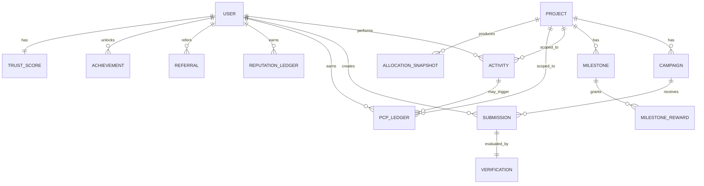

# Social Farming & Community Growth Engine — Architecture

**Status:** Draft for review (no code yet)
**Owner:** Social Farming module team
**Scope:** A standalone service that turns every launched meme coin into a community-growth campaign. It is **completely independent** of the launchpad and blockchain — it consumes events and exposes APIs.

---

## 0. Architectural decisions & assumptions (confirm or override before we build)

These are the load-bearing choices. Everything below follows from them; flag any you want changed.

| # | Decision | Choice | Rationale |
|---|----------|--------|-----------|
| D1 | Language / framework | **TypeScript + NestJS** | Same language as the launchpad (Next.js/TS) → shared types & hiring; NestJS's module system maps 1:1 to our "modular architecture" requirement and DI keeps modules loosely coupled. |
| D2 | Deployment shape | **Modular monolith first**, split-to-services ready | Loose coupling via clean module boundaries + an internal event bus, without premature microservice ops cost. Each module can be extracted later with zero domain changes. |
| D3 | Primary datastore | **PostgreSQL** | Points/reputation are financial-grade ledgers needing ACID + relational integrity + auditability. |
| D4 | Cache + leaderboards | **Redis** | Sorted sets are the ideal leaderboard structure; also session/nonce/rate-limit store. |
| D5 | Async processing | **BullMQ (Redis)** jobs + **Outbox pattern**; Kafka as the scale path | Reliable at-least-once processing in Node today; Kafka/Redis-Streams when throughput demands it. |
| D6 | Inbound event transport | **Signed webhook → durable queue** (HMAC-verified), idempotent | Simplest reliable contract with the launchpad; no shared DB, no coupling. |
| D7 | AI provider | **LLM behind a provider abstraction** (default: Claude) | AI evaluates *content quality only* and must be swappable; never touches reward math. |
| D8 | User identity | **Cardano wallet address (stake key)** as the primary key, verified by CIP-30 signed login; optional linked X/Twitter | We identify users by the same address the launchpad reports in events, without reading the chain. |
| D9 | Reward payout boundary | **We compute allocations; the launchpad executes on-chain distribution** | Honors "no blockchain transactions." We emit a distribution manifest / expose an API the launchpad consumes. |

### Hard boundaries (non-negotiable per brief)
This service **never**: deploys/mints tokens, creates pools, signs or submits transactions, or reads the chain directly. Its only knowledge of the chain is the **events the launchpad pushes** and the **allocation manifest it pulls back**.

---

## 1. High-level system architecture

```
                          (on-chain domain — NOT ours)
┌───────────────────────────────────────────────────────────────────────┐
│  LAUNCHPAD  (existing): minting, bonding curve, trading, LP, reward pool │
└───────────────┬───────────────────────────────────▲────────────────────┘
   PROJECT_CREATED, TOKEN_PURCHASED, TOKEN_SOLD,     │  GET allocation manifest
   LP_ADDED, LP_REMOVED, PROJECT_MIGRATED  (signed)  │  (address → PCP share)
                │ webhook (HMAC)                     │  REST (pull)
════════════════▼═════════════════════════════════════════════════════════
   SOCIAL FARMING & COMMUNITY GROWTH ENGINE  (our standalone service)
┌──────────────────────────────────────────────────────────────────────┐
│  Event Ingestion Gateway  →  dedupe/verify  →  raw_events (append-only) │
│         │ publish internal domain events (in-proc bus / BullMQ)        │
│         ▼                                                              │
│  ┌────────────┐ ┌────────────┐ ┌───────────────┐ ┌──────────────┐     │
│  │  Project   │ │  Activity  │ │  Campaign     │ │ Verification │     │
│  │  (mirror)  │ │  Tracker   │ │  Manager (+AI)│ │  Pipeline    │     │
│  └────────────┘ └─────┬──────┘ └──────┬────────┘ └──────┬───────┘     │
│                       │               │                 │  quality     │
│                       ▼               ▼                 ▼  score        │
│                 ┌───────────────────────────────────────────┐          │
│                 │  Reward Engine  (PCP ledger + Reputation)  │◄─ Trust  │
│                 └───────┬───────────────────────┬───────────┘   Engine  │
│                         ▼                       ▼                        │
│                  ┌────────────┐          ┌──────────────┐               │
│                  │ Milestones │          │ Leaderboards │               │
│                  └────────────┘          └──────────────┘               │
│                                                                        │
│  Cross-cutting: Identity/Auth · Analytics/Read-models · Notifications  │
└──────────────────────────────────────────────────────────────────────┘
      │ REST/GraphQL          │ WebSocket (live)        │
      ▼                       ▼                          ▼
  Creator Dashboard      User Dashboard            X/Twitter, Email, Discord
  (Next.js frontends — can live in the launchpad app or standalone)

  External deps: PostgreSQL · Redis · Object storage (media) · LLM API · OAuth (X)
```

**Data-flow in one sentence:** launchpad events and user submissions become **immutable activity records**; a **verification pipeline** (rules → AI score) and a **trust score** feed a **deterministic reward engine** that writes **PCP** and **reputation** ledgers, which drive **leaderboards, milestones, analytics, and an allocation manifest** the launchpad uses to pay out.

---

## 2. Module breakdown

Each is a NestJS module with its own controller / service / repository / domain events. Communication between modules is via **the internal event bus + service interfaces**, never by reaching into another module's tables.

### Core modules
| Module | Responsibility | Consumes | Produces |
|--------|----------------|----------|----------|
| **Project (mirror)** | Local read-model of launchpad projects (never the source of truth for chain state). | `PROJECT_CREATED`, `PROJECT_MIGRATED` | `project.registered`, auto-campaign trigger |
| **Campaign Manager** | Campaign CRUD, lifecycle, templates, **AI-assisted suggestions**, creator approval gate. | `project.registered` | `campaign.published`, `campaign.ended` |
| **Activity Tracker** | Turns every launchpad event + platform action into an **immutable activity record**. | all launchpad events, platform submissions | `activity.recorded` |
| **Verification Pipeline** | Rule validation → AI evaluation → quality score for *subjective* submissions. | `submission.created` | `submission.scored` |
| **Reward Engine** | Deterministic rules combine quality score + trust + campaign config → **PCP** and **Reputation** ledger entries. AI never decides amounts. | `activity.recorded`, `submission.scored` | `pcp.awarded`, `reputation.awarded`, `allocation.updated` |
| **Trust Engine** | Per-user trust score from behavioral signals; gates eligibility, multiplies rewards, weights leaderboards. | `activity.recorded`, `submission.scored`, referral events | `trust.updated` |
| **Milestone Tracker** | Configurable shared project goals + counters; fires bonus rewards/badges on completion. | `activity.recorded`, `pcp.awarded` | `milestone.reached` |
| **Leaderboards** | Project + platform rankings (contributors, builders, creators) via Redis sorted sets. | `pcp.awarded`, `reputation.awarded`, `trust.updated` | (read model) |
| **Analytics / Read-models** | Materialized views for creator + user dashboards. | all domain events | (read model) |

### Supporting modules
- **Identity & Auth** — wallet sign-in (CIP-30 nonce/sign), JWT sessions, X/Twitter OAuth linking, roles (user / creator / admin).
- **Event Ingestion Gateway** — HMAC verification, schema validation, idempotency (`processed_events`), append to `raw_events`, publish domain events. The only inbound door for the launchpad.
- **Integrations** — launchpad API client (pull allocation manifest is the launchpad calling us; we may also expose it), LLM provider adapter, social scrapers/OAuth, notifications (email/Discord/X).
- **Admin / Moderation** — manual review queue, dispute handling, abuse actions, config.

---

## 3. Folder structure

```
social-farming/
├─ src/
│  ├─ main.ts
│  ├─ app.module.ts
│  ├─ common/                     # cross-cutting, framework-level
│  │  ├─ config/                  # env, typed config
│  │  ├─ auth/                    # guards, JWT, wallet-signature verify
│  │  ├─ dto/  errors/  utils/
│  │  ├─ events/                  # internal event bus, base event types, outbox
│  │  └─ pagination/  logging/
│  ├─ ingestion/                  # inbound launchpad events
│  │  ├─ ingestion.controller.ts  # POST /events (HMAC)
│  │  ├─ ingestion.service.ts     # verify → dedupe → persist raw → publish
│  │  ├─ event-schemas/           # zod schemas per event type
│  │  └─ consumers/               # BullMQ processors
│  ├─ modules/
│  │  ├─ project/
│  │  ├─ identity/                # users, auth, social-linking
│  │  ├─ campaign/
│  │  │  ├─ templates/  ai-suggester/  campaign.service.ts  ...
│  │  ├─ activity/
│  │  ├─ verification/
│  │  │  ├─ rules/                # deterministic validators
│  │  │  ├─ ai/                   # LLM evaluators (originality, spam, …)
│  │  │  └─ pipeline.service.ts   # orchestrates rule → AI → score
│  │  ├─ reward/
│  │  │  ├─ pcp/                  # project points ledger
│  │  │  ├─ reputation/           # global reputation ledger
│  │  │  └─ allocation/           # manifest builder for launchpad
│  │  ├─ trust/
│  │  ├─ milestone/
│  │  ├─ leaderboard/
│  │  ├─ analytics/
│  │  └─ notification/
│  ├─ integrations/
│  │  ├─ llm/                     # provider-agnostic adapter (Claude default)
│  │  ├─ launchpad/               # client + shared event/manifest contracts
│  │  ├─ social/                  # X/Twitter, Discord
│  │  └─ storage/                 # media (S3/R2)
│  └─ infra/
│     ├─ database/  migrations/  seeds/
│     ├─ redis/  queue/
│     └─ health/
├─ test/            # unit + integration + e2e
├─ contracts/       # OpenAPI + JSON-schema for events & manifest (shared w/ launchpad)
└─ docs/
```

---

## 4. Database design

**Principles:** activities and ledgers are **append-only / immutable**; balances are materialized read-models rebuildable from the ledger; every subjective decision is auditable (rule result + AI scores + model version stored).

### ER diagram



### Key tables (Postgres)

**Identity & projects**
- `users` — `user_id (uuid pk)`, `wallet_address (unique)`, `stake_key`, `display_name`, `socials (jsonb)`, `created_at`.
- `projects` — `project_id (pk = launchpad id)`, `token_policy_id`, `creator_wallet`, `status`, `reward_pool_ref`, `migrated_at`, `created_at`. *(Mirror; populated from events, never authoritative for chain state.)*

**Events & activities (append-only)**
- `raw_events` — `event_id (pk)`, `type`, `payload (jsonb)`, `signature`, `received_at`, `processed_at`. Idempotency source of truth.
- `processed_events` — `event_id (pk)`, `at`. Fast dedupe guard.
- `activities` — `activity_id (pk)`, `user_id`, `project_id`, `type`, `source (launchpad|platform)`, `payload (jsonb)`, `occurred_at`, `origin_event_id`. **Immutable, partitioned by month.**

**Campaigns & submissions**
- `campaign_templates` — reusable definitions (`type`, `default_rules jsonb`, `scoring_schema jsonb`).
- `campaigns` — `campaign_id`, `project_id`, `type`, `title`, `rules (jsonb)`, `reward_config (jsonb: base_pcp, caps, budget)`, `status (draft|pending_approval|published|active|ended)`, `ai_generated (bool)`, `created_by`, `approved_by`, `starts_at`, `ends_at`.
- `submissions` — `submission_id`, `campaign_id`, `user_id`, `content (jsonb)`, `media_refs`, `status (pending|rule_rejected|scored|approved|rejected)`, `created_at`.
- `verifications` — `verification_id`, `submission_id (unique)`, `rule_result (jsonb)`, `ai_scores (jsonb: originality, relevance, creativity, educational_value, spam_probability, confidence)`, `quality_score (numeric)`, `model`, `model_version`, `created_at`.

**Rewards (append-only ledgers + materialized balances)**
- `pcp_ledger` — `entry_id`, `project_id`, `user_id`, `delta`, `reason`, `ref_type`, `ref_id`, `trust_multiplier`, `created_at`.
- `pcp_balances` — `(project_id, user_id) pk`, `balance`, `updated_at`. *(Materialized; rebuildable.)*
- `reputation_ledger` — `entry_id`, `user_id`, `delta`, `reason`, `ref_id`, `created_at`.
- `reputation_scores` — `user_id pk`, `score`, `tier`, `updated_at`.
- `allocation_snapshots` — `snapshot_id`, `project_id`, `taken_at`, `total_pcp`, `status`. + `allocation_entries` — `snapshot_id`, `user_id`, `wallet_address`, `pcp`, `share (numeric)`. **The manifest the launchpad consumes.**

**Trust, milestones, social, gamification**
- `trust_scores` — `user_id (+ optional project_id) pk`, `score (0..1)`, `signals (jsonb)`, `updated_at`.
- `trust_events` — append-only signal log.
- `milestones` — `milestone_id`, `project_id`, `type`, `target`, `current`, `status`, `reward_config (jsonb)`.
- `referrals` — `referral_id`, `referrer_user`, `referred_user`, `project_id`, `status`, `quality_score`.
- `achievements` — `achievement_id`, `user_id`, `project_id?`, `badge_code`, `awarded_at`.
- `audit_log` — every state change to campaigns/rewards/moderation.

---

## 5. Event flow

### 5.1 Inbound contract (launchpad → us)
Envelope (all events share it):
```json
{
  "event_id": "uuid",        // idempotency key (required)
  "type": "TOKEN_PURCHASED",
  "occurred_at": "ISO-8601",
  "project_id": "…",
  "actor_wallet": "addr_test1…",
  "data": { "amount": "…", "ada": "…", "tx_ref": "…" },
  "sig": "hmac-sha256(body, shared_secret)"
}
```
Delivery: HTTPS `POST /api/v1/events`. We verify HMAC, validate schema, **dedupe on `event_id`**, persist to `raw_events`, ACK 200, then publish internally. At-least-once → all consumers are idempotent. (Kafka/Redis-Streams can replace the webhook later without changing consumers.)

### 5.2 Launchpad-event path (e.g. a buy)
```mermaid
sequenceDiagram
  participant L as Launchpad
  participant G as Ingestion Gateway
  participant A as Activity Tracker
  participant R as Reward Engine
  participant T as Trust Engine
  participant M as Milestones
  participant B as Leaderboards
  L->>G: POST /events TOKEN_PURCHASED (signed)
  G->>G: verify HMAC + dedupe(event_id)
  G-->>L: 200 ACK
  G->>A: activity.recorded (buy)
  A->>R: activity.recorded
  R->>T: read trust multiplier
  R->>R: PCP += rule(campaign) × trust  (deterministic)
  R->>M: pcp.awarded
  R->>B: pcp.awarded (update sorted set)
  M->>M: increment holders/LP counters; maybe milestone.reached
```

### 5.3 Platform-submission path (e.g. a meme)
```
submission.created
  → Verification Pipeline:
       Rule Validation (duplicate? eligible? deadline? user ok?) ── fail → rule_rejected
       ↓ pass
       AI Evaluation (originality, relevance, creativity, educational, spam_prob, confidence)
       ↓
       Quality Score  (weighted, capped, model+version stored)
  → submission.scored
  → Reward Engine: reward = base × qualityBand × trust × milestoneBonus, within campaign budget
  → pcp.awarded + reputation.awarded → Leaderboards + Analytics
```
**AI never sets the reward** — it outputs scores; the Reward Engine's deterministic, creator-configured rules turn scores into points.

### 5.4 Outbound: allocation manifest (us → launchpad)
On reward-pool distribution (or `PROJECT_MIGRATED`), we freeze an `allocation_snapshot` mapping `wallet → pcp → share`. The launchpad **pulls** `GET /api/v1/projects/:id/allocations/latest` and executes the on-chain payout. We only compute; we never transact.

---

## 6. Internal API design (REST, `/api/v1`, JWT unless noted)

**Ingestion (launchpad only, HMAC)** · `POST /events`

**Auth / identity** · `POST /auth/wallet/nonce` · `POST /auth/wallet/verify` (CIP-30 sig → JWT) · `POST /users/me/socials/twitter` (OAuth link)

**Campaigns** · `GET /projects/:id/campaigns` · `POST /projects/:id/campaigns` · `POST /projects/:id/campaigns/ai-suggest` (returns editable drafts) · `PATCH /campaigns/:id` · `POST /campaigns/:id/approve` · `POST /campaigns/:id/publish` · `GET /campaign-templates`

**Submissions** · `POST /campaigns/:id/submissions` · `GET /campaigns/:id/submissions` · `GET /submissions/:id` · `POST /submissions/:id/moderate` (admin)

**Activities (read)** · `GET /users/:id/activities` · `GET /projects/:id/activities`

**Rewards** · `GET /projects/:id/pcp` · `GET /users/:id/pcp?project=` · `GET /users/:id/reputation` · `GET /projects/:id/allocations/latest` (launchpad-facing)

**Trust (internal/admin)** · `GET /users/:id/trust`

**Leaderboards** · `GET /projects/:id/leaderboard?metric=` · `GET /leaderboard/platform?board=builders|creators|contributors`

**Milestones** · `GET /projects/:id/milestones` · `POST /projects/:id/milestones` · `PATCH /milestones/:id`

**Analytics** · `GET /projects/:id/analytics` (creator) · `GET /users/me/dashboard`

**Conventions:** cursor pagination, idempotency keys on writes, per-user + per-IP rate limits, RBAC guards, OpenAPI-documented, WebSocket channel for live leaderboard/reward updates.

---

## 7. User (contributor) journey

1. **Discover** a coin on the launchpad → "Community" tab surfaces active campaigns (our UI).
2. **Sign in** by connecting the same wallet and signing a nonce (no gas, no tx). Optionally link X/Twitter.
3. **Earn passively**: their launchpad buys / holding duration / LP already stream in as events → PCP accrues automatically per active campaigns.
4. **Contribute actively**: submit a meme / thread / educational post / referral → pipeline validates + AI-scores → PCP + reputation awarded (trust-adjusted).
5. **Track**: user dashboard shows PCP per project, global reputation + tier, pending rewards, achievements, rank.
6. **Level up**: reputation unlocks Verified Builder status, reward multipliers, early access, exclusive campaigns.
7. **Get paid**: when the project distributes its reward pool, the launchpad pays out using our PCP shares.

## 8. Creator journey

1. Launch a coin (on the launchpad) → we receive `PROJECT_CREATED` → the project is auto-registered and a **starter campaign set is AI-suggested**.
2. **Review AI suggestions** in the Creator Dashboard: edit / remove / add campaigns, set budgets (PCP), rules, deadlines. **Nothing publishes without creator approval.**
3. **Configure milestones** (1,000 holders, 500 LPs, 100 quality submissions…) and their bonus rewards/badges.
4. **Publish** → campaigns go live; contributors start earning.
5. **Monitor**: campaign performance, community growth, participation, referral quality, top contributors, reward-pool usage, AI quality reports; moderate disputes.
6. **Distribute**: trigger reward-pool distribution → launchpad pulls the allocation manifest and pays out.

---

## 9. Dashboard structure

**Creator Dashboard** (per project): Overview KPIs (holders, participation rate, growth) · Campaigns (status, spend vs budget, submissions) · Community growth charts · Referral performance & quality · Top contributors · Reward-pool usage & allocation preview · AI quality reports · Moderation queue · Milestone progress. — Backed by `analytics` read-models + Redis leaderboards, live via WebSocket.

**User Dashboard** (global + per project): Active campaigns & how to earn · Pending / earned PCP per project · Platform Reputation + tier + next-tier benefits · Achievements/badges · Leaderboard positions · Immutable activity history.

Both are thin React/Next.js frontends over the internal API — can live inside the launchpad app or ship standalone; the service is UI-agnostic.

---

## 10. Deep-dives on the three "brains"

### Verification Pipeline (AI assists, never decides)
`Rule Validation` (deterministic gate: duplicate hash check, campaign eligibility, deadline, user/trust eligibility) → if pass, `AI Evaluation` returns `{originality, relevance, creativity, educational_value, spam_probability, confidence}` → `Quality Score` = configurable weighted blend, clamped, with low-confidence or high-spam routed to **human moderation**. All of it stored in `verifications` for audit. The Reward Engine consumes the score; the AI has no write access to ledgers.

### Reward Engine — two independent systems
- **Project Contribution Points (PCP):** project-scoped, ledger-based, the unit that splits *that project's* reward pool. `delta = base(campaign) × qualityBand × trustMultiplier × milestoneBonus`, bounded by per-user caps and the campaign's PCP budget. Earned from holding, referrals, memes, participation, education, liquidity.
- **Platform Reputation:** global, persistent, **non-redeemable**. Slower-moving, harder to farm, decays less. Unlocks tiers → Verified Builder, reward multipliers, early access, exclusive campaigns. Think "XP/credit score," not currency.
Two ledgers, two lifecycles, one rule engine.

### Trust Engine
Per-user score in [0,1] from signals: referral quality (do referred users actually participate?), duplicate/near-duplicate behavior, spam detection, historical participation, community behavior, AI confidence. Outputs feed: (a) reward multiplier, (b) eligibility gates, (c) leaderboard weighting. Low trust throttles rewards and can require manual review — the core anti-Sybil / anti-farming defense.

---

## 11. Security & anti-abuse (cross-cutting)
Wallet-signature auth (no passwords) · HMAC + replay protection on ingestion · idempotency everywhere · per-content duplicate hashing · Sybil resistance via Trust Engine + reputation weighting + referral-quality checks · rate limits · human-in-the-loop for low-confidence AI · full audit log · reward budgets/caps so no single actor drains a pool.

---

## 12. Future scalability plan
- **CQRS read-models**: dashboards/leaderboards served from materialized views + Redis, decoupled from write-path.
- **Partitioning**: `activities`/`raw_events` partitioned by month; archive cold partitions.
- **Queue scaling**: BullMQ → Kafka/Redis-Streams; consumers scale horizontally; replay from `raw_events`.
- **Stateless services**: API + workers scale horizontally behind a load balancer; Redis/Postgres are the only stateful tiers (with read replicas).
- **Module extraction**: any core module → its own service (boundaries + event bus already enforce this).
- **AI cost & throughput**: batch + cache evaluations, cheap pre-filters before the LLM, provider abstraction for failover, hard spend caps.
- **Multi-tenant isolation**: per-project scoping on all queries; noisy-project isolation.
- **Eventual consistency**: leaderboards/analytics are async; ledgers are strongly consistent.

---

## 13. Proposed implementation roadmap (after you finalize this)
1. **Foundation** — service scaffold, config, Postgres+Redis, Identity/Auth (wallet sign-in), Ingestion Gateway + raw-event store + idempotency.
2. **Activity + Project mirror** — consume launchpad events → immutable activities; project auto-register.
3. **Campaign Manager** — CRUD, templates, approval gate (AI-suggest stubbed).
4. **Reward Engine (PCP)** + **Trust Engine v1** — ledgers, balances, deterministic rules on activity events.
5. **Verification Pipeline + AI** — submissions, rules, LLM adapter, quality scoring; wire to Reward Engine.
6. **Reputation + Leaderboards + Milestones + Achievements.**
7. **Allocation manifest** endpoint + launchpad pull integration.
8. **Analytics + Dashboards** (creator, user) + notifications.
9. **Hardening** — anti-abuse, load tests, observability, scale path.

Each step is independently shippable and testable — matching your "implement each module incrementally" requirement.
