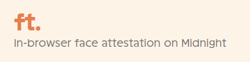
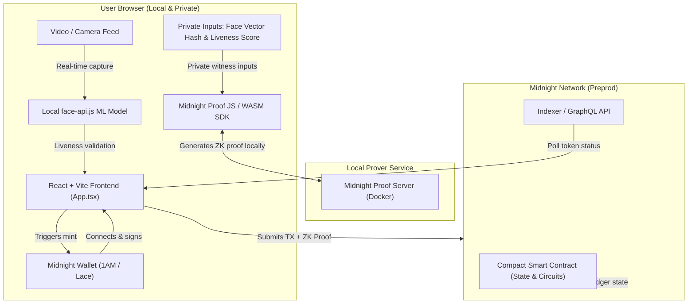

# Face Token (ft.) - Private Humanity Verification

<p align="center">
  
</p>

[](https://youtu.be/x4Pt95QZ-Og)
[](https://docs.google.com/presentation/d/1In0fkKNhou94Qs2GJN_3GGtMy77W0OijyL633CsdJmc/edit?usp=sharing)

**Demo Video:** [https://youtu.be/x4Pt95QZ-Og](https://youtu.be/x4Pt95QZ-Og)
---
**REPO LINK:** [https://github.com/khushal1512/ft](https://github.com/khushal1512/ft)
---
**Presentation Slides:** [Google Slides](https://docs.google.com/presentation/d/1In0fkKNhou94Qs2GJN_3GGtMy77W0OijyL633CsdJmc/edit?usp=sharing)
---

## The Problem
Apps like LinkedIn, Bumble, and modern financial services require you to prove you're human (and of age) to use their platforms. To do this, they ask you to upload a government ID and scan your face.

In return, you get **zero guarantee of data deletion.** Your highly sensitive biometric and identity data sits on their servers (or third-party verification services), creating security risks that frequently lead to devastating data breaches.

---

## The Solution
Face Token (ft.) is a decentralized humanity verifier that completely flips this model using Zero-Knowledge (ZK) cryptography.

1. **100% In-Browser:** When you scan your face, the machine learning model runs entirely locally in your browser.
2. **Zero Data Leaves Your Device:** Your facial data, video feed, and biometric measurements are never sent to a server. They never leave your computer.
3. **ZK Proofs:** Instead of uploading your face, the local model generates a unique mathematical hash of your facial vectors and a confidence score. This hash is passed into a local ZK circuit to generate a cryptographic proof.
4. **On-Chain Attestation:** The ZK proof is minted as a Humanity NFT to your wallet on the Midnight Network.

You get a verifiable, copyable hash to prove your humanity to any service, without ever surrendering your actual facial data.

---

## Tech Stack used while building the project
- **Zero-Knowledge Contracts**: Compact (Midnight Network)
- **Frontend dApp**: React 19, Vite, TypeScript, Tailwind CSS
- **In-Browser ML**: face-api.js (TensorFlow.js)
- **Client Integration**: Midnight JS SDK
- **State Management**: RxJS
- **Prover Environment**: Midnight Proof Server (Docker)
- **Monorepo Setup**: npm Workspaces

---

## Team Members' Info

### Team Name: **Gravitino**

- **Khushal Agarwal**[](https://github.com/khushal1512) [](https://linkedin.com/in/agarwal-khushal)

---

## Project Structure

This monorepo is divided into three key workspaces:

```
ft/
├── contract/               # Compact Smart Contract (ZK Circuit)
│   ├── facetoken.compact   # Core ZK contract logic defining the 'mint' and 'verifyHuman' circuits
│   └── src/
│       ├── index.ts        # Exports compiled contract descriptors and references
│       └── witnesses.ts    # Defines private inputs (face vector hash, liveness score) injected into the circuit
├── api/                    # TypeScript SDK / API wrappers
│   └── src/
│       ├── index.ts        # Handles contract deployment & interactions (e.g. minting, joining)
│       ├── common-types.ts # Defines types for ledger state entries and client providers
│       └── utils/          # Formatting & hex conversion helpers for wallets and cryptographic elements
└── ft-ui/                  # React + Vite Frontend dApp
    └── src/
        ├── App.tsx         # Central state manager composing the subcomponents and connecting state
        ├── index.css       # Tailwind/Vanilla custom design aesthetics and animations
        ├── main.tsx        # React entry point, initializes Midnight Network ID globally
        ├── components/     # Modular UI Subcomponents
        │   ├── Header.tsx           # Logo banner, wallet picker, and connect wallet button
        │   ├── Scanner.tsx          # Local face-api.js webcam tracker & liveness state machine
        │   ├── SuccessModal.tsx     # Checkmark success overlay displaying the copyable face hash
        │   ├── IntroAndExplainer.tsx# Educational Hero and Problem vs Solution cards
        │   └── IdentitiesLedger.tsx # Dynamic table displaying active registered humanity NFTs
        ├── contexts/
        │   └── BrowserFaceTokenManager.ts # Connects to 1AM & Lace wallets, coordinates contract deployment and provider creation
        └── hooks/
            └── useFaceToken.ts            # Apollo GraphQL indexer client hook to fetch active humanity NFTs in real-time
```

## System Architecture



### Flow Breakdown
1. **Biometric Scan:** The camera feed is processed in-browser. The machine learning model calculates the face vector and liveness score (requiring left/right head movements).
2. **ZK Proof Generation:** The private inputs (face vector hash, liveness score) are fed into the Compact ZK circuit. The local proof server works with the SDK to compile proof verification keys without exposing the raw inputs to the network.
3. **On-Chain Attestation:** The Midnight wallet constructs the transaction, balance-checks the gas fees (DUST), and publishes the proof to the Midnight network.

---

## Core Circuit Snippets

### 1. Smart Contract Circuit Logic (`facetoken.compact`)

This is the Compact ZK contract code that runs on-chain and inside the prover. Notice how the face vector hash and liveness score are defined as private witnesses:

```compact
// Private witnesses (never exposed on the public ledger)
witness localFaceVectorHash(): Bytes<32>;
witness localLivenessScore(): Uint<64>;

// Publicly callable circuit to mint a verification NFT
export circuit mint(
  to: Either<ZswapCoinPublicKey, ContractAddress>
): Uint<64> {
  const hash = localFaceVectorHash();
  const score = localLivenessScore();

  // Assert minimum liveness score of 70 (private check)
  assert(disclose(score) >= 70, "Liveness score too low");
  
  // Assert face hash has not been registered yet (Sybil resistance)
  assert(!faceHashes.member(disclose(hash)), "Face already registered");

  nextTokenId.increment(1);
  const tokenId = disclose(nextTokenId.read() as Uint<64>);

  tokens.insert(tokenId, TokenEntry {
    tokenId: tokenId,
    owner: disclose(to),
    faceHash: disclose(hash),
    livenessScore: disclose(score)
  });

  faceHashes.insert(disclose(hash), tokenId);
  return tokenId;
}

// Publicly callable circuit to verify that a token exists (is human)
export circuit verifyHuman(tokenId: Uint<64>): [] {
  assert(tokens.member(disclose(tokenId)), "Token does not exist");
}
```

### 2. TypeScript Client Execution (`api/src/index.ts`)

How the client API wrapper invokes the circuits using `@midnight-ntwrk/midnight-js-contracts`:

```typescript
export class FaceTokenAPI {
  // ...
  
  /** Mint a new FaceToken NFT */
  async mint(to: { is_left: boolean, left: { bytes: Uint8Array }, right: { bytes: Uint8Array } }): Promise<number> {
    // Calls the contract's mint circuit which requests the private witnesses
    const result = await (this.deployedContract as any).callTx.mint(to);
    return Number(result);
  }

  /** Verify standard humanity of a token */
  async verify(tokenId: bigint): Promise<void> {
    await (this.deployedContract as any).callTx.verifyHuman(tokenId);
  }
}
```

## How to Run

### Prerequisites
- Node.js (v18+)
- 1AM Wallet or Lace Wallet extension (with Midnight support)

### 1. Run the Local Midnight Proof Server
The application requires a local zero-knowledge proof server to generate transaction proofs. Start it via Docker:
```bash
docker run -d -p 6300:6300 midnightntwrk/proof-server:8.0.3 -- midnight-proof-server --network preprod
```

### 2. Setup & Run Frontend/Contract
```bash
# Install dependencies from project root
npm install

# Compile the Compact smart contract
npm run compile

# Build the contract and API packages
npm run build

# Start the development server
cd ft-ui
npm run dev
```
Visit `http://localhost:3000` to open the dApp.

### 3. Local testing / DUST preparation
To interact with the contract (e.g., minting your humanity NFT):
1. **Get test tokens:** Open your 1AM or Lace wallet, find the Midnight Faucet option, and request some free test network tokens.
2. **Convert to DUST:** Smart contract execution fees on Midnight require DUST. Inside your wallet UI, look for a "Generate DUST" (or "Convert to DUST") button. Click it to convert some of your faucet tokens into DUST.
3. **Connect and Mint:** With DUST in your wallet, return to the dApp page, scan your face, connect your wallet, and click **Mint Humanity NFT**.
